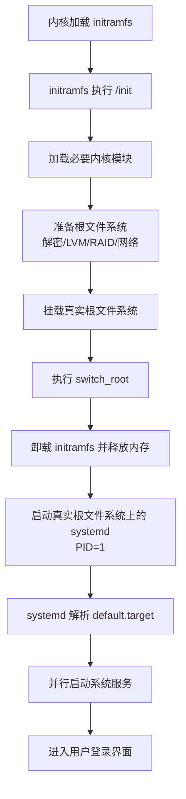

# 2025 南京大学操作系统原理

> 操作系统原理课程学习笔记
> 包括*软件安装，环境配置，运行命令，专有名词，基本概念*等。

[toc]

---
## 问题目录
[Minix2](#Minix-make运行失败)

---
## 12. 构建应用生态
我们已经了解了一个典型的操作系统给应用程序提供的 “一切”：从操作系统为应用程序提供的对象和 API 到可执行文件的链接和加载，操作系统实现了管理硬件资源的底层机制。这是狭义 “操作系统” 负责的功能。

**本讲内容**：一个真实的 “操作系统”，如何使用操作系统的对象和 API，构建丰富的应用生态？其中又有怎样的实用工具起到了决定性的作用？

---
### Evolution of the UNIX Time Sharing System
**最早的版本甚至没有 fork**
1. Shell 关闭所有打开的文件，然后为 0, 1 fd 打开终端文件
2. 从终端读取命令行
3. 打开文件，把加载器代码复制到内存并执行 (相当于 exec)
4. exit 会重新加载 shell
    - [DMR 的文章](https://read.seas.harvard.edu/~kohler/class/aosref/ritchie84evolution.pdf)
    - Takeaway message: 不要害怕 “不好”，大胆去做，并且持续改进

**所以，从零开始做很重要**

---
### Minix by Andrew S. Tanenbaum
**Minix1 (1987)**
- UNIXv7 兼容
- Linus 实现 Linux 的起点
- 同时兼容 16-bit 和 32-bit
    - 真实展示 16-bit 编程

**[Minix2](http://download.minix3.org/previous-versions/Intel-2.0.4/) (1997)**
- POSIX 兼容
- 随书附有代码

--- 
<a id="Minix-make运行失败"></a>

>Minix: Minix 是 UNIX 之后的经典教学操作系统，Andrew Tanenbaum 也因此成就了一代计算机系统研究者。代码来自 [Minix 1 and 2, Quick and Dirty editions。](https://github.com/davidgiven/minix2)


- **性能开销**
在Windows驱动器上使用像git这样的/O密集型操作将具有较差的性能。请考虑将项目文件移动到 Linux 文件系统以获得更好的性能。单击下方了解详细信息。
- [ ] **请参阅[附录1](#附录1)**。 <a id="返回附录1正文"></a> ==还是没解决网络代理问题,没能运行代码？？？==
- [ ] 网络问题git失败, `ping github.com` 超时，如何解决？
    - vpn加速器下载
    - windows powershell配置代理
        ```powershell
        $env:https_proxy="http://127.0.0.1:7897"
        $env:http_proxy="http://127.0.0.1:7897"
        Remove-Item Env:\https_proxy
        Remove-Item Env:\http_proxy
        7897: 端口修改成自己的

        git clone --depth 1 --single-branch -b master https://github.com/davidgiven/minix2
        ```
```powershell
$env:https_proxy="http://127.0.0.1:10808"
$env:http_proxy="http://127.0.0.1:10808"
```

**wsl2设置网络模式mirror**
```bash
# export http_proxy="http://127.0.0.1:10808"
# export https_proxy="http://127.0.0.1:10808"
# curl -i cip.cc
# curl -i https://www.google.com
# curl -i https://example.com
make ？？？
v2ray: vscode不行，powershell可以make, 但还是报错未解决

which qemu-system-i386
sudo apt update
sudo apt install qemu-system-x86
```
**[附录2:/mnt](#附录2)**。 <a id="返回附录2正文"></a>

---
### 轻人的第一个 “全功能” 操作系统
[Minix3](http://minix3.org/) (2006): POSIX/NetBSD 兼容
- 一度是世界上应用最广的操作系统 (Intel ME)

---
### 25 Aug 1991, The Birthday of Linux
>Hello, everybody out there using minix – I’m doing a (free) operating system (just a hobby, won’t be big and professional like gnu) for 386(486) AT clones. This has been brewing since April, and is starting to get ready.
>
>—— Linus Torvalds (时年 21 岁)

**类似于 “我写了个加强版的 OSLab，现在与大家分享”**
- 发布在 comp.os.minix
    - (“百度贴吧”)
    - 因为还依赖 Minix 的工具链 (从零开始做东西是不现实的)
    - 跑的都是 GNU 的程序：gcc, bash, ...
- 合适的人、合适的时间
```bash
lsblk -f # 查看磁盘信息
```
- [ ] **GNU's Not Unix / Linux 内核**：​​[附录3](#附录3) <a id="返回附录3正文"></a>


---
### 诞生了不少名场面
**“The single worst company we've ever dealt with...”**

---
### “Just for fun”
**The story of an accidental revolutionary**
>Revolutionaries aren’t born. Revolutions can’t be planned. Revolutions can’t be managed. Revolutions happen....
>
>—— David Diamond (本书作者)

**教育部印发《关于加强高校有组织科研 推动高水平自立自强的若干意见》**
- 就推动高校充分发挥新型举国体制优势，加强有组织科研，全面加强创新体系建设，着力提升自主创新能力，更高质量、更大贡献服务国家战略需求作出部署。
- “在人-机-物融合时代实现操作系统的弯道 (换道) 超车”

---
### “Linux is Obsolete” Debate
**在 comp.os.minix 上关于 Linux 的讨论越来越多了**
- Andrew Tanenbaum 做出了 “官方回应”
    - 觉得 “太落后”
- Linus 完全不服气
    - [全文](https://www.oreilly.com/openbook/opensources/book/appa.html)
- Ken Thompson 也参与了讨论
    - 他已经在 ~10 年前获得了图灵奖……

---
### 后来大家知道的故事
- Linux 2.0 引入多处理器 (Big Kernel Lock, 内核不能并行)
- Linux 2.4 内核并行
- 2002 年才引入 Read-Copy-Update (RCU) 无锁同步
- 2003 年 Linux 2.6 发布，随云计算开始起飞

---
### Linux 的 “两面”
**Kernel**
- 加载第一个进程
    - 相当于在操作系统中 “放置一个位于初始状态的状态机”
    - “Initramfs” 模式
- 包含一些进程可操纵的操作系统对象
- 除此之外 “什么也没有” (Kernel 就是一个 trap handler)
**Linux Kernel 系统调用上的发行版和应用生态**
- 系统工具 [coreutils](https://www.gnu.org/software/coreutils/coreutils.html), [binutils](https://www.gnu.org/software/binutils/), [systemd](https://systemd.io/), ...
- 桌面系统 Gnome, xfce, Android
- 应用程序 file manager, vscode, ...

>Linux Kernel 是什么？“Initramfs” 模式？从initramfs到systemd？
[附录4](#附录4) <a id="返回附录4正文"></a>
:smile:
:rocket:

---
### 12.2 Linux 和应用程序的接口 🌶️

### 除了对象和系统调用 API
**The last piece: “初始状态”**
- Everything is a state machine
    - “操作系统中的对象” 应该也有一个初始状态

**它是什么呢？**
- 观察到 Linux 的系统更新
    - “update-initramfs... (漫长的等待)”
    - 这就是 Linux Kernel 启动后的 “初始状态”

---
### initramfs
**我们的 initramfs**
- 可以只有一个 init 文件
    - 可以是任意的 binary，包括我们自己实现的
- (系统启动后，Linux 还会增加 /dev 和 /dev/console)
    - 需要给 stdin/stdout/stderr 一个 “地方”

**实际的 initramfs (我们可以解开来看一看)**
- 基本的命令行工具
- 基础设备驱动程序 (可能从磁盘/网络挂载文件系统)
- 文件系统工具 (万一磁盘损坏了，还能抢救一下)

---
>**最小 Linux**: 我们完全可以构建一个 “只有一个文件” 的 Linux 系统——Linux 系统会首先加载一个 “init RAM Disk” 或 “init RAM FS”，在作系统最小初始化完成后，将控制权移交给 “第一个进程”。借助互联网或人工智能，你能够找到正确的文档，例如 [The kernel’s command-line parameters](https://www.kernel.org/doc/html/latest/admin-guide/kernel-parameters.html) 描述了所有能传递给 Linux Kernel 的命令行选项。

<a id="附录:最小Linux"></a>

- [ ] 运行不了?:[附录最小Linux](#Appendix-Minimum-Linux)
```bash
# makefile
ls
find build/
rm -rf build/initramfs/bin/ 
make 
make run
```

>**最小 Linux**: 我们可以在 initramfs 中放置任意的数据——包括应用程序、内核模块 (驱动)、数据、脚本……操作系统世界已经开始运转；但直到执行 pivot_root，才真正开始 今天 Linux 应用世界 (systemd) 的启动。

```bash
busybox --help
sudo busybox ping baidu.com
busybox vi
busybox sh
/bin/busybox --list

man 2 mknod
man 2 mkfifo

ls /
ls /bin
```

---
### 点亮 Linux 世界
**[Busybox](https://git.busybox.net/busybox/tree/busybox?h=1_01) utilities**
```bash
[ [[ acpid adjtimex ar arch arp arping ash awk basename bc blkdiscard blockdev
brctl bunzip2 busybox bzcat bzip2 cal cat chgrp chmod chown chpasswd chroot
chvt clear cmp cp cpio crond crontab cttyhack cut date dc dd deallocvt depmod
devmem df diff dirname dmesg dnsdomainname dos2unix dpkg dpkg-deb du dumpkmap
dumpleases echo ed egrep env expand expr factor fallocate false fatattr fdisk
fgrep find fold free freeramdisk fsfreeze fstrim ftpget ftpput getopt getty
grep groups gunzip gzip halt head hexdump hostid hostname httpd hwclock
i2cdetect i2cdump i2cget i2cset id ifconfig ifdown ifup init insmod ionice ip
ipcalc ipneigh kill killall klogd last less link linux32 linux64 linuxrc ln
loadfont loadkmap logger login logname logread losetup ls lsmod lsscsi lzcat
lzma lzop md5sum mdev microcom mkdir mkdosfs mke2fs mkfifo mknod mkpasswd
mkswap mktemp modinfo modprobe more mount mt mv nameif nc netstat nl nologin
nproc nsenter nslookup nuke od openvt partprobe passwd paste patch pidof ping
ping6 pivot_root poweroff printf ps pwd rdate readlink realpath reboot renice
reset resume rev rm rmdir rmmod route rpm rpm2cpio run-init run-parts sed seq
setkeycodes setpriv setsid sh sha1sum sha256sum sha512sum shred shuf sleep sort
ssl_client start-stop-daemon stat static-sh strings stty su sulogin svc svok
swapoff swapon switch_root sync sysctl syslogd tac tail tar taskset tc tee
telnet telnetd test tftp time timeout top touch tr traceroute traceroute6 true
truncate tty tunctl ubirename udhcpc udhcpd uevent umount uname uncompress
unexpand uniq unix2dos unlink unlzma unshare unxz unzip uptime usleep uudecode
uuencode vconfig vi w watch watchdog wc wget which who whoami xargs xxd xz
xzcat yes zcat
```

---
### initramfs: 并不是我们 “看到” 的 Linux 世界
**启动的初级阶段**
- 加载剩余必要的驱动程序，例如磁盘/网卡
- 挂载必要的文件系统
    - Linux 内核有启动选项 (类似环境变量)
        - /proc/cmdline (man 7 bootparam)
    - 读取 root filesystem 的 /etc/fstab
- 将根文件系统和控制权移交给另一个程序，例如 systemd

**启动的第二级阶段**
- 看一看系统里的 /sbin/init 是什么？
- 计算机系统没有魔法 (一切都有合适的解释)
```bash
cat /proc/cmdline
lsblk -f

vi /etc/fstab
```

---
### 构建 “真正” 应用世界的系统调用
**switch_root 命令背后的系统调用**
```c
int pivot_root(const char *new_root, const char *put_old);
```
- `pivot_root()` changes the root mount in the mount namespace of the calling process. More precisely, it moves the root mount to the directory `put_old` and makes `new_root` the new root mount. The calling process must have the `CAP_SYS_ADMIN` capability in the user namespace that owns the caller's mount namespace.
- syscalls(2)

```bash
# init 文件
busybox --list | grep root
pivot_root --help
switch_root --help

ls
mkdir mnt
mount /dev/sda mnt
ls
cd mnt
ls
cd ..
ls
ls mnt
cd ..
umount /mnt
```

---
### 我们可以自己接管一切
**创建一个磁盘镜像**
- /sbin/init 指向任何一个程序
    - 同样需要加载必要的驱动
    - 例子：pivot_root 之后才加载网卡驱动、配置 IP
    - 例子：tty 字体变化
        - 这些都是 systemd 的工作
- 例子：[NOILinux Lite](https://zhuanlan.zhihu.com/p/619237809)

**Initramfs 会被<span style="color:#4169E1">释放</span>**
- 功成身退

```bash
ls -l /sbin/init
# lrwxrwxrwx 1 root root 20 Jun  4 22:17 /sbin/init -> /lib/systemd/systemd
```

---
### That's All: 操作系统 = 对象的集合
**初始状态**
- initramfs 中的对象 + /dev/console + 加载的 init

**状态迁移**
- 选择一个进程 (对象) 执行一条指令
- 系统调用指令
    - 进程管理: fork, execve, exit, waitpid, getpid, ...
    - 操作系统对象和访问: open, close, read, write, pipe, mount, mkfifo, mknod, stat, socket, ...
    - 地址空间管理: mmap, sbrk (mmap 的前身)
    - 以及一些其他的机制: pivot_root, chmod, chown, ...

---
### 12.3 构建应用程序的世界 🌶️
### 操作系统是应用世界的幕后英雄
**仅有的机制**
- 初始状态 + 系统调用

**操作系统完全 “感知不到” 应用程序**
- Shell: 系统管理的接口
- 系统工具: grep, cat, gcc, ...
- 应用程序: vscode, ...
- 后台服务: sshd, httpd, ...
    - 嘿！AI 时代，操作系统也许可以 “感知” 应用了：为每一个 system call (甚至是 function call) 提供 “traceability”

---
### 但我们还是需要应用程序的
**前互联网时代**
- 软盘发行 (DOS) v.s. 光盘发行 (Windows 3.X/95)
    - 双击安装程序，输入 CD-Key (“破解” 简直太容易了)

**今天呢？**
- 装应用哪那么麻烦；登录账号，自动管理，自动更新、……

>光盘安装软件演示
---
### 操作系统上的应用生态
**应用商店模式**
- 操作系统提供 SDK/API
- 开发者独立发行 (安装包)，或像 AppStore 提交
    - [入门：在 Microsoft Store 中发布你的第一个应用](https://learn.microsoft.com/zh-cn/windows/apps/publish/)
    - $19 可以开一个 “个人账户”

**开源模式**
- 开发者维护代码
- 和发行版团队共同维护应用仓库

---
## 例子：Debian
**Our Mission: Creating a Free Operating System**
>The Debian Project is an association of individuals, sharing a common goal: We want to create a free operating system, freely available for everyone. Now, when we use the word "free", we're not talking about money, instead, we are referring to software freedom.

- CS 和其他任何学科都不同：开源开放
- apt-get install firefox (1998)
    - 跨时代的 “Advanced Packaging Tool”

---
### Debian 的包管理 (“软件供应链”)
picture:

---
### Debian 软件包 (deb)
**一个压缩包 ([例子](https://packages.debian.org/trixie/ffmpeg))**
- control.tar.xz
    - “control” 文件: Package, Source, Version, Architecture, Maintainer, Depends, Suggests, Section, Priority, Description, ...
- data.tar.xz
    - 实际的文件 (绝对路径)
- dpkg 可以安装 deb 包
    - 它也是操作系统上的一个普通应用程序 (使用系统调用完成 “安装” 功能)

---
### dpkg 的流程
**Preinstall & Unpack**
- 执行 preinst 脚本，用于检查/备份等

**Configure**
- 执行 postinit 脚本；dpkg 标记为 installed

**Triggers (可以延迟到多个包安装后执行)**
- 延迟触发的操作 (man-db update 等)，例如 update-initramfs

**Postinstall**
- 执行 postinst 脚本

---
### 关于生态
**为什么建设我们的生态那么艰难？**
- 生态的关键是<span style="color:#4169E1">开发者</span>
- 但 qualify 的开发者太少了
    - 大学四年都在写高血压代码？
    - <span style="color:#4169E1">错误的设计 = 无法维护的泥潭</span>
        - 课程的使命是让大家 “见识” 各种设计

**AI 时代**
“软件生态” 会消失吗？
只需要一个 “最小” 的执行环境
AI 随时随地按需生成代码

---
## 12.4 总结
　　**Take-away Messages**: 至此，我们终于完全展示了逐层抽象的计算机系统世界：
- 硬件向上提供了指令集体系结构
- 基于指令集，实现了操作系统 (对象、系统调用 API 和 initramfs 定义的初始状态)
- 操作系统上面支撑了系统工具 (coreutils, shell, apt, gcc, ...)
- 系统工具上面才是各式各样的应用程序

实际上，我们看到的计算机系统中的一切都是由应用程序 “完成” 的，操作系统只是提供系统调用这个非常原始的服务接口。正是系统调用 (包括操作系统中的对象) 这个稳定的、向后兼容的接口随着历史演化和积累，形成了难以逾越的技术屏障，在颠覆性的技术革新到来之前，另起炉灶都是非常困难的。

---
## 附录1
[↑ 返回附录1正文](#返回附录1正文)


你看到的这条提示信息非常中肯。在 Windows 驱动器（特别是 NTFS 格式）上通过 WSL 进行 Git 这类 I/O 密集型操作，性能确实可能不如在 Linux 文件系统内。这主要是由于**跨文件系统访问带来的额外开销**。

下面我将解释原因，并提供解决方案。

### ⚡ 为何 Windows 驱动器（NTFS）上 Git 操作慢

当你直接在 WSL 中访问位于 Windows 文件系统（如 `/mnt/c/` 或 `/mnt/d/` 挂载点）上的文件时，所有的读写操作都需要经过一层**转换和协议通信**：

1.  **系统调用转换**（WSL1架构）或**虚拟机通信**（WSL2架构）：WSL2 使用 9P 协议来访问 Windows 主机上的文件，这个过程比直接访问原生文件系统产生更多开销。
2.  **文件权限和元数据映射**：Linux 和 Windows 的文件权限系统（如 NTFS 的 ACL 和 Linux 的 POSIX 权限）工作方式不同，需要转换，这增加了额外处理成本。
3.  **缓存效率降低**：跨系统的文件操作难以充分利用 Linux 内核高效的缓存机制（如 page cache, dentry cache），导致缓存命中率较低。

因此，对于涉及大量小文件读写的操作（如 Git 克隆、状态检查、切换分支），性能损耗尤其明显。

### 🚀 提升性能的建议

为了让 Git 和其他 I/O 密集型操作在 WSL 中运行得更快，你可以考虑以下方法：

#### 1. 将项目移至 WSL 原生的 Linux 文件系统

这是**最有效**的提升性能方法。WSL 有其自己的根文件系统（通常为 `ext4`），运行在虚拟硬盘（VHD）上。在这里操作文件无需与 Windows 主机进行交叉访问。

*   **WSL 中的项目路径通常类似**：`/home/<你的用户名>/my_project`
*   **如何操作**：
    *   在 WSL 终端中，直接将项目克隆到主目录或其子目录：`git clone https://github.com/username/repo.git ~/my-project`
    *   或者，将现有项目从 `/mnt/c/...` 移动到 `~/` 目录下。

**注意**：文件放在 WSL 文件系统内，意味着你需要**通过 WSL 环境来访问和处理它们**（使用 Linux 工具链），而不是在 Windows 文件资源管理器中进行操作。

#### 2. 优化 WSL 与 Windows 文件系统之间的访问（如果必须使用）

如果项目暂时必须放在 Windows 文件系统上，可以尝试这些优化措施来减轻性能损失：

*   **使用合适的挂载选项**：在 WSL 中挂载 Windows 驱动器时，可以尝试添加一些选项来改善性能，例如调整缓存策略。
    ```bash
    # 例如，可以尝试在挂载时使用 'metadata' 选项来改善文件权限性能和 'cache' 选项来调整缓存行为
    sudo mount -t drvfs C: /mnt/c -o metadata,uid=1000,gid=1000,cache=loose
    ```
    *(注意：这些选项的效果可能因 WSL 版本和具体工作负载而异)*
*   **对于 WSL2**：确保 `.wslconfig` 文件（通常在 `C:\Users\<你的用户名>\` 目录下）中配置了足够的内存（`memory`）和 CPU 核心（`processors`），以便 WSL2 虚拟机有充足资源处理 I/O 操作。

#### 3. 选择适合的 WSL 版本

根据你的工作流，选择合适的 WSL 版本有时也能带来性能差异：

*   **WSL2**：**大多数情况下的推荐选择**。它提供更完整的 Linux 内核兼容性，对于在 **Linux 文件系统内部**的操作（如编译、软件运行）通常有更好的性能。
*   **WSL1**：在**频繁交叉访问 Windows 和 Linux 文件**的场景下，WSL1 有时可能因为架构不同而感觉响应更快，因为它没有虚拟机的开销。但对于 Linux 内部的密集操作，通常不如 WSL2。

你可以根据需要为不同的发行版设置不同的 WSL 版本。

### 💎 性能对比参考

下表概括了不同文件系统环境对 Git 等 I/O 密集型操作的大致性能影响：

| 操作环境                          | 架构特点                                                                 | 适用场景                                                                 | Git 等 I/O 操作性能                               |
| :-------------------------------- | :----------------------------------------------------------------------- | :----------------------------------------------------------------------- | :-------------------------------------------------- |
| **Windows NTFS**                  | Windows 原生文件系统                                                     | 纯 Windows 应用                                                          | N/A                                                 |
| **WSL2 访问 Windows NTFS (如 /mnt/c/)** | 通过 9P 协议跨系统通信，开销较大                               | 需要频繁在 Windows 和 WSL 间编辑、共享文件                                  | **较差** (因跨系统开销)                              |
| **WSL2 内部 Linux 文件系统 (如 ext4)** | WSL2 虚拟机内的原生 Linux 文件系统，无跨系统开销                           | 纯 Linux 环境开发，需要最佳兼容性和性能                                    | **很好** (接近原生 Linux)                            |
| **原生 Linux 系统 (如 ext4)**       | 无任何虚拟化或转换层开销                                                   | 服务器或纯 Linux 开发环境                                                | **最佳**                                            |

### 💡 总结

为了在 WSL 中获得最佳的 Git 操作性能，**强烈建议你将项目文件放在 WSL 的原生 Linux 文件系统内**（即 WSL 的根文件系统中，如 `~/` 目录）。这是最简单且最有效的性能提升方法。

如果工作流要求你必须将文件保留在 Windows 文件系统中，可以尝试调整挂载选项和 WSL 配置来优化，但性能可能无法达到原生 Linux 文件系统的水平。

---
## 附录2
[↑ 返回附录2正文](#返回附录2正文)

Linux 系统中的 `/mnt` 文件夹是一个专门用于**手动临时挂载**其他文件系统或存储设备的标准目录。下面为你详细解释它的作用和常见用法。

### 📁 1. `/mnt` 的主要作用

`/mnt` 是 "mount" 的缩写，意为"挂载"。它的核心作用是作为一个**挂载点（Mount Point）**，即一个目录位置，允许你将其他文件系统（如硬盘分区、U盘、移动硬盘、网络共享等）连接到当前 Linux 目录树中，从而访问其中的文件。

*   **临时性**：手动挂载到 `/mnt` 下的文件系统通常是临时的。系统重启后，这些手动挂载的设备通常不会自动重新挂载，需要用户重新操作。
*   **灵活性**：你可以在 `/mnt` 下创建任意名称的子目录（如 `/mnt/usb`, `/mnt/share`）来挂载不同的设备，这非常灵活。

### 🔄 2. 挂载与卸载的基本操作

挂载设备到 `/mnt` 通常涉及以下步骤：

1.  **确认设备标识符**：插入设备（如U盘）后，使用 `lsblk` 或 `fdisk -l` 命令查看系统识别到的设备名（如 `/dev/sdb1`）。
2.  **创建挂载点**：在 `/mnt` 下创建一个目录作为挂载点，例如 `sudo mkdir /mnt/myusb`。
3.  **执行挂载**：使用 `mount` 命令将设备挂载到刚创建的目录，例如 `sudo mount /dev/sdb1 /mnt/myusb`。现在，访问 `/mnt/myusb` 就是访问U盘的内容。
4.  **卸载设备**：使用完毕后，务必使用 `umount` 命令卸载，例如 `sudo umount /mnt/myusb`。卸载成功后即可安全移除硬件。

### 🆚 3. `/mnt` 与 `/media` 和 `/proc` 的区别

理解 `/mnt` 与这些目录的区别能帮你更好地使用它们：

| 目录        | 主要用途                                                                 | 管理方式           | 典型场景                                     |
| :---------- | :----------------------------------------------------------------------- | :----------------- | :------------------------------------------- |
| **`/mnt`**  | **手动临时挂载**各种文件系统                                             | **手动**由管理员操作 | 挂载硬盘分区、网络共享（NFS/Samba）、ISO镜像等 |
| **`/media`** | **自动挂载**用户可移动设备                                               | **自动**由系统完成   | U盘、移动硬盘、光盘等插入后自动在此创建目录并挂载  |
| **`/proc`** | 虚拟文件系统，提供**内核和进程信息的实时访问** | 由内核自动管理       | 查看系统信息、硬件状态、进程参数等               |

### ⚙️ 4. 常见应用场景

`/mnt` 目录在许多情况下都非常有用：
*   **访问外部存储设备**：挂载U盘、移动硬盘或其他硬盘分区。
*   **访问网络共享**：挂载局域网中的NFS（Network File System）或Samba共享文件夹。
*   **挂载光盘或ISO镜像**：通过 `mount -o loop ubuntu.iso /mnt/iso` 可以挂载ISO文件并访问其内容。
*   **系统维护与数据恢复**：在修复系统或从另一个系统访问当前系统的磁盘时非常有用。

### 💡 5. 注意事项

*   **权限问题**：挂载操作通常需要 `root` 权限，因此经常需要在前述命令前加 `sudo`。
*   **自动挂载**：如果你希望某个设备在系统启动时**自动挂载**，需要编辑 `/etc/fstab` 配置文件，而不是简单地挂载到 `/mnt` 下。
*   **卸载的重要性**：在物理断开设备之前，务必先成功执行 `umount` 命令，否则可能导致数据丢失或文件系统损坏。

### 💎 小结

`/mnt` 目录是 Linux 系统中一个由系统管理员**手动临时挂载**其他文件系统的标准位置。它不同于系统自动挂载可移动媒体的 `/media` 目录，也不同于提供系统信息的虚拟目录 `/proc`。掌握如何在 `/mnt` 下挂载和卸载设备，是有效管理 Linux 存储资源的重要基础技能。

希望这些信息能帮助你更好地理解和使用 Linux 的 `/mnt` 文件夹！

---
## 附录3
[↑ 返回附录3正文](#返回附录3正文)

。GNU/Linux 是一个**完整的操作系统**，它由 **Linux 内核** 和 **GNU 项目的大量系统工具与库** 共同组成。简单来说，**Linux 是系统的“引擎”（内核）**，而 **GNU 提供了围绕这个引擎的“车身和内饰”（工具集和用户环境）**。

为了帮助你更好地理解，下面我将从几个方面进行介绍。

### 🧩 1. GNU 和 Linux 各自是什么？

*   **GNU 项目（GNU's Not Unix）**：
    *   由 **Richard Stallman** 在 **1983年** 发起，目标是创建一个完全自由、类Unix的操作系统。
    *   在1990年代初，GNU 项目已经开发了操作系统所需的大量关键组件，例如：
        *   **GCC**（GNU Compiler Collection）：编译器套件。
        *   **Glibc**：C语言标准库。
        *   **Bash**（Bourne-Again Shell）：命令行解释器。
        *   **Coreutils**：包含了 `ls`, `cp`, `mv` 等基础命令。
        *   **Emacs**：文本编辑器。
    *   然而，GNU 项目自身的内核 **Hurd** 开发进展缓慢，导致整个系统缺少最核心的部分。

*   **Linux 内核**：
    *   由 **Linus Torvalds** 于 **1991年** 开发并首次发布。
    *   它是一个**类Unix的操作系统内核**，负责管理系统的硬件资源（如CPU、内存、设备驱动）、进程调度、文件系统等最基础的核心功能。
    *   Linux 内核本身是独立开发的，但采用了 **GNU GPL** 开源许可证发布，这使得它与 GNU 项目的自由软件理念高度契合。

### 🤝 2. 为什么是 GNU/Linux？

GNU 项目提供了几乎一整套操作系统外围工具，但缺少内核；Linux 则适时地提供了一个功能完善且自由的内核。**两者结合，互补短板，形成了一个完整的、可用的操作系统**。因此，从构成上看，更准确的称呼应为 **GNU/Linux**，以 acknowledging GNU 项目的巨大贡献。

不过，由于 **Linux 内核的名字更简短且传播更广**，许多人习惯性地将整个操作系统简称为“Linux”。这在日常生活中很常见，但了解其背后的历史与构成能帮助我们更准确地理解开源世界。

### 📦 3. GNU/Linux 操作系统的构成

一个典型的 GNU/Linux 发行版（如 Ubuntu、Debian、Fedora）包含以下主要层次：

1.  **Linux 内核**：处于最底层，是操作系统的核心，直接与硬件交互。
2.  **GNU 工具集**：构成了系统的基础运行时环境和工具链，例如上面提到的 Bash、GCC、Coreutils 等。这是 GNU 贡献的核心体现。
3.  **其他自由/开源软件**：包括图形界面（如 X Window System, GNOME, KDE）、各种应用程序（如 Firefox, LibreOffice）、服务器软件（如 Apache, Nginx）等。

### 🔍 4. 主要特点和哲学

GNU/Linux 系统继承并融合了 GNU 项目和 Linux 内核的诸多优点：

*   **自由开源**：用户有权使用、复制、研究、修改和分发软件。这得益于 **GPL** 等自由软件许可证的保护。
*   **类Unix设计**：遵循 POSIX 标准，具有良好的稳定性、可移植性和强大的命令行文化。
*   **模块化与可定制性**：不同的发行版可以基于相同的 Linux 内核和 GNU 工具，搭配不同的软件包，满足从服务器、桌面到嵌入式设备等各类需求。
*   **强大的社区支持**：拥有全球范围内庞大的开发者及用户社区，共同推动其发展。

### 💡 5. “GNU/Linux” 与 “Linux” 的称呼问题

*   坚持使用 **GNU/Linux** 主要是为了**明确承认 GNU 项目在构成完整操作系统中不可或缺的贡献**，强调其自由软件的哲学背景。
*   在日常口语和许多媒体报道中，**Linux** 常被用作整个操作系统的简称。这种用法虽然不够精确，但已广为流传。

理解这段历史，有助于我们更全面地认识这款深刻改变了软件产业的操作系统。

### 💎 总结

你可以这样理解：
*   **GNU** 提供了一个建造完整操作系统所需的**工具箱和蓝图**（各种基础工具和组件）。
*   **Linux** 则提供了最关键的核心**发动机**（内核）。
*   两者结合，便构成了功能强大、无处不在的 **GNU/Linux 操作系统**。

希望以上解释能帮助你理解 GNU/Linux。

---
## 附录4
[↑ 返回附录4正文](#返回附录4正文)

Linux Kernel（Linux 内核）是 Linux 操作系统的核心组件，Initramfs（Initial RAM Filesystem）则是 Linux 内核启动过程中使用的一个临时内存文件系统。它们协同工作，确保操作系统能够顺利启动。下面我将为你解释这两个概念。

### 🐧 1. Linux Kernel：操作系统的心脏

Linux Kernel 是 Linux 操作系统的核心部分，它直接运行在计算机硬件之上，充当**硬件与软件应用程序之间的桥梁**。它的主要作用是管理计算机的底层硬件资源（如 CPU、内存、硬盘、各种输入输出设备），并为上层应用程序提供一个稳定、高效的运行环境。

**Linux Kernel 的核心功能包括：**

*   **进程管理与调度**：内核负责创建、调度和管理进程（运行中的程序），并合理分配 CPU 时间，实现多任务并发执行。它采用的**完全公平调度器（CFS）** 是其中的关键算法。
*   **内存管理**：内核通过虚拟内存机制管理物理内存和虚拟内存，负责内存的分配和回收，并确保不同进程之间的内存空间相互隔离，互不干扰。
*   **设备驱动与抽象**：内核包含了大量设备驱动程序，用以识别和控制各种硬件设备（如硬盘、网卡、显卡等）。它通过统一的接口抽象硬件细节，使上层软件无需关心具体的硬件差异。
*   **文件系统管理**：内核支持多种文件系统（如 EXT4、XFS、Btrfs 等），并通过**虚拟文件系统（VFS）** 层提供“一切皆文件”的统一抽象接口，方便用户和程序对文件和目录进行操作。
*   **网络通信**：内核内置了 TCP/IP 等网络协议栈，实现了网络通信功能，管理网络接口设备，并提供网络通信服务。
*   **系统调用与安全**：内核通过**系统调用（System Call）** 接口为用户空间的应用程序提供安全访问硬件和内核功能的能力。同时，它还负责实施权限控制、安全访问策略等安全机制。

Linux Kernel 采用**开源**和**模块化**设计，具有良好的可扩展性和跨平台性，因此能够广泛应用于从嵌入式设备（如路由器、智能手机）到服务器、超级计算机等各种场景。

---

### 🚀 2. Initramfs：启动的“引导垫脚石”

Initramfs 是一个在 Linux 内核启动初期被加载到内存中的**临时根文件系统**。它的主要使命是在内核完成自身初始化后、但还无法挂载真正的根文件系统之前，提供一个临时的运行环境，以便执行必要的准备工作。

**为什么需要 Initramfs？**
在某些情况下，挂载真正的根文件系统（例如根文件系统在加密的磁盘分区上、使用了特殊的文件系统格式、或者位于网络存储上）所需要的驱动程序或工具可能并没有直接编译进内核，而是以模块的形式存在。这些模块本身又存储在真正的根文件系统上——这就形成了一个“鸡生蛋，蛋生鸡”的依赖循环。Initramfs 就是为了打破这个循环而存在的，它提前将这些必需的驱动和工具加载到内存中，从而让内核能够顺利找到并挂载真正的根文件系统。

**Initramfs 的主要作用和工作流程：**

1.  **加载与解压**：计算机启动时，**Bootloader（如 GRUB 或 U-Boot）** 会将 Linux 内核和 Initramfs 镜像文件一同加载到内存中。内核启动后，会将 Initramfs 解压并作为临时根文件系统挂载起来。
2.  **执行初始化脚本**：内核会执行 Initramfs 中的 `/init` 脚本（这个脚本是 Initramfs 内的第一个进程，PID 为 1）。这个脚本通常负责：
    *   初始化基本设备，挂载 `/proc`, `/sys`, `/dev` 等虚拟文件系统。
    *   加载访问真实根文件系统所必需的硬件驱动模块（如磁盘控制器、加密驱动、网络驱动等）。
    *   识别真正的根文件系统设备（例如 `/dev/sda1` 或 `UUID=...`）。
    *   对于一些高级设置，如解密加密的根文件系统或通过网络挂载根文件系统（NFS），也会在这一阶段进行。
3.  **切换根文件系统**：在准备工作完成后，Initramfs 会通过 `pivot_root` 或 `switch_root` 操作，将根目录从 Initramfs 切换至真正的根文件系统。
4.  **移交控制权**：最后，Initramfs 会启动真实根文件系统中的 `/sbin/init` 程序（通常是 Systemd 或 SysVinit 等系统初始化管理器），从而完成整个启动过程，并将控制权完全交给完整的操作系统。

**Initramfs vs. Initrd**
Initramfs 是现代 Linux 系统更常用的方式，它取代了旧的 `initrd`（Initial RAM Disk）机制。两者的主要区别在于：

| 特性         | Initrd                       | Initramfs                  |
| :----------- | :--------------------------- | :------------------------- |
| **格式**     | 压缩的块设备镜像（如 ext2）   | cpio 格式的归档文件          |
| **挂载方式** | 作为块设备挂载               | 直接解压到内存中使用         |
| **现代性**   | 较旧，逐渐被取代             | 更新，Linux 2.6 内核后引入 |

Initramfs 基于 **tmpfs**（一种内存文件系统）实现，能够更高效地利用内存，避免了不必要的数据拷贝，设计上也更加简洁和灵活。

---

### 💎 总结

简单来说：
*   **Linux Kernel** 是操作系统的**核心引擎**，永久驻留内存，负责管理所有硬件资源和提供核心服务。
*   **Initramfs** 是一个**临时的启动助手**，它在系统启动的早期阶段被加载到内存中，帮助内核完成访问真正根文件系统所必需的准备工作，任务完成后就被替代和丢弃。

它们之间的关系就像是：**Kernel** 是一位需要长期在特定办公室（**根文件系统**）里工作的经理，而 **Initramfs** 则是一位临时的接待员或向导，负责在经理到达自己的办公室前，先准备好钥匙、打开门（**加载驱动**）、并引导经理进入办公室。一旦经理顺利入驻，接待员的任务就完成了。

希望以上的解释能帮助你更好地理解 Linux Kernel 和 Initramfs。

### 从initramfs到systemd
Linux 系统从 initramfs 切换到 systemd 的过程，是系统启动的关键环节。它完成了从内核搭建的临时环境到真正用户空间管理器的交接。下面这张图概括了这个过程的主要阶段：



下面我们来详细解读图中的每一个阶段。

### 🌀 Initramfs 的核心任务

Initramfs（Initial RAM Filesystem）是一个临时的内存根文件系统。它的核心使命是**在内核启动后、挂载真正的根文件系统之前，提供一个临时的运行环境**，以便执行那些访问真实根文件系统所必需的准备工作。这主要是为了解决一个“先有鸡还是先有蛋”的问题：**访问根文件系统可能需要特定的驱动或工具，而这些驱动或工具本身又存储在根文件系统上**。

Initramfs 被内核加载并解压到内存后，会执行其根目录下的 `/init` 脚本（通常是一个 Shell 脚本或指向 `/usr/lib/systemd/systemd` 的软链接）。这个脚本是 initramfs 运行时的控制中心，按顺序负责以下关键任务：

1.  **初始化基本环境**：挂载 `/proc`, `/sys`, `/dev` 等虚拟文件系统。这些是内核与用户空间交互的接口，对于设备识别和管理至关重要。
2.  **加载关键内核模块**：加载访问真实根文件系统所在设备所需的硬件驱动模块，例如磁盘控制器（如 SATA、NVMe）、文件系统（如 ext4、XFS）、以及更复杂的存储方案驱动（如 LVM、软件 RAID、加密卷 dm-crypt）。这些模块通常都包含在 initramfs 镜像中。
3.  **处理复杂存储**：激活 LVM 卷组、组装软件 RAID、解密经过加密的根分区等操作。
4.  **挂载真正的根文件系统**：使用加载好的驱动和工具，根据内核参数 `root=` 指定的位置，将真正的根文件系统挂载到 initramfs 内的一个临时目录（通常是 `/sysroot` 或 `/new_root`）。

### 🔄 切换根文件系统 (`switch_root`)

这是最关键的一步。一旦真正的根文件系统被成功挂载，initramfs 就需要将控制权移交给它。

*   传统上使用 `pivot_root`，但现代 initramfs（尤其是与 systemd 集成的）更常用 `switch_root`。
*   **`switch_root` 的作用**是**将当前的根目录从 initramfs 的根切换到已经挂载好的真实根文件系统**。之后，initramfs 所占用的内存会被释放。

### 🚀 Systemd 接管并初始化用户空间

切换完成后，initramfs 中的 `init` 程序（或脚本）会**执行真实根文件系统上的 `/sbin/init` 程序**。在绝大多数现代 Linux 发行版中，`/sbin/init` 是指向 `systemd` 的软链接。

至此，**内核创建的 1 号进程（PID 1）正式由 initramfs 中的临时 `init` 转变为真实根文件系统上的 `systemd`**。systemd 作为所有用户空间进程的父进程，开始接管系统的后续初始化工作：

1.  **解析默认目标**：systemd 读取 `/etc/systemd/system/default.target` 符号链接，确定系统的默认启动目标（类似于旧式的运行级别），通常是 `multi-user.target`（命令行界面）或 `graphical.target`（图形界面）。
2.  **并行启动服务**：systemd 会根据依赖关系，**并行地**启动达到目标所需的各种系统服务和守护进程（如网络、日志、显示管理器等），这相比旧的 SysVinit 串行启动方式效率更高。
3.  **提供用户登录**：服务启动完毕后，systemd 会启动登录管理器（如 GDM）或终端登录程序（如 getty），最终向用户呈现登录界面。

### 💡 Initramfs 的必要性

Initramfs 并非总是必需，但在以下情况下不可或缺：
*   **根文件系统位于复杂的存储设备上**：例如使用了 LVM、软件 RAID（mdadm）。
*   **根文件系统被加密**：需要 initramfs 在早期提示用户输入密码或读取密钥文件。
*   **根文件系统位于网络**：如 NFS 根文件系统。
*   **根文件系统使用非标准内核模块**：需要动态加载特定驱动才能识别。

### 🛠️ 传统 Init (SysVinit) 与现代 Systemd 的启动对比

| 特性 | 传统 Init (SysVinit) | 现代 Systemd |
| :--- | :--- | :--- |
| **核心进程** | `init` (PID 1) | `systemd` (PID 1) |
| **配置方式** | `/etc/inittab`, `/etc/rc.d/rc?.d/` 中的脚本 | `.target`, `.service` 等单元文件（Unit Files） |
| **启动方式** | **串行执行**脚本，按顺序启动服务 | **并行启动**，根据依赖关系优化启动速度 |
| **运行级别** | 数字表示（0-6），如 3 为多用户文本，5 为图形 | **目标（target）** 表示，如 `multi-user.target`, `graphical.target` |
| **服务管理** | `service` 和 `chkconfig` 命令 | `systemctl` 命令（如 `start`, `stop`, `enable`） |

### 💎 总结

简单来说，从 initramfs 到 systemd 的切换过程，就像是一场精密的**接力赛**和**场地交接**：
1.  **内核**（第一棒）加载了 initramfs 这个**临时场地**。
2.  **Initramfs**（第二棒）在这个临时场地上，准备好了访问**真实场地**（根文件系统）所需的一切工具和通道（驱动、解密、挂载）。
3.  **`switch_root`** 是关键的**交接动作**，将活动场地从临时场地瞬间切换到真实场地，并拆除了临时场地。
4.  **Systemd**（第三棒）在真实场地上开始指挥所有人员和设备（系统服务），最终让整个系统（城市）正常运转起来。

希望以上解释能帮助你更深入地理解 Linux 系统的启动过程。

---

## 附录最小Linux {#Appendix-Minimum-Linux}
[返回最小linux](#附录:最小Linux)

根据你提供的 Makefile 内容和相关的搜索结果，在 WSL2 的 Ubuntu 环境中直接运行这个 Makefile **很可能会遇到问题**。主要原因在于 WSL2 的环境与标准 Linux 发行版存在一些差异。下面我来帮你分析一下原因和可能的解决方案。

### ⚠️ 主要问题和原因分析

1.  **内核镜像路径和访问权限问题**：
    *   你的 Makefile 中 `initramfs` 目标试图从 `/boot/vmlinuz` 复制内核镜像。在标准的 Linux 发行版中，内核通常的确存在于 `/boot` 目录下，其名称可能类似于 `vmlinuz-<版本号>`。**然而，在 WSL2 中，情况有所不同**。
    *   WSL2 使用 Microsoft 定制的内核，这个内核文件**通常不直接以 `/boot/vmlinuz` 的形式提供给 WSL2 环境内部访问**。你在 WSL2 的 Ubuntu 中检查 `/boot` 目录，很可能是空的，或者里面的文件并非你期望的、可供 QEMU 直接使用的内核镜像。
    *   命令 `sudo bash -c "cp /boot/vmlinuz build/ && chmod 666 build/vmlinuz"` 会因为源文件不存在而失败。

2.  **KVM 加速问题**：
    *   Makefile 的 `run` 目标中设置了 `-machine accel=kvm:tcg`，这表示优先使用 KVM（Kernel-based Virtual Machine）进行硬件加速，如果不可用则回退到 TCG 模拟。
    *   **WSL2 本身基于 Hyper-V**，**其虚拟机环境通常不支持嵌套虚拟化（如 KVM）**。因此，即使在 WSL2 中安装了 QEMU 和 KVM 相关的包，`accel=kvm` 也很可能无法正常工作，导致 QEMU 回退到速度较慢的 TCG 模拟，或者直接报错。

3.  **WSL2 的文件系统特性**：
    *   虽然与你当前 Makefile 的直接关联不大，但值得注意的是，WSL2 的文件系统（位于 Windows NTFS 之上）在**默认情况下是大小写不敏感的**。这在编译某些对文件名大小写敏感的项目时可能会导致意外行为。

### 🔧 解决方案和建议

1.  **获取适用于 QEMU 的内核镜像**：
    *   **方案一：自行编译内核**。这是最可靠的方法。你可以参考搜索结果中和的指导，在 WSL2 环境内下载 Linux 内核源码并进行编译。编译成功后，使用生成的内核镜像（例如 `arch/x86/boot/bzImage`）来替换 Makefile 中 `/boot/vmlinuz` 的路径。
    *   **方案二：查找现有镜像**。有些 Linux 发行版可能会提供可直接用于 QEMU 的内核镜像包，你可以尝试在 Ubuntu 的软件仓库中搜索。但这种方式获得的镜像可能功能不全或版本不匹配。

2.  **修改 Makefile 中的路径和选项**：
    *   将复制内核镜像的命令修改为你自己编译的内核镜像路径，例如：
        ```bash
        cp /path/to/your/compiled/bzImage build/vmlinuz
        ```
    *   鉴于 KVM 在 WSL2 中很可能无法使用，**建议将 `-machine accel=kvm:tcg` 选项修改为 `-machine type=q35`（或其他支持的机器类型）并移除 `accel=kvm` 的尝试**，强制使用 TCG 模拟，以避免潜在的错误：
        ```bash
        qemu-system-x86_64 \
          ... \
          -machine q35 \
          ... 
        ```
        请注意，纯软件模拟（TCG）的速度会远慢于硬件加速。

3.  **考虑替代方案**：
    *   对于需要直接操作内核、使用虚拟化加速（如 KVM）或测试完整 Linux 系统引导的开发任务，**物理机安装的双系统 Linux，或者运行在 VMware / VirtualBox 中的标准 Linux 虚拟机，通常是比 WSL2 更合适且问题更少的环境**。这些环境能提供更完整的 Linux 内核体验和对硬件虚拟化的直接支持。

### 总结

你的 Makefile **在标准的 Linux 环境中很可能是可行的**，但在 WSL2 这个特殊环境下，由于**内核镜像的访问方式**和**硬件虚拟化支持（KVM）的限制**，直接运行会遇到障碍。

建议你优先考虑**在标准 Linux 环境中进行此类操作**。如果必须在 WSL2 中进行，则需要**自行编译内核并修改 Makefile 中的相应路径和机器加速选项**。

希望这些信息能帮你解决问题！