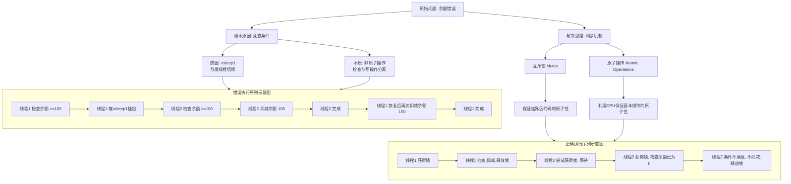
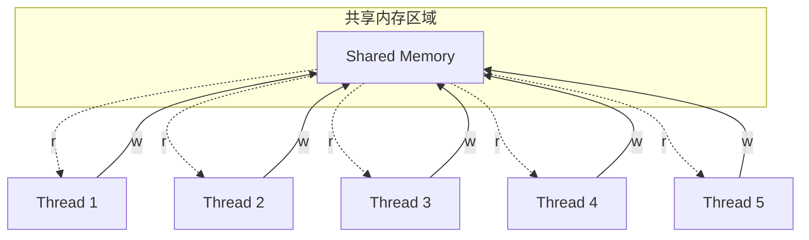
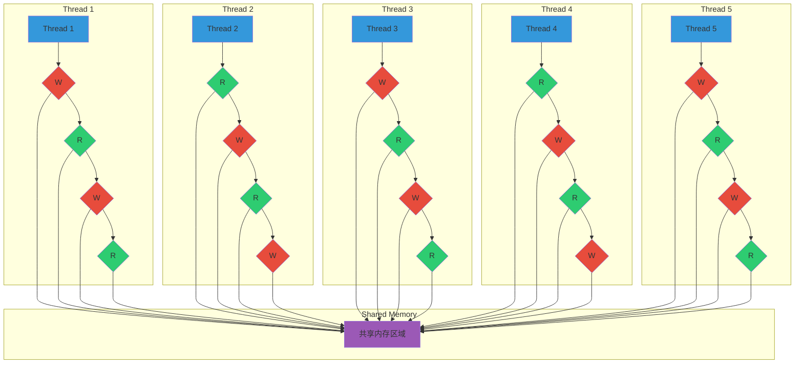
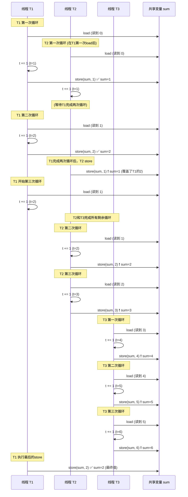

# 2025 南京大学操作系统原理

> 操作系统原理课程学习笔记
> 包括*软件安装，环境配置，运行命令，专有名词，基本概念*等。

[toc]

---
## 13. 多处理器编程：从入门到放弃
在UNIX 有了基础的系统调用 API (进程、地址空间、对象访问) 之后随即爆火，新的需求也随之而来，例如进程在 read() 等操作等待 I/O 时可能还可以同时完成其他任务，以及硬件逐渐有了多个 CPU 处理器……进程级的并行显得有些 “不太够用”。我们需要一个新的机制，能让多个执行流共享内存——于是就有了线程。

**本讲内容**：多线程编程模型、线程库，以及现代多处理器系统上的并发编程为什么困难。

---
## 13.1 入门：共享内存线程模型与线程库

```c
void http_server(int fd) {
    while (1) {
        nread = read(fd, buf, 1024);
        handle_request(buf, nread);
    }
}
```
**如果 buf 到来的时间不确定？**
- 瞬间有大量请求到来
    - 代码等 handle_request 完成才读取下一个请求
    - 如果系统里有多个 CPU，这就更浪费了
- 我们想要有<span style="color:#4169E1">共享内存的进程</span>

---
### 解决方法：加一个操作系统 API
**C 程序的状态机模型**
- 初始状态：main(argc, argv, envp)
- 状态迁移：执行一条语句 (指令)

**<span style="color:#4169E1">多线程程序</span>的状态机模型**
- 增加一个特殊的系统调用：spawn()
    - 增加一个 “状态机”，有独立的栈，但共享全局变量
- 状态迁移：选择一个状态机执行一条语句 (指令)
    - Let's do it with model checker

---
### 并发 v.s. 并行
**并发**
- 逻辑上的 “同时执行”
    - 可以由操作系统/运行库模拟出的 “轮流执行”
    - (也可以是真正同时执行)

**并行**
- 真正意义上的 “同时执行”
- 有 (共享内存的) 多个处理器
    - 同时执行指令 (load/store 访问共享内存)

>程序并行一定是并发的。并行可能是交替的交错的。并行是并发的一种特殊（且理想）的实现方式。

---
### 多处理器编程：入门
**简化的线程 API (thread.h)**
- `spawn(fn)`
    - 创建一个入口函数是 `fn` 的线程，并立即开始执行
        - `void fn(int tid) { ... }`
        - 参数 tid 从 1 开始编号
- `join()`
    - 等待所有运行线程的返回
        - main 返回默认会 join 所有线程
    - 行为：`while (num_done != num_threads) ;`

---
### 多处理器编程入门，就这么简单
```c
#include <thread.h>

int x = 0, y = 0;

void inc_x() { while (1) { x++; sleep(1); } }
void inc_y() { while (1) { y++; sleep(2); } }

int main() {
    spawn(inc_x);
    spawn(inc_y);
    while (1) {
        printf("\033[2J\033[H");
        printf("x = %d, y = %d", x, y);
        fflush(stdout);
    }
}
```
- 这个程序 “证明” 了全局变量确实是共享的
```bash
# thread-lib
ls
make
./hello
top

ls
ps
pkill hello
```

---
### 更多的问题
**多线程程序真的利用了多处理器吗？**
- 并发确定了，那是不是真并行？

**线程是否具有独立堆栈？**
- 如果是，栈的范围？

**如何用 gdb 单步调试多线程程序？**
- LLM 帮你读过 [The Friendly Manual](https://sourceware.org/gdb/onlinedocs/gdb/Threads.html) 了
- EuroSys 时的对话：System 人最擅长的就是底层工具的使用，曾经是 “做 system” 的壁垒；但现在有 LLM 了，这都不算什么了

>提问比阅读更重要！！！
```bash
# thread-example
# 定义 TLIB_PATH（根据您的实际路径修改）makefile
TLIB_PATH := /mnt/e/2025/learn/VS\ Code/2025\ 南京大学操作系统原理/13.\ 多处理器编程：从入门到放弃/thread-lib

ls
make &&  ./test_shm

# test_stack.c
./test_stack
./test_stack | sort -n -k 3
8192 KB = 8M KB
gdb test_stack
layout src
b probe
r
n
info proc mappings
python3
>>> 0x800000 / 1024 / 1024
8.0 
>>> 0x1000 / 1024
4.0

# 0x1000 red zone
# 0x800000
# 0x1000 red zone
```

---
>**最小线程库**：在这个 “最简” 的线程库中，我们封装了 POSIX 线程库，提供了线程管理的 API：spawn(fn) 创建一个新线程，执行函数 fn；join() 等待当前运行的线程结束。使用这两个 API，我们就可以利用系统中的多处理器资源了：线程可以被同时调度到不同的处理器上并行执行。

>**通过线程库理解线程行为**：我们可以不必 “直接接受” 老师或书本上的知识，而是亲手验证它们，例如线程的确是共享内存的，再比如验证每个线程都有独立的栈——我们可以把 “访问过” 的栈空间标记出来，从而得到每个线程栈的大概范围。

在我们的 thread.h 是用 POSIX Threads (pthread) 实现的。pthread 支持配置线程栈、将线程从 main 函数中 “分离” 出去，不在 main 返回后被杀死等功能，[手册](https://www.man7.org/linux/man-pages/man7/pthreads.7.html)包含了它的功能。Linux 操作系统提供了 clone() 等系统调用实现 POSIX Threads API。

---
### 13.2 放弃 (1)
💡**并发编程确实有诸多好处**
那么，代价是什么呢？代价就是我们需要重新理解 “编程”。

### 放弃 (1)：状态迁移的确定性
---
### 确定性的丧失
**虚拟化使进程认为<span style="color:#4169E1"> “世界上只有自己”</span>**
- 除了系统调用，程序的行为是 deterministic 的
    - 初始状态 (argv, envp) 一样、syscall 行为一样，程序无论运行多少次，结果都是一样的

**<span style="color:#4169E1">并发打破了这一点</span>**
- 并发程序每次 non-deterministically 选一个线程执行
    - 这意味着 load 可能读到其他线程的 store (也可能不)
- 非确定性的程序理解起来相当困难

---
### 确定性的丧失：例子
```c
unsigned int balance = 100;

int T_alipay_withdraw(int amount) {
    if (balance >= amount) {
        balance -= amount;
        return SUCCESS;
    } else {
        return FAIL;
    }
}
```
两个线程并发支付 ¥100 会发生什么 (代码演示)

- 账户里会多出用不完的钱！
- Bug/漏洞不跟你开玩笑：Mt. Gox Hack 损失 650,000 BTC
    - 时值 ~$28,000,000,000

```bash
# alipay
# 定义 TLIB_PATH（根据您的实际路径修改）makefile
TLIB_PATH := /mnt/e/2025/learn/VS\ Code/2025\ 南京大学操作系统原理/13.\ 多处理器编程：从入门到放弃/thread-lib

make && ./alipay
# balance = 0
usleep(1);
make && ./alipay
# balance = 18446744073709551516
# assert(balance >= amount)

去掉usleep(1), 99
while true
    ./alipay
end

while true; do ./alipay; done # bash

```
[附录：alipay](#附录：alipay) <a id="alipay"></a>



---
### 真实的例子：Diablo I (1996)
**在捡起物品的瞬间拿起 1 块钱……**

---
### 你发现 1 + 1 都不会求了……
**计算 1+1+1+…+1**
- 共计 2n 个 1，分 2 个线程计算
```c
#define N 100000000
long sum = 0;

void T_sum() { for (int i = 0; i < N; i++) sum++; }

int main() {
    create(T_sum);
    create(T_sum);
    join();
    printf("sum = %ld\n", sum);
}
```
- 会得到怎样的结果？
```bash
# 定义 TLIB_PATH（根据您的实际路径修改）makefile
TLIB_PATH := /mnt/e/2025/learn/VS\ Code/2025\ 南京大学操作系统原理/13.\ 多处理器编程：从入门到放弃/thread-lib

ls
make && ./sum
# sum = 114777113
# 2*n = 200000000
```

---
### 失去确定性的后果
**并发执行三个 T_sum，sum 的最小值是多少？**
- 初始时 sum = 0; 假设单行语句的执行是原子的
```c
void T_sum() {
    for (int i = 0; i < 3; i++) {
        int t = load(sum);
        t += 1;
        store(sum, t);
    }
}
```
- deepseek-r1 & o3-mini: 3
    - 即便给 “还有更小的” 的提示，r1 和 o3-mini 都在非常长的思考后……还是给出 3

T1先完成两次循环，T2在T1第一次load(sum)后load(sum),在T1完成两次循环后store一次循环，然后在T1第三次循环时，T2，T3先完成所有循环，最后T1 store sum = 2

[附录：sum的最小值](#附录：sum的最小值) <a id="sum的最小值"></a>

```bash
# sum-model
第五章mosaic文件夹
ls
mosaic/mosaic.py -c sum.py | mosaic/collect.py
# sum = 2⏎ 
# sum = 3⏎ 
# sum = 4⏎ 
# sum = 5⏎ 
# sum = 6⏎ 
# sum = 7⏎ 
# sum = 8⏎ 
# sum = 9⏎ 
# |V| = 92565, |E| = 333826.
# There are 8 distinct outputs.
```

---
### 答案到底是多少呢？
Model Checker: sum = 2
- 注意不是 1 (因为循环了 3 次)
- ([Trace recovery is NP-Complete](https://epubs.siam.org/doi/10.1137/S0097539794279614).)

**“数学视角” 的价值**
- Nondeterminism 对人类来说是<b style="color:#4169E1">本质困难</b>的
- <b style="color:#4169E1">证明</b>才是解决问题的方法
    - ∀ 线程调度，程序满足 XXX 性质

---
### 确定性的丧失：后果
**正确实现并发 1 + 1 比想象中困难得多**
- 1960s，大家争先在共享内存上实现原子性 (互斥)
- 但几乎所有的实现都是<b style="color:#4169E1">错的</b>
    - 直到 [Dekker's Algorithm](https://en.wikipedia.org/wiki/Dekker%27s_algorithm)，还只能保证两个线程的互斥

**并发影响了计算机系统世界中的一切**
- libc 里的函数还能在多线程程序里调用吗？
- 我们都知道 printf 是有缓冲区的 (fork 的例子)
    - 两个线程同时执行 buf[pos++] = ch 很危险
    - man 3 printf

`Thread safety`

---
>**山寨支付宝**：由于线程调度可能随时随地发生，人类并不擅长理解它们的行为。与其他的编程语言特性联系在一起，就可能产生糟糕的后果——尤其是在有 undefined behavior 的编程语言 (例如 C/C++) 中，可能导致诸多安全漏洞。

>**并发 1 + 1**：如果两个线程，每个线程都执行 N 次 sum++，最终会得到什么结果？即便我们强制使用一条汇编指令完成 sum++，依然无法保证最终得到 2N 的结果。在共享内存上实现并发控制是一个相当困难的问题。

>**建模理解并发求和**：原本这是一道期中测验题——我们要求同学们给出一个合法的线程调度，它输出最小的 sum 值。Online Judge 显示，几乎没有同学第一次就构造出正确的调度：通常 Wrong Answer 若干次后才能意识到 sum 可能有更小的值。

---
## 13.3 放弃 (2)
### 放弃 (2)：代码按顺序执行

---
### 让我们来看看编译器
**虚拟化：进程只需要看到自己和操作系统**
- Determinism: 除了系统调用，没人能 “干涉” 程序的状态

**编译器：按照 “系统调用” 优化程序**
- <b style="color:#4169E1">语句/指令不需要按程序声明的那样执行</b>
    - 典型的优化：死代码消除 (dead code elimination)
- 只要保证优化前后的程序在系统调用层面上等价，可以任意调换/删除语句
    - <b style="color:#4169E1">但这和 non-determinism 是矛盾的</b>
        - load 可能会读到来自其他线程写入的值
        - 如果依赖这个假设编程，编译器会教你做人的 😊

---
### 一个聪明的例子
```c
while (!flag);
```
- 这样就可以实现线程的等待了
- “等另一个线程举起旗子，我再继续”？

#### <span style="color:#4169E1">聪明，但不如编译器聪明 😭</span>
- 如果这是个顺序程序，编译器可以做什么优化？
    - (这甚至也是一个常见的并发 bug 模式)
    - “[Ad hoc synchronization considered harmful](https://www.usenix.org/conference/osdi10/ad-hoc-synchronization-considered-harmful)”
```c
while (!flag)

int t = flag;
while (t);

if (flag) {
} else {
    while(1);
}
```

---
### 求和 (再次出现)
```c
#define N 100000000
long sum = 0;

void T_sum() { for (int i = 0; i < N; i++) sum++; }

int main() {
    create(T_sum);
    create(T_sum);
    join();
    printf("sum = %ld\n", sum);
}
```
如果添加编译优化？
* -O1: 100000000 (n) 😱😱
* -O2: 200000000 (2n) 😱😱😱

```bash
# sum
CFLAGS: -O1 -O2
make && ./sum
```
---
### 编译器做了什么？
**T_sum 的行为是对 sum 做 n 次自增**
- 等价的改写 1
    - t = <b style="color:#4169E1">load</b>(sum);
    - while (n--) t++;
    - <b style="color:#4169E1">store</b>(sum, t);
- 等价的改写 2
    - t = <b style="color:#4169E1">load</b>(sum);
    - <b style="color:#4169E1">store</b>(sum, t + n);
- 编译优化假设 determinism 是绝对必要的
    - 否则程序的性能就不能看了

```bash
objdump -d sum | less
/T_sum

python3 
>>> 0x5f5e10
100000000
```

---
### 控制编译器优化的行为 🌶️
**方法 1：插入 “不可优化” 的代码块**
```c
while (!flag) {
    asm volatile ("" ::: "memory");
}
```
**方法 2：标记变量 load/store 为不可优化**
```c
int volatile flag;
while (!flag);
```
**以上都<b style="color:#4169E1">不是</b>《操作系统》课推荐的方法**
- <b style="color:#4169E1">Don't play with shared memory.</b>

>`volatile`的​​核心作用​​是​​防止编译器优化​​，确保内存访问的​​可见性​​和​​顺序性;它​​不是​​线程同步的万能药，​​不保证操作的原子性​​。对于复杂的共享数据操作，仍需使用锁或原子变量

---
>**并发 1 + 1**：如果两个线程，每个线程都执行 N 次 sum++，最终会得到什么结果？即便我们强制使用一条汇编指令完成 sum++，依然无法保证最终得到 2N 的结果。在共享内存上实现并发控制是一个相当困难的问题。

---
## 13.4 放弃 (3)
### 放弃 (3)：全局的指令执行顺序

---
### 并发程序的状态机模型
**状态迁移：选择一个<span style="color:#4169E1">线程</span>执行一条指令**
- Shared memory 会 “立即写入”、“立即读出”
- 因此存在一个全局的指令执行顺序


[附录:多线程](#附录：多线程) <a id="多线程"></a>

---
### 但这只是过度简化的幻觉 🌶️
**Reading: [Memory Models](https://research.swtch.com/mm) by Russ Cox**
- 多处理器系统很努力地维护这个幻觉
- 但这个幻觉是靠不住的 (想象我们在星球之间传递数据)
    - Non-Uniform Memory Access 甚至是分离的核心

```bash
sudo apt install numactl
numactl --hardware
```

---
### 真实的状态机模型
**为了性能：“宽松内存模型” (relaxed memory model)**
- Store 写入 local memory (cache)，再慢慢同步给其他处理器
- 允许 load 读到 local memory (cache) 的旧值

---
### 一个 “无序” 的真实世界 🌶️
**共享内存导致了 “乱序”**
- Store 对其他处理器可见的时间点可能不同

**处理器内部也会 “乱序”**
- 对同一个地址的 store/load 允许 bypass
- 不同地址的 load/store 允许重排
    - “乱序执行” (out-of-order execution): 现代高性能处理器最值得骄傲的特性之一
    - 处理器也是编译器 😂

---
### 观测 “无序” 带来的后果 🌶️
```C
int x = 0, y = 0;

void T1() {
  x = 1; int t = y; // Store(x); Load(y)
  __sync_synchronize();
  printf("%d", t);
}

void T2() {
  y = 1; int t = x; // Store(y); Load(x)
  __sync_synchronize();
  printf("%d", t);
}
```
**Model Checker: 01 10 11**
- 实际：00 (????)

```bash
# mem-model
mosaic/mosaic.py -c sc.py | mosaic/collect.py
01
10
11
|V| = 60, |E| = 69.
There are 3 distinct outputs.

./test-rmo | head -n 100000 | sort | uniq -c # 100次结果排序+统计
# 25 0 0 
# 59 0 1 
# 16 1 0 

#   25798 0 0 
#   63903 0 1 
#   10297 1 0 
#       2 1 1 
```

---
### 观测 “无序” 带来的后果 (cont'd) 🌶️
**CPU 设计者面临了难题**
- 更有序的内存模型 = 更糟糕的性能，但更容易编程
- x86：市面 “最强” 内存模型 (类比 ARM/RISC-V)
center

**因此，在 ARM 上模拟 x86 是个世界性的难题**
- [Apple cheated](https://github.com/saagarjha/TSOEnabler)! M1 可以把自己 “配置” 成 x86-TSO

---
### 共享内存 x 地址空间 🌶️
**《计算机系统基础》里还学过一个东西叫 TLB**
- Translation Lookaside Buffer
- 存储了虚拟地址到物理地址的映射
    - 每条指令执行都会访问 TLB
    - (因为 M[PC] 是虚拟机地址)

**如果我 munmap/mprotect 改变一段内存？**
- 有另外一个线程在另一个 CPU 上执行
    - 内存都没了，它还在执行？
    - “TLB shootdown”

---
>内存模型：我们简化理解多处理器的状态机模型时假设了每次选择一个处理器执行一条指令。然而，由于动态指令调度和缓存的共同作用，实际程序的运

---
## 13.4 总结
　　**Take-away Messages**: 至此，我们终于完全展示了逐层抽象的计算机系统世界：
- 硬件向上提供了指令集体系结构
- 基于指令集，实现了操作系统 (对象、系统调用 API 和 initramfs 定义的初始状态)
- 操作系统上面支撑了系统工具 (coreutils, shell, apt, gcc, ...)
- 系统工具上面才是各式各样的应用程序

实际上，我们看到的计算机系统中的一切都是由应用程序 “完成” 的，操作系统只是提供系统调用这个非常原始的服务接口。正是系统调用 (包括操作系统中的对象) 这个稳定的、向后兼容的接口随着历史演化和积累，形成了难以逾越的技术屏障，在颠覆性的技术革新到来之前，另起炉灶都是非常困难的。

---
<a id="附录：多线程"></a>

## 附录：多线程读写共享内存示意图

[返回](#多线程)



## 图例说明
- **蓝色矩形**: 线程
- **紫色矩形**: 共享内存
- **红色菱形**: 写操作(W)
- **绿色菱形**: 读操作(R)
- **箭头**: 操作流向

## 操作序列
- Thread 1: W → R → W → R
- Thread 2: R → W → R → W
- Thread 3: W → R → W → R
- Thread 4: R → W → R → W
- Thread 5: W → R → W → R

所有操作都指向共享内存区域，表示线程通过读写操作与共享内存交互。

---
<a id="附录：alipay"></a>

## 附录：没有usleep(1)为啥能正确输出？并发bug发生是随机的吗

[返回](#alipay)

你提出了一个非常好的问题，这触及了并发编程中一个关键且反直觉的特性。

## 为什么没有 `usleep(1)` 时可能"正确"输出？

当没有 `usleep(1)` 时，程序**不一定**总能正确输出，它只是**有可能**在某些运行中表现出"正确"的行为。这是因为：

1. **线程执行速度极快**：现代CPU执行一条指令只需要几纳秒，而检查条件 `balance >= amount` 和执行 `balance -= amount` 都是非常快速的操作。

2. **线程调度的时间尺度**：线程切换（上下文切换）通常发生在毫秒级别（1-10ms），而你的代码关键区域执行时间可能只有几十或几百纳秒。

3. **可能的执行顺序**：
   - 在一种幸运的情况下，第一个线程可能在这极短的时间内完成了全部操作（检查、扣款），然后第二个线程才开始执行
   - 当第二个线程检查余额时，余额已经是0，所以它不会执行扣款操作
   - 结果：余额 = 0，看起来"正确"

## 并发bug是随机的吗？

**是的，并发bug本质上是随机和非确定性的**。这是因为：

1. **线程调度不确定性**：操作系统线程调度器的行为是不确定的，它受到许多因素影响：
   - 系统负载（其他运行的程序）
   - CPU核心数量
   - 中断和系统事件
   - 甚至硬件特性

2. **时间敏感竞态条件**：你的bug属于"时间敏感的竞态条件"，它的出现取决于两个线程执行特定操作的相对时机。

3. **难以重现**：这正是并发bug难以调试的原因 - 它们可能在一千次运行中出现一次，但在重要的演示中必然出现（根据"墨菲定律"）。

## 演示不确定性的实验

你可以通过多次运行程序来观察这种不确定性：

```bash
# 编译程序
gcc -o bank bank.c -lpthread

# 多次运行观察结果
for i in {1..20}; do
    echo "Run $i: $(./bank)"
done
```

在某些运行中你可能看到 `balance = 0`，在其他运行中可能看到 `balance = -100`。

## 关键结论

1. **没有竞争条件保护的程序行为是不可预测的**，即使它有时看起来"正确"
2. **`usleep(1)` 并没有引入bug**，它只是通过增加线程切换的可能性，使得原本就存在的bug更容易显现
3. **真正的解决方案**是使用适当的同步机制（如互斥锁），确保检查余额和扣款操作成为一个原子操作

这就是为什么在多线程编程中，不能依赖测试时"看起来工作正常"就认为代码是正确的 - 你必须使用正确的同步原语来保证代码的正确性。

---
<a id="附录：sum的最小值"></a>

## 附录：并发执行三个 T_sum，sum 的最小值是多少？

[返回](#sum的最小值)

你描述的这个多线程执行顺序非常具体，它展示了并发编程中一个典型的**竞态条件（Race Condition）** 案例。通过下面这张时序图，我们可以清晰地看到各线程是如何交错执行的，以及最终 `sum` 为何为 2。



### 🧠 关键步骤解读与竞态条件分析

这个执行序列中，`sum` 的最终值是 **2**，而不是理想的 **9**（3个线程 × 3次循环）。原因在于多个线程在没有同步的情况下读写共享变量，导致了**更新丢失**。图中用 ✅ 表示有效的计数递增，用 ❗ 表示因覆盖而丢失的递增。

1.  **T1 的领先与 T2 的读取**：T1 率先完成两次循环，将 `sum` 依次更新为 1 和 2。但在 T1 第一次 `load` 后，T2 也执行了 `load`，**读取到了旧值 0**。这意味着 T2 的第一次循环基础值就是 0。
2.  **T2 的覆盖**：在 T1 将 `sum` 更新为 2 后，T2 才将其第一次循环的结果 `store`。由于 T2 是基于 0 计算的，它写入了 1，**意外地将 `sum` 从 2 覆盖回 1**。这是一次明显的更新丢失。
3.  **T1 第三次循环的读取**：T1 开始第三次循环时执行 `load`，此时 `sum` 是 1（很可能是因为 T2 的覆盖），因此 T1 读取到 1，计算得 `t=2`。
4.  **T2 和 T3 的全力冲刺**：在 T1 执行第三次循环的 `load` 后、`store` 前，T2 和 T3 完成了它们所有的循环。在此期间，`sum` 的值被它们多次修改（可能先被 T2 增加到 2，然后到 3，最后 T3 将其一路增加到 6）。
5.  **T1 的最终覆盖**：**最关键的一步**，T1 最后执行其第三次循环的 `store` 操作，将本地计算好的 `t=2` 写入 `sum`。这个操作**完全覆盖了 T2 和 T3 所有努力的结果**，将 `sum` 的最终值设定为 2。

### ⚠️ 并发编程的启示：为何需要同步机制

这个例子直观展示了**竞态条件**的危害：**多个线程对共享资源（这里是 `sum`）的读写顺序是不确定的**，最终结果依赖于线程执行的精确时序。即使每次操作是原子的，但“读-改-写”整个组合操作并非原子，中间可能被插入其他线程的操作。

要保证结果的正确性（即 `sum` 最终为 9），必须通过**同步机制**确保每个线程的“读-改-写”操作成为一个**不可分割的原子操作**。常用方法包括：

*   **互斥锁 (Mutex)**：在操作 `sum` 的代码块前后加锁和解锁，保证同一时间只有一个线程能执行该代码块。
*   **原子操作 (Atomic Operations)**：使用编程语言提供的原子类型（如 C++ 的 `std::atomic<int>`），这些类型通常直接提供原子的 `fetch_add` 等指令，性能往往更高。

希望这个图示和解释帮助你彻底理解了这个问题！多线程编程需要细心处理同步问题。

--- 
## x86 ARM APPLE
理解x86、ARM和苹果芯片（如M系列）在内存模型和一些核心设计上的区别，对把握当前计算设备特性很有帮助。下面我将通过一个表格汇总它们的主要区别，然后进行解释。

| 特性维度         | x86 (由Intel/AMD主导)                                  | ARM (架构设计, 由多家公司使用)                          | 苹果芯片 (Apple Silicon, 如M1/M2)                          |
| :--------------- | :----------------------------------------------------- | :----------------------------------------------------- | :--------------------------------------------------------- |
| **内存模型**       | **强内存序 (TSO - Total Store Order)**  | **弱内存序 (Weakly Ordered)**           | 基于ARM架构，故为**弱内存序**                                     |
|                  | 默认情况下指令重排序较少，尤其对`Store-Store`, `Load-Load`, `Load-Store`顺序保持较好 | 默认允许更多的指令重排序（如`Load-Load`, `Load-Store`, `Store-Store`, `Store-Load`）以提升性能 | 基于ARM架构，故默认允许更多指令重排序                               |
|                  | 主要允许`Store-Load`重排序                      | 需开发者**显式使用**内存屏障（如`DMB`）或原子操作的**Acquire/Release**语义保证顺序 | 需开发者**显式使用**内存屏障或原子操作的**Acquire/Release**语义保证顺序       |
| **指令集架构 (ISA)** | CISC (复杂指令集)                  | RISC (精简指令集)                  | 基于ARMv8-A或更新版本的**RISC**指令集，苹果有**自定义扩展**       |
| **典型代表**       | Intel Core i9, AMD Ryzen                           | 高通骁龙, 联发科天玑, 亚马逊Graviton                      | Apple M2, M2 Pro, M2 Max                              |
| **性能特点**       | **绝对峰值性能高**，长期主导高性能桌面和服务器市场     | **能效比高**，在移动和嵌入式市场占主导     | **能效比极佳**，在特定应用（如媒体处理、机器学习）性能表现惊人       |
| **内存设计**       | 传统分离式设计，CPU通过内存控制器访问外部独立内存               | 多种实现，常见为通过总线访问外部内存                         | **统一内存架构 (UMA)**：CPU和GPU共享同一片物理内存            |
| **主要应用场景**     | 台式机、笔记本电脑、高性能服务器、工作站             | 智能手机、平板电脑、物联网设备、嵌入式系统、渐进的服务器市场 | MacBook, iMac, Mac Studio, iPad Pro                    |
| **生态与授权**      | **封闭**，主要由Intel和AMD两家公司控制              | **开放授权**，Arm公司将IP授权给众多芯片设计公司        | **苹果自用**，基于ARM架构授权进行**深度定制**，不对外销售          |

---

### 💡 详解“最强”内存模型与区别

#### 🔍 x86的“强”内存序 (TSO)
表格中提到x86采用**TSO (Total Store Order) 内存模型**，相对“强”。这意味着：
*   **指令执行顺序**与**程序代码顺序**的一致性更高，尤其在写操作（Store）之间、读操作（Load）之间以及读后写。这主要限制了`Store-Load`类型的重排序。
*   **对开发者更友好**：在x86上编写多线程程序，有时可能**不需要**显式地插入大量内存屏障（Memory Barrier）指令就能保证正确的执行顺序，降低了并发编程的一些复杂性。
*   **性能权衡**：“强”序虽然简化了编程，但在某些场景下可能限制了处理器和编译器优化的空间，潜在地牺牲了一些性能。x86主要通过**写缓冲区（Store Buffer）** 等设计来缓解由此带来的性能开销。

“最强”通常是在**对比ARM和RISC-V默认的“弱”内存序**时而言的。弱内存序为编译器和处理器的优化提供了更大空间，但要求开发者在需要严格顺序时必须**显式地**使用内存屏障（如ARM的`DMB`指令，RISC-V的`FENCE`指令）或具有特定内存序语义的原子操作（如C++中的`std::memory_order_acquire` 和 `std::memory_order_release`）来强制排序，否则可能出现意想不到的行为。

#### 🍎 苹果芯片的特殊之处
苹果的M系列芯片是**基于ARM架构**的，因此它也继承了ARM的**弱内存模型**。开发者同样需要注意内存顺序问题。

苹果芯片的独特之处在于其**统一的内存架构（UMA）**：CPU、GPU和其他处理单元共享同一块物理内存。这样做的主要好处是：
*   **避免复制**：数据不需要在CPU和GPU的内存空间之间来回拷贝，提升了效率。
*   **简化编程**：对开发者来说，内存管理模型更简单。
*   **高带宽**：得益于先进的封装技术，访问内存的带宽非常高。

#### ⚖️ 总结对比

*   **x86 (Intel/AMD)**：**强内存序(TSO)**、**复杂指令集(CISC)**、**高性能**（尤其持续高性能输出），主导传统PC和服务器市场。其强大的生态和向后兼容性是巨大优势。
*   **ARM (授权架构)**：**弱内存序**、**精简指令集(RISC)**、**高能效**，主宰移动和嵌入式领域，并不断向服务器、笔记本电脑（如苹果Mac和高通骁龙本）等领域扩张。其开放授权的模式催生了多样化产品。
*   **苹果芯片 (Apple Silicon)**：采用ARM的**弱内存序**和**RISC**基础，但通过**极致的软硬件垂直整合**（如自定义核心设计、统一的内存架构、专用的神经网络引擎等），在特定的产品线（Mac, iPad）上实现了**出色的能效比和性能体验**。

希望以上解释能帮助你更好地理解它们的区别。

---
好的，作为一名芯片架构师，我很乐意为你深入浅出地解释 x86、ARM 和 Apple 的区别。我们将从一个简单的比喻开始，然后逐步深入技术细节。

### 核心概念一句话总结

*   **x86 和 ARM** 是两种不同的 **“语言”** 或 **“设计图纸”**（指令集架构，ISA）。
*   **Apple Silicon** 是使用其中一种“语言”（ARM），并基于该“图纸”自己设计和建造的 **“超级跑车”**（具体芯片产品）。

---

### 第一部分：用一个比喻让你彻底明白

想象一下建造房屋：

1.  **x86**：像一套非常**详细、复杂的施工手册**（CISC）。手册里有很多特定的指令，比如“砌一面带窗户的承重墙”。指令很强力，但手册本身很厚重，工人需要更长时间来理解和执行每条复杂的指令。
    *   **结果**：可以建出非常强大、功能复杂的房子（高性能服务器、游戏PC），但**耗材多、耗电高**。

2.  **ARM**：像一套**简单、基础、模块化的施工手册**（RISC）。手册里只有“砌砖”、“抹灰”、“安装窗框”等最基础的指令。每条指令都非常简单，执行速度极快。
    *   **结果**：工人（CPU核心）效率很高，用电很省。你可以根据需要，快速搭建很多种不同的小型、高效的房子（手机、手表、物联网设备）。**省电、高效**是其核心优势。

3.  **Apple Silicon (M1/M2/M3 芯片)**：**一个顶级建筑公司（Apple）**，它购买了 **ARM 的简单施工手册**（授权了ARM指令集）。但它并不直接照搬手册，而是：
    *   自己**设计更高效的工人和工具**（自研CPU/GPU核心）。
    *   自己**优化整个施工流程**（软硬件协同设计）。
    *   把**水管、电路、花园**都集成在同一块地基上（SoC系统级芯片设计）。
    *   **结果**：它用省电的“ARM方法”，最终却建出了堪比甚至超越“x86复杂方法”建造的**豪华摩天大楼**（高性能台式机、工作站），同时还能保持极低的能耗。

**这个比喻的精髓在于：Apple Silicon 的成功不在于它用了什么“语言”（ARM），而在于它作为一个“建筑师”的顶级设计能力。**

---

### 第二部分：深入解析三种技术

#### 1. x86：高性能领域的传统霸主

*   **出身**：由英特尔（Intel）创立，源自1978年的Intel 8086处理器，因此得名。
*   **技术特点**：**CISC（复杂指令集计算机）**。
    *   指令集庞大且复杂，单条指令可以完成更多工作。
    *   硬件逻辑复杂，负责将复杂指令解码为更简单的微操作（μOps）。
    *   追求极高的单线程性能和绝对性能。
*   **商业模式**：主要由**英特尔**和**AMD**两家公司设计、制造和销售。
*   **优势**：
    *   **性能强大**：在绝对计算能力上长期领先。
    *   **生态成熟**：数十年来积累了海量的软件（Windows程序、游戏等），兼容性不是问题。
*   **劣势**：**功耗高**。为了高性能，晶体管数量多，漏电和发热问题更显著。
*   **典型设备**：大多数Windows/ Linux台式机、笔记本电脑、服务器、游戏主机（PS5/Xbox使用AMD的x86芯片）。

#### 2. ARM：高能效比的移动之王

*   **出身**：由ARM公司（原名Acorn RISC Machine）设计。**ARM公司本身不制造芯片**。
*   **技术特点**：**RISC（精简指令集计算机）**。
    *   指令集精简、长度固定，每条指令只执行一个基本操作。
    *   解码和执行效率极高，完成同样工作所需的指令数可能更多，但执行速度更快。
    *   核心设计理念是**能效比**（Performance per Watt）——用最少的电干最多的活。
*   **商业模式**：**IP授权**。ARM公司将设计蓝图（架构）授权给其他公司，如苹果、高通、三星等。这些公司再根据自己的需求设计芯片。
*   **优势**：
    *   **功耗极低**：天生为电池供电设备而生。
    *   **灵活性高**：客户可以购买标准设计（Cortex-A系列核心），也可以像苹果一样，只购买指令集授权，进行完全自研。
*   **劣势**：在传统领域（如PC），软件生态不如x86成熟（但正在快速改变）。
*   **典型设备**：**几乎所有的智能手机**（iPhone、安卓机）、平板电脑、智能手表、物联网设备、树莓派。

#### 3. Apple Silicon：软硬件一体化的典范

*   **出身**：**苹果公司**自研的芯片系列，包括手机/平板上的A系列芯片和Mac上的M系列芯片。
*   **技术特点**：
    *   **基于ARM指令集**：它“说”的是ARM语言，所以本质上属于ARM生态。
    *   **自研微架构**：苹果只使用了ARM的“基础指令集”，CPU核心（如Firestorm、Icestorm）和GPU核心全是自己设计的，远超ARM公版设计。
    *   **SoC（系统级芯片）设计**：将CPU、GPU、内存、神经网络引擎（NPU）、安全隔区、媒体编码器等所有部件集成在同一块芯片上。这种“统一内存架构”极大提升了数据交换效率。
    *   **极致的软硬件整合**： macOS/iPadOS/iOS 系统与芯片硬件深度协同优化。开发者知道代码最终会运行在有限的几种苹果芯片上，可以做极致优化。
*   **商业模式**：苹果设计，委托台积电（TSMC）等代工厂生产。
*   **优势**：
    *   **惊人的能效比**：在提供媲美甚至超越同期x86芯片性能的同时，功耗和发热量极低，使MacBook获得了革命性的续航能力。
    *   **无缝的生态体验**：为iPhone、iPad、Mac打造统一架构，应用无缝跨设备运行。
*   **典型设备**：**所有苹果产品**—— iPhone, iPad, MacBook Air/Pro, iMac, Mac Studio等。

---

### 第三部分：重要对比表格

| 特性 | x86 (Intel/AMD) | ARM (公版设计) | Apple Silicon |
| :--- | :--- | :--- | :--- |
| **本质** | **一种指令集架构** | **一种指令集架构** | **基于ARM指令集的具体芯片产品** |
| **设计哲学** | CISC (复杂指令集) | RISC (精简指令集) | RISC + 极致的自研与整合 |
| **核心目标** | 巅峰性能 | 能效比 | **极致的性能与能效平衡** |
| **商业模式** | 垂直整合（设计+销售） | IP 授权（只卖蓝图） | 自研（基于ARM授权）+ 代工 |
| **主要玩家** | Intel, AMD | 高通，联发科，三星 | **Apple** |
| **优势** | 绝对性能，软件生态 | 低功耗，灵活性 | 无敌的能效比，软硬件协同 |
| **劣势** | 功耗高，发热大 | 绝对性能传统上较弱 | 封闭生态，只能苹果设备用 |
| **典型场景** | 游戏PC，数据中心 | 智能手机，物联网 | **全线苹果产品** |

### 给初学者的总结与启示

1.  **不是同类型比较**：将x86/ARM与Apple对比，就像是拿“汽油发动机原理”和“法拉利引擎”对比。前者是理论，后者是前者的顶级应用。
2.  **Apple的成功密钥**：Apple Silicon的强大并非因为ARM指令集本身有多神奇，而是源于苹果**顶级的芯片设计能力**和**深度的软硬件一体化整合**。它证明了，只要设计得当，ARM架构完全可以冲击传统x86的高性能领域。
3.  **未来的趋势**：Apple Silicon的成功正在改变整个行业。微软和高通也在合作推动Windows on ARM，其他厂商也在努力模仿苹果的模式。计算世界正在从“x86性能为王”转向“ARM能效优先”的新平衡。

希望这个解释能帮助你清晰地理解它们之间的区别和联系！

---
好的，作为一名专业人士，我很乐意为您解释RISC-V。它会与我们刚才讨论的x86和ARM完美地联系起来。

### 一句话总结

**RISC-V是一个基于RISC原则的、开放、免费的指令集架构。** 你可以把它理解为芯片界的“Linux”——一个开源的、任何人都可以自由使用、修改和贡献的基础设计。

---

### 详细解释

#### 1. 名字的含义

*   **RISC**: 代表“精简指令集计算机”，与我们之前讨论的ARM属于同一哲学阵营，即使用简单、高效、固定的指令。
*   **V**: 代表“第五代”。这是因为它是加州大学伯克利分校开发的第五代RISC项目。它不是一家公司的产品，而是一个源于学术研究的项目。

#### 2. 核心特征：开放与自由

这是RISC-V与x86和ARM**最根本、最重要的区别**。

| 架构 | 商业模式 |
| :--- | :--- |
| **x86** | **完全封闭**：由Intel和AMD私有，其他公司无法使用。你需要获得他们的许可（基本上是买他们的芯片）。 |
| **ARM** | **授权模式**：ARM公司设计蓝图，然后**收费授权**给苹果、高通等公司使用。你可以买现成的设计（架构授权），或者买指令集许可自己设计（更贵）。 |
| **RISC-V** | **开源模式**：其指令集规范是**开放、免费**的。任何公司、大学或个人都可以自由地使用RISC-V来设计、制造和销售芯片，而无需支付任何授权费。 |

这种开放性带来了巨大的优势：
*   **无授权费和版税**：大幅降低芯片设计的门槛和成本。
*   **可定制和可扩展**：用户可以根据特定应用（例如AI、物联网、存储控制器）自由添加自定义指令和扩展，不受制于架构提供者。
*   **透明和安全**：由于指令集是开放的，任何人都可以审查它，理论上避免了隐藏的后门指令。
*   **创新加速**：全球社区（学术界和工业界）都可以为其发展和优化做贡献。

#### 3. 技术特点

作为RISC架构，它与ARM类似：
*   **精简指令集**：指令格式简单、规整，易于解码和执行。
*   **模块化设计**：RISC-V采用模块化的设计理念。它有一个最小的**基础整数指令集**，然后提供一系列标准**扩展**。
    *   例如：`M`扩展提供乘除法指令，`A`扩展提供原子操作指令，`F`和`D`扩展提供单双精度浮点指令。
*   **可配置性**：芯片设计者可以根据应用需求，像搭积木一样选择所需的基础指令集和扩展，实现性能、功耗和面积的最佳平衡。

#### 4. RISC-V vs. ARM vs. x86

让我们用一个比喻来加深理解：

*   **x86** 像是**一门古老而强大的专利语言**，只有两家公司（Intel和AMD）是母语者，其他人必须通过他们才能使用。
*   **ARM** 像是**一门需要付费购买教科书和许可证才能教学的商业语言**。你可以用它来说话（设计芯片），但必须向ARM公司交费。
*   **RISC-V** 像是**一门完全开源的语言**，其语法和词典（指令集）对所有人免费公开。任何人都可以学习它、用它来创作（设计芯片），甚至可以提议为这门语言增加新的词汇（自定义扩展）。

#### 5. 应用与现状

RISC-V正处于高速发展的早期阶段，其应用主要先集中在对定制化、成本敏感的领域，然后逐步向高性能领域渗透。

*   **IoT设备**：物联网设备需要极低的功耗和成本，RISC-V的开源和可定制特性完美契合。
*   **嵌入式系统**：微控制器、传感器、硬盘控制器（Western Digital已大量采用）。
*   **教育领域**：由于其开放性，它已成为计算机体系结构教学的首选平台。
*   **新兴领域**：AI加速器、专用处理器等。
*   **高性能计算**：这是RISC-V的未来目标，一些公司（如Ventana）已经开始设计高性能的RISC-V服务器CPU。

#### 6. 对行业的意义

RISC-V的崛起正在打破由x86和ARM长期主导的处理器市场格局。它为中国、欧洲等希望减少对外部技术依赖的地区和企业提供了一个绝佳的自主可控的技术选择。它代表了处理器领域的一场“开源革命”。

---

### 总结

| 特性 | x86 | ARM | RISC-V |
| :--- | :--- | :--- | :--- |
| **本质** | 指令集架构 | 指令集架构 | **指令集架构** |
| **哲学** | CISC | RISC | **RISC** |
| **商业模式** | 封闭，私有 | 收费授权 | **开源，免费** |
| **主要玩家** | Intel, AMD | Apple, 高通, 三星... | **全球社区，初创公司，学术机构** |
| **优势** | 高性能生态成熟 | 高能效比，移动生态 | **自由，可定制，无许可成本** |
| **核心区别** | **性能** | **能效与生态** | **开放与自由** |

简单来说，**RISC-V不是某一个具体的芯片，而是一套开放的“游戏规则”**。任何人都可以基于这套规则，制造出属于自己的、量身定制的芯片。它是芯片世界一股强大的民主化和创新力量。

---
## `mosaic -c sc.py | collect`
要将 `mosaic/mosaic.py -c sc.py | mosaic/collect.py` 简化为 `mosaic -c sc.py | collect`，核心是让系统能直接识别 `mosaic` 和 `collect` 这两个命令。以下是具体的方法和步骤：

### 🛠️ 简化命令的方法

你可以通过以下几种方式实现命令简化，主要思路是为 `mosaic.py` 和 `collect.py` 创建可执行脚本或链接，并确保系统能找到它们。

| 方法 | 操作步骤 | 优点 | 缺点 |
| :--- | :--- | :--- | :--- |
| **添加PATH** | 将脚本所在目录加入`PATH`环境变量 | 一劳永逸，任何位置都能调用 | 需修改环境变量配置文件 |
| **创建符号链接** | 在系统路径如`/usr/local/bin`创建软链接 | 不修改`PATH`，干净整洁 | 需要sudo权限 |
| **使用别名** | 在shell配置文件中为长命令设置短别名 | 配置简单快捷 | 仅对当前用户生效 |

下面是每种方法的详细操作。

#### 方法一：将脚本目录添加到 PATH 环境变量

这是最直接的方法，通过将包含 `mosaic.py` 和 `collect.py` 的目录（假设是 `mosaic/`）添加到系统的 `PATH` 环境变量中，你就可以在任何位置直接使用 `mosaic` 和 `collect` 命令了。

1.  **确认脚本的完整路径**：假设你的 `mosaic.py` 和 `collect.py` 都位于 `/home/user/mosaic/` 目录下。
2.  **将目录添加到 PATH**：
    *   **临时生效（仅当前终端会话）**：在终端执行：
        ```bash
        export PATH=$PATH:/home/user/mosaic
        ```
    *   **永久生效**：需要将上述命令添加到你的 shell 配置文件中。
        *   对于 Bash，通常编辑 `~/.bashrc` 文件：
            ```bash
            echo 'export PATH=$PATH:/home/user/mosaic' >> ~/.bashrc
            ```
        *   然后运行 `source ~/.bashrc` 使更改立即生效。
3.  **确保脚本有可执行权限**：在简化命令前，确保你的 Python 脚本本身有可执行权限：
    ```bash
    chmod +x /home/user/mosaic/mosaic.py
    chmod +x /home/user/mosaic/collect.py
    ```
4.  **可选：重命名命令（去除.py后缀）**：虽然添加 PATH 后可以直接 `mosaic.py -c sc.py`，但如果你想彻底省略 `.py`，可以创建**符号链接**：
    ```bash
    # 在同一个目录下创建无后缀的符号链接
    ln -s /home/user/mosaic/mosaic.py /home/user/mosaic/mosaic
    ln -s /home/user/mosaic/collect.py /home/user/mosaic/collect
    chmod +x /home/user/mosaic/mosaic /home/user/mosaic/collect # 确保符号链接指向的脚本有可执行权限
    ```
    现在，你就可以使用 `mosaic -c sc.py | collect` 了。

#### 方法二：创建符号链接到系统路径

如果你不想修改 `PATH` 变量，可以将符号链接创建在系统已有的路径中，例如 `/usr/local/bin/`。

1.  为脚本创建符号链接：
    ```bash
    sudo ln -s /home/user/mosaic/mosaic.py /usr/local/bin/mosaic
    sudo ln -s /home/user/mosaic/collect.py /usr/local/bin/collect
    ```
2.  确保原始脚本有可执行权限：
    ```bash
    chmod +x /home/user/mosaic/mosaic.py /home/user/mosaic/collect.py
    ```
    之后，你就可以在任何位置使用 `mosaic -c sc.py | collect` 了。

#### 方法三：使用 Shell 别名 (Alias)

如果只是不想每次都输入长命令，并且简化仅对当前用户生效，设置别名是最快的方法。

1.  编辑 shell 配置文件（如 `~/.bashrc` 或 `~/.bash_aliases`），添加以下行：
    ```bash
    alias mosaic='/home/user/mosaic/mosaic.py'
    alias collect='/home/user/mosaic/collect.py'
    ```
2.  运行 `source ~/.bashrc` 使别名立即生效。
3.  确保脚本有可执行权限。
    这样，你输入 `mosaic -c sc.py | collect`，Shell 会自动替换为完整的命令执行。

### 💡 重要提醒

*   **脚本权限**：无论用哪种方法，**务必确保你的 `mosaic.py` 和 `collect.py` 脚本具有可执行权限**（通过 `chmod +x` 命令）。
*   **脚本解释器**：确保你的 Python 脚本第一行有 **shebang**，例如 `#!/usr/bin/env python3`，这样系统才知道用什么解释器来执行它。
*   **选择哪种方法**：
    *   **添加 PATH** 或**创建系统符号链接**是让命令“全局”可用。
    *   **创建别名**通常更适用于当前用户快速的个性化定制。

### 📌 总结

为了实现 `mosaic -c sc.py | collect` 的简化操作，**通常需要添加 PATH 或创建符号链接**。最推荐的步骤是：

1.  为 `mosaic.py` 和 `collect.py` 添加可执行权限。
2.  将包含它们的目录（或为它们创建的符号链接）添加到 `PATH` 环境变量中，或在系统路径（如 `/usr/local/bin`）中为它们创建符号链接。

这样修改之后，你就可以愉快地使用简短的命令了。