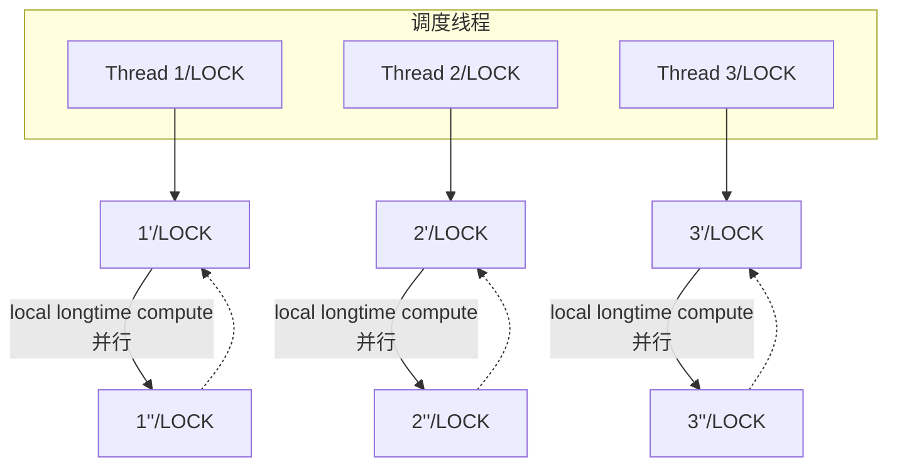
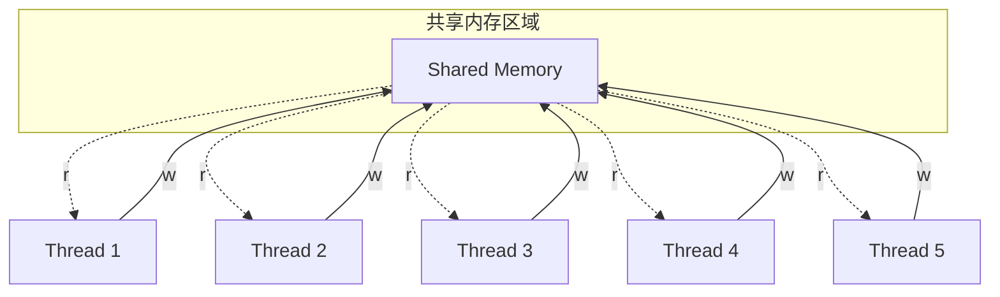

# 2025 南京大学操作系统原理

> 操作系统原理课程学习笔记
> 包括*软件安装，环境配置，运行命令，专有名词，基本概念*等。

[总结](#并发的时候用这个)

[toc]

---
## 14. 并发控制：互斥
线程并发给了我们利用多处理器的能力，同时也带来了 “难编程” 的挑战——当然，这样的问题我们见得也不少，通常通过引入新的编程语言机制，或者是一个新的 API 就能解决问题。

**本讲内容**：基础并发控制：互斥 (mutual exclusion)。

### 多处理器编程：从入门到放弃
**入门：线程库**
- spawn(fn): 创建共享内存的线程 (执行流、状态机)
- join(): 等待线程结束

**放弃：确定性 & 执行顺序 & 全局一致性**
- 人类是 “sequential creatures”
    - 具备 A → … → B 简化为 A → B 的直觉本能
    - 编译器 (处理器也是编译器) 也是这样设计的
- 但是<b style="color:#4169E1">多处理器彻底改变了 “执行” 的含义</b>
    - 任何 load 都可能读到其他线程写入的值
    - 连 1 + 1 都不会实现了，这还怎么玩？

---
### 不要急，我们是来解决问题的
**线程 = 人**
- 大脑能完成局部存储和计算

**共享内存 = 物理世界**
- 物理世界天生并行

**程序 = 状态机**
- C 程序、机器指令、model checker……
- 物理世界也可以用状态迁移来建模


## 14.1 互斥：阻止并发 (并行) 的发生
---
### 总是从简单的问题入手
**1 + 1，够简单了吧**
```c
long sum = 0;

void T_sum() {
    sum++;
}
```
**我们希望有一个 API**
- 无论怎么执行，sum 的求和都是正确的
- 互斥 (互相排斥)：<b style="color:#4169E1">阻止同时的 sum++</b>

---
### Stop the World (cont'd)
```c
long sum = 0;

void T_sum() {
    stop_the_world();
    // ザ・ワールド 状态
    sum++;
    resume_the_world();
}
```
**似乎有些 “overkill”**
- 只要能声明 “不能并发” 的代码块就可以了
- 其他 (和 sum 无关的) 代码还是可以同时执行的

---
### 互斥：阻止并发
```c
lock();
sum++;
// 或者任意代码
unlock();
```
**拟人视角**
- 用 lock/unlock 标记一个代码块
- 所有标记的代码块之间 “mutually exclusive”
    - “一旦我进入标记的代码块，其他人就无法进入”

**状态机视角**
- <b style="color:#4169E1">被标记代码块的执行可以理解为 “一次状态迁移”</b>
    - (当然，这是有条件的)

---
### FAQ: 都不并发了，我们还要线程吗？
**悲观的 Amdahl's Law**
- 如果你有 $1/k$ 的代码是不能并行的，那么
$$
T_\infty > \frac{T_1}{k}
$$

**乐观的 Gustafson's Law (的更细致版本)**
- 并行计算总是能实现的
$$
T_p < T_\infty + \frac{T_1}{p}
$$
- ($T_n$代表 n 个处理器的运行时间)

**ww: 还是能并行部分代码**


---
### 实际生活中的许多计算都是可以并行的
**经典物理：局部性原理**
- <b style="color:#4169E1">物体对相邻物体的影响需要时间</b>
    - (即便[严格来说不成立](https://plato.stanford.edu/entries/bell-theorem/)，依然是一个很好的近似)
- 推论：任何物理世界模拟皆可以大规模并行
$$
T_\infty \ll T_1
$$

**Embarrassingly Parallel 的例子**
- 图书馆 v.s. 分布式数据存储
- 大脑 v.s. 深度神经网络
- NP-Hard 问题的搜索

---
## 14.2 使用共享内存实现互斥
### 互斥：不正确的尝试 (方向)
### Dekker's Algorithm (1965)
>[绕口令](https://series1.github.io/blog/dekkers-algorithm/)：A process P can enter the critical section if the other does not want to enter, otherwise it may enter only if it is its turn.

center

- “[Myths about the mutual exclusion problem](https://zoo.cs.yale.edu/classes/cs323/doc/Peterson.pdf)” (IPL, 1981)

---
### Peterson's Algorithm (1981)
>还是绕口令：A process P can enter the critical section if the other does not want to enter, or it has indicated its desire to enter and has given the other process the turn.

**并发的危险**
- <b style="color:#4169E1">你很难从字面上判断它到底对不对</b>
    - 就像 “ n 个线程循环 m 次，sum 的最小值为 1”
    - 就像 “ n 个线程循环 m 次，sum 的最小值为 2”
    - 就像 “ n 个线程循环 m 次，sum 的最小值为 3”
        - 2025 年的思考模型都做不到……

---
### Peterson's Protocol: 问题重述
**熟悉的仙林校区宿舍厕所……**
- 厕所当然需要<b style="color:#4169E1">互斥使用</b>
- (这厕所也太干净了吧……)

---
### Peterson's Protocol
>有三个变量：你的手、他的手、厕所门。

**如果希望进入厕所，按顺序执行以下操作：**
1. 举起自己的旗子 (store 手)
2. 把写有对方名字的字条贴在厕所门上 (store 门)

**然后进入持续的观察模式：**
- 观察对方是否举旗 (load 手)
- 观察厕所门上的名字 (load 门)
    - <b style="color:#4169E1">对方不举旗或名字是自己，进入厕所，否则继续观察</b>

**出厕所后，放下自己的旗子 (不用管门上的字条)**

---
### 直观解释
**进入厕所的情况**
- 如果只有一个人举旗，他就可以直接进入
- 如果两个人同时举旗，由厕所门上的标签决定谁进
    - 手快 🈶️ (被另一个人的标签覆盖)、手慢 🈚

**一些更细节情况**
- A 看到 B 没有举旗
    - B 一定不在厕所
    - B 可能想进但还没来得及把 “A 正在使用” 贴在门上
- A 看到 B 举旗子
    - A 一定已经把旗子举起来了 (!@^#&!%^(&^!@%#

---
### 我们需要 “绝对正确” 的工程化解决方案
**Model Checker: 自动遍历状态空间的乐趣**
- 先贴标签再举旗，还对吗？
- 如果放下旗子之后 (前) 把门上的字条撕掉，还对吗？
- 观察举旗和名字的顺序交换，还对吗？
- 是否存在 “两个人谁都无法进入厕所”、“对某一方不公平” 等行为？
    - 都转换成图 (状态空间) 上的遍历问题了！

**电脑为什么叫 “电脑”**
- 因为它能替代部分人类的思维活动
- 而且能替代得越来越多 (计算器 → 编程语言 → 大模型)


```bash
ww
# peterson/peterson.py
../../mosaic/mosaic.py -c peterson.py | grep \"cs\" | sort | uniq
        #   "cs": ""
        #   "cs": "❶"
        #   "cs": "❷"
先贴标签再举旗
heap.x = '🏴'
<-->
heap.turn = '❷'
../../mosaic/mosaic.py -c peterson.py | grep \"cs\" | sort | uniq
        #   "cs": ""
        #   "cs": "❶"
        #   "cs": "❶❷"
        #   "cs": "❷"
        #   "cs": "❷❶"

如果放下旗子之后 (前) 把门上的字条撕掉
        heap.y = ''
        sys_sched()
观察举旗和名字的顺序交换 line8<->line10
```
---
### Computer Science 的 “叛逆” 本质
**我们的终极目标就是干掉我们自己**
- 人奸 🤖🚀🔄⚡💻

**每个班上都有一个老师总是夸夸，你曾经暗恋的 Ta**
- Ta：认认真真完成老师作业
    - 工整的笔记，启发了思维，浪费了生命
- 我：烦死了！劳资不干了！玩  去了
    - <b style="color:#4169E1">战略</b>：提出好的问题、适当地分解问题
    - <b style="color:#4169E1">战术</b>：执行过程中使用先进工具替代机械思考
        - 状态空间搜索 + AI 启发式剪枝 (AlphaX)

---
### 回到 Peterson 算法：假设
**做了并发编程中需要 “放弃” 的假设**
1. Load/store 指令是瞬间完成且生效的 ❌
2. 指令按照程序书写顺序执行 ❌
    - (不怪他们，那时候还没有高性能编译器和多核计算机)



**所以……**
- 直接写那么一个 Peterson 算法应该是错的？
    - 我们当然能写个程序试试！


```bash
ww
# peterson/peterson.c
# 定义 TLIB_PATH（根据您的实际路径修改）thread-lib
TLIB_PATH := /mnt/e/2025/learn/VS\ Code/2025\ 南京大学操作系统原理/thread-lib

#define BARRIER
make && ./peterson
# peterson: peterson.c:26: critical_section: Assertion `atomic_fetch_add(&inside, +1) == 0' failed.
# peterson: peterson.c:36: critical_section: Assertion `atomic_fetch_add(&inside, -1) == 1' failed.
# Aborted (core dumped)

#define BARRIER __sync_synchronize()
make && ./peterson
    new terminal
    top
```

---
### 实现正确的 Peterson 算法 🌶️
**Compiler barrier (编译优化屏障)**
- asm volatile("": : :"memory"); 或是 volatile 变量

**Memory barrier (内存屏障)**
- `__sync_synchronize()` = Compiler Barrier +
    - x86: `mfence`
    - ARM: `dmb ish`
    - RISC-V: `fence rw, rw`
- 能够实现<b style="color:#4169E1">单次</b> load/store 的原子性

---
### 而且……上厕所的问题并没有解决……
center

(感谢网友投稿)
<b style="color:#4169E1">智力体操不是我们想要的</b>
- 我们需要 “absolutely correct” 的工程化方案

---
> **Peterson 算法**：Model checker 给了我们探索 Peterson 算法变体的能力：我们可以改变语句执行的顺序等，实现 Peterson 算法的变体，并且由 model checker 给出一个快速的反馈，在反馈的基础上，我们能更快、更好地理解 Peterson 算法的原理。然而，在宽松内存模型上，Peterson 算法既低效又很难实现。直接用 load/store 实现互斥并不是正确的努力方向。
---
## 14.3 使用原子指令实现互斥
### 实现互斥：硬件来帮忙

---
### Peterson 算法的路线错误
**试图在 load/store 上实现互斥**
- 计算机系统是我们造的
    - 我们当然也可以<b style="color:#4169E1">把它改成容易实现互斥的样子</b>
    - 这是 Computer Science 和自然科学的一个很大不同
        - 相当多的游戏规则是我们定的

**软件不好解决的，硬件帮忙**
- 给我一条 “stop the world” 的指令可以吗？

---
### 还真的有这么一条指令
**cli (x86)**
- Clear Interrupt Flag
    - eflags 里有一个 bit 是 IF (0x200)
    - 对于单处理器系统，死循环 = 计算机系统卡死

**csrci mstatus, 8 (RISC-V)**
- Control and Status Register Clear Immediate
    - 同样，清除 mstatus 的 MIE bit

**适用条件**
- 单处理器系统、操作系统内核代码

```bash
# stop-the-world/cli.c
make 
gdb cli
layout asm
starti
si
n
p $eflags
si
# segmentation fault

make debug # 虚拟机运行???
```

---
### 实现线程互斥需要怎样的指令?
**思路**
- 从不正确的代码开始，把我们 “想做到” 的事用指令去做
- 错误原因：if 条件在执行 can_go = ❌ 时已经不成立了
```c
void lock() {
retry:
    if (can_go == ✅) {
        can_go = ❌;  // then function returns
    } else {
        goto retry;
    }
}

void unlock() {
    can_go = ✅;
}
```

---
### 硬件：提供 stop-the-world 的 “小操作”！
**ἄτομος (atomos): “indivisible” 的原子指令**
- 一个 “不被打断” 的 load + 计算 + store
    - x86: Bus Lock (locked instruction)
    - RISC-V: LR/SC & A 扩展
        - 来自 MIPS: Load-Linked/Store-Conditional (LL/SC)
    - arm: ldxr/stxr, stadd (store add) 指令
```c
if (can_go == ✅) {
    can_go = ❌;  // then function returns
}

// movl $✅, %eax
// movl $❌, %edx
// lock cmpxchgl %edx, (can_go)
```
LR: load reserve 

---
### 终于可以实现 1 + 1 了 😂
```c
asm volatile("lock incq %0" : "+m"(sum));
```
center:
486处理器

```bash
ww
# sum-atomic/sum.c
make && ./sum
# sum = 200000000
# 2*n = 200000000
objdump -d sum | less
/T_sum
```

---
### 自旋锁：API 与实现
```c
typedef struct {
  ...
} lock_t;
void spin_lock(lock_t *lk);  // 可以有多组 can_go
void spin_unlock(lock_t *lk);
```
```c
void spin_lock(lock_t *lk) {
retry:
    if (!atomic_cmpxchg(&lk->status, ✅, ❌)) {
        goto retry;
    }
}

void spin_unlock(lock_t *lk) {
    lk->status = ✅;
    __sync_synchronize();
}
```

```bash
ww
# sum-spinlock/sum.c
make
./sum
# Thread 2: sum = 27869820
# Thread 3: sum = 29667170
# Thread 1: sum = 30000000
# sum  = 30000000
# 30*n = 30000000
T         6
make && ./sum
# Thread 2: sum = 55225820
# Thread 5: sum = 56006120
# Thread 1: sum = 56630750
# Thread 3: sum = 58458390
# Thread 4: sum = 59846580
# Thread 6: sum = 60000000
# sum  = 60000000
# 60*n = 60000000

```

---
### Caveat: lock/unlock 是万恶之源 😁
**从设计出这个 API 开始……**
- 人类就走上万劫不复的错误道路了
- 因为 lock 和 unlock 都是<b style="color:#4169E1">程序员负责的</b>
    - <b style="color:#4169E1">写代码的时候就必须清楚地知道什么时间会和谁共享数据</b>
    - 还记得 Tony Hoare 的 billion-dollar mistake 吗？程序员 100% 会花式犯错的！！！
        - 忘记标记代码；在偶然的路径上忘记 unlock (例如：在 lock/unlock 之间 return)；……
```c
T1: spin_lock(&l); sum++; spin_unlock(&l);
T2: spin_lock(&I); sum++; spin_unlock(&I);
```
- 不要笑，🤡 就是你自己


---
> **Stop-the-world 实现互斥**：对于操作系统上的应用程序，关闭中断是不能容忍的：这会使微小的 bug 或是恶意的程序破坏计算机的运行。操作系统正是因为统治了中断，才实现了对应用程序的管理。在操作系统内核的实现中，关闭中断是一个常见的操作。

> **使用原子指令实现求和**：如果我们为 add/inc 等指令增加 lock 的前缀，处理器硬件会实现将这条指令实现为原子指令。

> **使用 cmpxchg 实现自旋锁**：原子的 load-store 可以帮助我们实现：(1) 取出内存中的数值 (2) 写入一个数值，并且指令的执行在多处理器系统上依旧带有 “stop-the-world” 的效果。因此，无论有多少线程同时执行 lock()，仅有一个能获得 UNLOCKED 的数值，从而实现互斥。

---
## 14.4 使用系统调用实现互斥
### 实现互斥：操作系统也来帮忙了！
### 性能的另一个维度：Scalability
> 系统随着需求或负载增加时，依然能够保持性能和稳定性，灵活扩展资源的能力。(另一个角度：在资源增长时，能维持或提升性能的能力)

center

Spinlock 已经可以算是 performance bug 了

Scalability:可扩展性

---
### 自旋锁的 Scalability 问题
**性能问题 (1)**
- 除了获得锁的线程，其他处理器上的线程都在<b style="color:#4169E1">空转</b>
    - “一核有难，八核围观”
    - 如果代码执行很久，不如把处理器让给其他线程

**性能问题 (2)**
- <b style="color:#4169E1">应用程序不能关中断……</b>
    - 持有自旋锁的线程被切换
    - 导致 100% 的资源浪费
    - (如果应用程序能 “告诉” 操作系统就好了)
        - 你是不是想到了什么解决方法？

---
### 线程自己解决不了，就让操作系统来帮忙
**把锁的实现放到操作系统里就好啦**
- syscall(SYSCALL_acquire, &lk);
    - 试图获得 lk，但如果失败，就切换到其他线程
- syscall(SYSCALL_release, &lk);
    - 释放 lk，如果有等待锁的线程就唤醒
- 剩下的复杂工作都交给内核
    - 关中断 + 自旋
        - <b style="color:#4169E1">自旋锁只用来保护操作系统中非常短的代码块</b>
    - 成功获得锁 → 返回
    - 获得失败 → 设置线程为 “不可执行” 并切换

---
<a id="并发的时候用这个"></a>

### pthread Mutex Lock
**与自旋锁完全一致，而且性能足够好**
```c
pthread_mutex_t lock;
pthread_mutex_init(&lock, NULL);

pthread_mutex_lock(&lock);
pthread_mutex_unlock(&lock);
```
**编程的时候用这个就行啦!**
- 没有争抢的时候性能非常好
    - 甚至都不需要 trap 进操作系统内核
- 更多线程争抢时也有相当好的 scalability
    - 这么神奇？

```bash
ww
# sum-mutex/main.c
make
time ./atomic 1
time ./atomic 2

python3 plot.py
(pip3 install numpy; pip3 install matplotlib)
plt.savefig('my_plot.png') # 保存图片wsl2中需要添加

atomic中间只执行一条指令
而mutex中间可以写任何代码

strace -f ./mutex # 长度远小于sum++循环次数
# futex wait wake
```

---
### Futex: Fast Userspace muTexes 🌶️
**小孩子才做选择。操作系统当然是全都要啦！**
- 性能优化的最常见技巧：<b style="color:#4169E1">优化 fast path</b>

**Fast Path: 自旋一次**
- 一条原子指令，成功直接进入临界区

**Slow Path: 自旋失败**
- 请求系统调用 `futex_wait`
- 请操作系统帮我达到自旋的效果
    - (实际上并不真的自旋)

---
### Futex: Fast Userspace muTexes 🌶️
**比你想象的复杂**
- 如果没有锁的争抢，Fast Path 不能调用 `futex_wake`
- 自旋失败 → 调用 `futex_wait` → 线程睡眠
    - 如果刚开始系统调用，自旋锁被立即释放？
    - 如果任何时候都可能发生中断？

**并发：水面下的冰山**
- [LWN: A futex overview and update](https://lwn.net/Articles/360699/)
- [Futexes are tricky](https://cis.temple.edu/~giorgio/cis307/readings/futex.pdf) by Ulrich Drepper

> **使用不同方式求和**：我们对比使用自旋锁 (手工实现)、互斥锁和原子指令之间的 scalability 差异。我们用一个 Python 脚本，对于三个可执行文件：atomic, mutex, spin，我希望分别给它们命令参数 argv[1] 赋值为 1, 2, 4, 8, 16 的五种可能性，并统计 5 次运行时间的中位数。使用 matplot 绘图，将 atomic, mutex, spin 作为三个折线，横轴为 argv[1] 的值，纵轴为时间 (含 error bar)。

---
## 14.5 总结
　　***Take-away Messages***: 并发编程 “很难”，而类应对这种复杂性的方法就是退回到不并发。我们可以在线程中使用 lock/unlock 实现互斥——所有被同一把锁保护的代码，都失去了并发的机会 (虽然先后依然是不受控制的)。当然，互斥的实现是相当有挑战性的，现代系统中的互斥设计线程中的原子操作、内核中的中断管理、原子操作和自旋等机制。值得注意的是，而只要程序中 “能并行” 的部分足够多，串行化一小部分也并不会对性能带来致命的影响。
[总结](#pthread-mutex-lock)