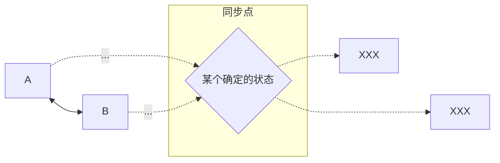
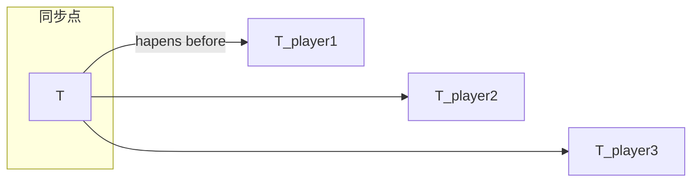
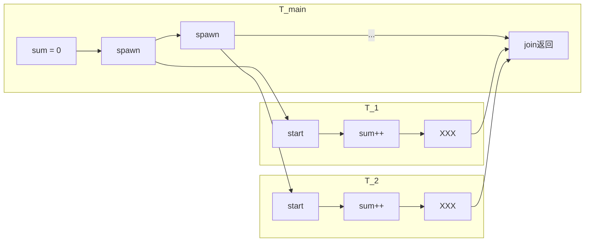
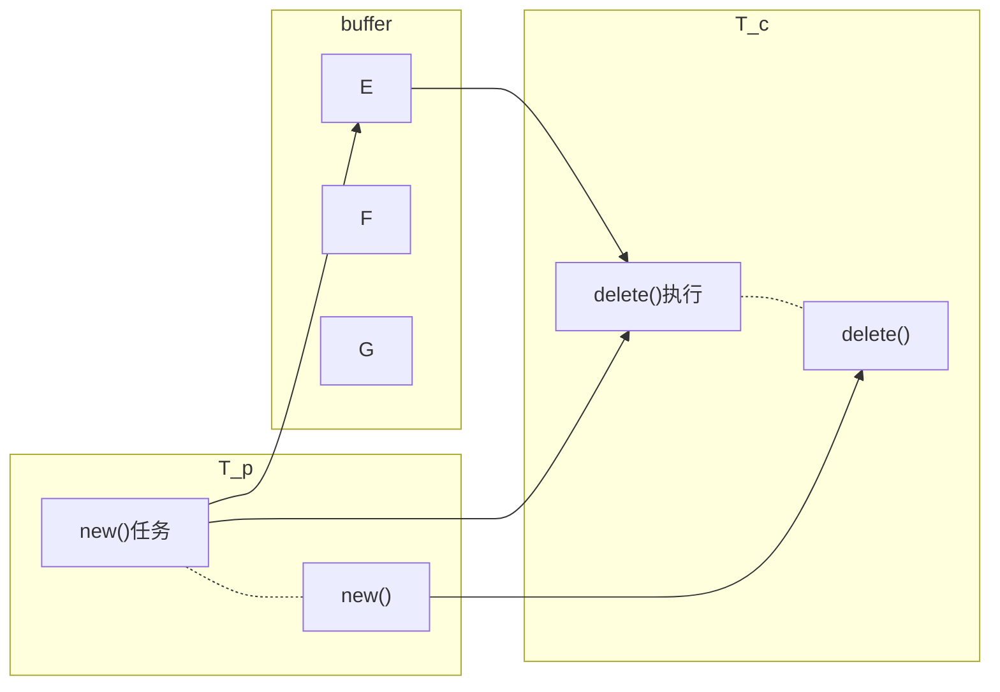
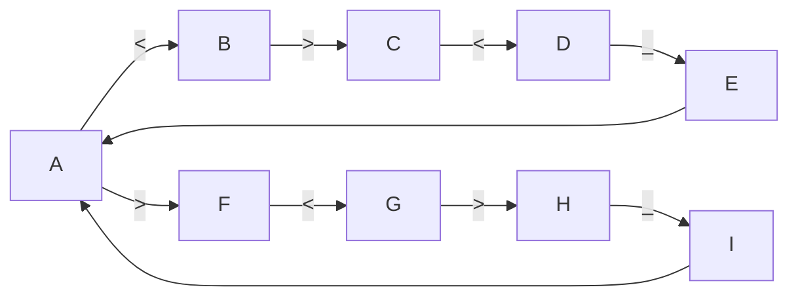

# 2025 南京大学操作系统原理

> 操作系统原理课程学习笔记
> 包括*软件安装，环境配置，运行命令，专有名词，基本概念*等。

[toc]

---
==由于学习进度慢,后面只注意重点内容。==

[PPT](https://jyywiki.cn/OS/2025/lect15.md)

---
## 15. 并发控制：同步 (1)
借助硬件原子指令和操作系统的帮助，我们实现了高效的互斥锁，能够确保锁保护的代码块按照**某个顺序**执行。然而，互斥并不总是能满足多个并发线程协作完成任务的需求，我们很多时候还需要控制代码块执行的**先后次序**。如何能便捷地让共享内存的线程协作以共同完成计算任务？

**本讲内容**：并发控制：同步。同步问题的定义、生产者-消费者问题、“万能” 的同步方法：条件变量。

---
### 好消息
**终于可以实现正确的 1 + 1 了！**
- 自旋锁 spin_lock, spin_unlock
- 互斥锁 mutex_lock, mutex_unlock
```c
lock(&lock);
sum++;
// 任意代码
unlock(&lock);
```

---
### 坏消息
**互斥似乎还不够**
- 互斥实现了<b style="color:#4169E1">原子性</b>：A→B 或 B→A
- 但没有给我们<b style="color:#4169E1">确定性</b>：A→B

**理解并发的方法**
- 线程 = 我们自己
- 共享内存 = 物理空间

---
## 15.1 同步和条件变量
### 并发控制：同步 (Synchronization)
>“两个或两个以上随时间变化的量在变化过程中保持一定的相对关系”
>- 同步电机、同步电路、红绿灯……
>
>DeepSeek: 多个事件、进程或系统在时间上协调一致，确保按<b style="color:#4169E1">预定顺序</b>或<b style="color:#4169E1">同时</b>执行

**我们希望<b style="color:#4169E1">控制</b>事件发生的先后顺序**
- A→B→C
    - 互斥锁只能确保 “分开” A,B,C，做不到顺序控制
- 我们希望形成受我们控制的 “happens-before” 关系

---
### 现实事件中的同步(1)
(我让 DeepSeek 找生活中的例子也给了合唱团 😊)

**理解同步：什么是<b style="color:#4169E1">事件</b> (代码的执行)、什么是<b style="color:#4169E1">顺序</b>**
- 每个乐手都是一个 “线程” (状态机)
    - 事件：发出节拍、演奏节拍
    - 顺序：发出节拍 i → 演奏节拍 i
    - (这个模型允许一个节拍演奏得过长)
```c
void T_player() {
    while (!end) {
        wait_next_beat();
        play_next_beat();
    }
}
```

---
### 现实世界中的同步 (2)
**今晚 23:59:59 大活门口，不见不散！**

**理解同步：什么是<b style="color:#4169E1">事件</b> (代码的执行)、什么是<b style="color:#4169E1">顺序</b>**
- 事件 A: 第一个人到达、事件 B: 第二个人到达
- 不见不散：有一个共同完成的事件 XXX (类似线程 join)
    - A→XXX, B→XXX
        - 因此<b style="color:#4169E1">一定有一瞬间 A,B 完成、XXX 还没有开始</b>
        - (同步点：一个<b style="color:#4169E1">确定</b>的状态；从而实现并发控制)
        - “控制”：将发散的并发程序状态 “收束”
```c
void T_A() {
    arrive_at_activity_center();  // 大活
    while (!both_A_and_B_are_here()) ;  // 不见不散
    xxx();
}
```
ww: 同步(2)

同步(1)


---
### 程序世界中的同步
```C
sum = 0;  // A
spawn(T_sum);  // T_1 start -> T_1 end
spawn(T_sum);  // T_2 start -> T_2 end
join();
printf("sum = %ld\n", sum);  // B
```
**理解同步：什么是<b style="color:#4169E1">事件</b> (代码的执行)、什么是<b style="color:#4169E1">顺序</b>**
- $ A \rightarrow T_1^{start} \rightarrow T_1^{end} \rightarrow join \rightarrow B $

- $ A \rightarrow T_2^{start} \rightarrow T_2^{end} \rightarrow join \rightarrow B $

    - 同一线程内的事件天然存在 happens-before 关系
    - 没有 happens-before 的代码就是<b style="color:#4169E1">并发</b>的
        - 在多处理器系统中可以并行执行

- [x] ww

- join后，不会有线程改变sum,所以printf安全的打印
- 两个sum++并发

---
### 实现同步：实现 Happens-before
实现 $ A \rightarrow B $
- $ A $; can_proceed = true; (🏴)
- while (!can_proceed) ;  $B$
    - $ B $: 如果同步的条件不满足，就等待
```C
void T_player() {
    for (int i = 0; i < n; i++) {
        while (current_beat < i) ;
        play_beat(i);
    }
}
```
- “大致可用”，但存在一些问题
    - 例如，current_beat 存在和 sum++ 类似的问题

```bash
# orchestra 
# 定义 TLIB_PATH（根据您的实际路径修改）thread-lib
TLIB_PATH := /mnt/e/2025/learn/VS\ Code/2025\ 南京大学操作系统原理/thread-lib

sudo apt update
sudo apt install -y ffmpeg

ffplay G7.wav

./orchestra
Enter
```

---
### 我们不妨再问问魔法的操作系统？
**能不能帮我们替代自旋的循环**
```C
while (!can_proceed) ;
```
**“发明” 条件变量机制**
- 一个理想的 API
    - wait_until(cond)，把代码编译到内核里
- 当然，过去的操作系统设计者不会搞那么复杂
    - 条件不满足时等待 (让出 CPU)
        - <b style="color:#4169E1">wait</b> - 直接睡眠等待
    - 条件满足时继续
        - <b style="color:#4169E1">signal/broadcast</b> - 唤醒所有等待的线程

---
### C++: 我可以把条件放到 $ \lambda $ 表达式里！
```c
std::mutex mtx;
std::condition_variable cv;  // Since C++11

void T_player() {
    std::unique_lock lk(mtx);
    
    cv.wait(lk,
        // This reads better!
        []{ return can_proceed; }
    );

    // can_proceed holds here

    cv.notify_all();
    lk.unlock();
}
```

```bash
# orchestra/orchestra-cv
./orchestra-cv
Enter
```

>**同步**：乐团指挥希望每个成员在听到指挥的信号后，才开始演奏一拍——也就是建立一个 “happens-before” 的关系。在代码中，我们可以通过 happens-after 的一方 “等待” 同步条件达成的方式来实现同步。这个想法形成了条件变量。我们可以对比使用 spin 和条件变量版本的乐团指挥。

---
## 15.2 条件变量的正确打开方式
### 经典同步问题：生产者-消费者问题
**学废你就赢了**
99% 的实际并发问题都可以用生产者-消费者解决
**Producer 和 Consumer 共享一个缓冲区**
- Producer (生产数据)：如果缓冲区有空位，放入；否则等待
- Consumer (消费数据)：如果缓冲区有数据，取走；否则等待
    - <b style="color:#4169E1">同步</b>：同一个 object 的生产必须 happens-before 消费
```c
void produce(Object obj);
Object consume();
```



---
### 生产者-消费者问题的简化
**一个等价的描述**
```C
void produce() { printf("("); }
void consume() { printf(")"); }
```
- 生产 = 打印左括号 (push into buffer)
- 消费 = 打印右括号 (pop from buffer)
- 在 printf 前后增加代码，使得打印的括号序列满足
    - <b style="color:#4169E1">不能输出错误的括号序列</b>
    - 括号嵌套的深度不超过 n
        - n=3, `((())())(((` ✅
        - n=3, `(((())))`, `(()))` ❌

[22. 括号生成](https://leetcode.cn/problems/generate-parentheses/description/)

---
### 条件变量的正确打开方式
**想清楚<b style="color:#4169E1">程序继续执行的条件</b>**
- 什么时候可以 produce，什么时候可以 consume？
```c
mutex_lock(🔒);
while (!cond) {  // cond 可以是任意的计算
    cond_wait(&cv, 🔒);
}
assert(cond);    // 此时 cond 成立且持有锁 lk
mutex_unlock(🔒);
```
```c
// 注意锁的使用
mutex_lock(🔒);
cond = true;
cond_broadcast(&cv); // 唤醒所有可能继续的线程
mutex_unlock(🔒);
```

---
### 使用条件变量实现同步 (cont'd)
**生产/消费的条件是什么？**
- $d < n$ 可以生产；$ d > 0 $ 可以消费 (然后，<b style="color:#4169E1">抄代码</b>)
```c
void produce() {
    mutex_lock(🔒);
    while (!(depth < n)) {
        cond_wait(&cv, 🔒);
    }

    assert(depth < n);
    depth++;
    printf("("); // put object to queue

    cond_broadcast(&cv);
    mutex_unlock(🔒);
}
```

```bash
# producer-consumer/pc-cv-broadcast.c
./pc-cv-broadcast
Usage: ./pc-cv-broadcast depth num-thread-pairs

./pc-cv-broadcast 1 4
./pc-cv-broadcast 2 4

./pc-cv-broadcast 4 16 | python3 check.py 4 

```

---
### Caveat: 小心并发！
**“看起来正确” 其实很危险**
- Producer 如果唤醒了等待的 producer 就糟了……
```c
void produce() {
    mutex_lock(🔒);
    while (!(depth < n)) {
        cond_wait(&cv, 🔒);
    }

    assert(depth < n);
    depth++;
    printf("("); // put object to queue

    cond_signal(&cv);  // ⚠
    mutex_unlock(🔒);
}
```
```bash
# producer-consumer/pc-cv.c
cond_signal(&cv);  // ⚠

./pc-cv 1 1
./pc-cv 1 2

if --> while
./pc-cv 1 1
./pc-cv 2 4 输出一会停止了

???不太理解
```

---
### 条件变量：万能的同步方法
**有三种线程**
- $T_a$若干: 死循环打印 `<`
- $T_b$若干: 死循环打印 `>`
- $T_c$若干: 死循环打印 `_`

**任务：**
- 对线程同步，使得屏幕打印出 `<><_` 和 `><>_` 的组合

**使用条件变量，只要回答三个问**题：
- 打印 “`<`” 的条件？打印 “`>`” 的条件？打印 “`_`” 的条件？



```bash
# 定义 TLIB_PATH（根据您的实际路径修改）thread-lib
TLIB_PATH := /mnt/e/2025/learn/VS\ Code/2025\ 南京大学操作系统原理/thread-lib

./fish
```
>*Condition Variables（条件变量） 源于 "等待某个条件成立" 的同步需求，其核心是建立线程间的 happens-before 关系。*


[1117.H2O 生成](https://leetcode.cn/problems/building-h2o/)
```cpp
class H2O {
private:
    std::mutex mtx;
    std::condition_variable cv;
    int h;
    int o;
public:
    H2O() : h(0), o(0) {

    }

    void hydrogen(function<void()> releaseHydrogen) {
        std::unique_lock<std::mutex> lock(mtx);
        cv.wait(lock, [this]() { return h < 2; });
        // releaseHydrogen() outputs "H". Do not change or remove this line.
        releaseHydrogen();
        h++;
        if (h == 2 && o == 1) {
            h = 0;
            o = 0;
            cv.notify_all();
        }
    }

    void oxygen(function<void()> releaseOxygen) {
        std::unique_lock<std::mutex> lock(mtx);
        cv.wait(lock, [this]() { return o < 1; });
        // releaseOxygen() outputs "O". Do not change or remove this line.
        releaseOxygen();
        o++;
        if (h == 2 && o == 1) {
            h = 0;
            o = 0;
            cv.notify_all();
        }
    }
};
```
---
>**生产者-消费者问题**：在解决同步问题时，关键在于理解 “同步成功” 的条件是什么。然后各个线程在条件不满足时等待，直到条件满足方可继续。这个思路自然地引出了 “条件变量” 这一同步机制。

>**奇怪的同步问题**：我们可以构造出 “奇怪” 的同步条件，例如有三种线程，分别死循环打印 <、>、_。如何同步这些线程，使得屏幕上看到的总是 <><_ 和 ><>_ 的组合？而只要我们能列出同步条件，就可以直接使用条件变量解决。

---
## 15.3 实现并发计算图
### 计算图与并发控制
### 理解你的计算任务：计算图模型
**$G(V,E)$: 有向无环的 Dependency Graph**
- 计算任务在节点上
        - (可以使用 shared memory)
- 边 $(u, v) \in E$ 表示 $v$ 的计算要用到 $u$ 产生的值
    - $(u, v)$ 也是一个 happens-before 关系

**这是一个<b style="color:#4169E1">非常基础的模型</b>**
- <b style="color:#4169E1">几乎总是可以用这个视角去理解并行计算</b>
- 如果节点 “独立计算时间” 足够长，算法就是可高效并行的

---
### 例子：电路模拟

---
### 例子：Longest Common Subsequence
ww: [最长公共子序列](https://leetcode.cn/problems/longest-common-subsequence/)，动态规划

---
### 例子：深度神经网络
- 我们会专门有一次课讲各类计算任务的并行方法

---
### 同步：实现任意计算图 (1)
**为每个计算节点设置一个线程和条件变量**
```c
void T_u() {  // u -> v
    ... // u 的计算
    mutex_lock(v->lock);
    v->num_done++;
    cond_signal(v->cv);  // 这里是可以 signal 的
    mutex_unlock(v->lock);
}

void T_v() {
    mutex_lock(v->lock);
    while (!(v->num_done == v->num_predecessors)) {
        cond_wait(v->cv, v->lock);
    }
    mutex_unlock(v->lock);
    ... // v 的计算
}
```
```bash
# 定义 TLIB_PATH（根据您的实际路径修改）thread-lib
TLIB_PATH := /mnt/e/2025/learn/VS\ Code/2025\ 南京大学操作系统原理/thread-lib

./cgraph
Computing node #0...
Computing node #2...
Computing node #1...
Computing node #3...
Computing node #4...
Computing node #5...
Execution completed.

./cgraph
Computing node #0...
Computing node #2...
Computing node #3...
Computing node #1...
Computing node #4...
Computing node #5...
Execution completed.
```

---
### 同步：实现任意计算图 (2)
**实现一个任务的<b style="color:#4169E1">调度器</b>**
- 一个生产者 (scheduler)，许多消费者 (workers) 循环：
```c
mutex_lock(🔒);
while (!(all_done || has_job(tid))) {
    cond_wait(&worker_cv[tid], 🔒);
}
mutex_unlock(🔒);

if (all_done) {
    break;
} else {
    process_job(tid);
}

signal(&sched_cv);
```

---
### 用 “生产者-消费者” 理解计算图
**方法 (1): 每个节点都 “先消费、后生产”**
- 对于 $u \rightarrow v$
    - $T_u$ : 完成后为 $T_v$ 生产一份
    - $T_v$ : 消费 pred 份后继续

**方法 (2): 双向生产/消费**
- : $T_{worker}$ : 生产 ready，消费 job
- : $T_{scheduler}$ : 消费 ready，生产 job
    - “生产 happens-before 消费”

---
>**条件变量实现计算图**：计算任务可以执行的条件是它依赖的计算都已经完成——因此我们可以为每个计算任务设置一个条件变量，我们等待 pending dependency 减少到 0，并且在条件满足时使用 signal 通知后继节点。

---
## 15.4 总结
　　***Take-away Messages***: 同步的本质是线程需要等待某件它所预期的事件发生，而事件的发生总是可以用条件 (例如 depth 满足某个条件，或是程序处于某个特定的状态) 来表达。因此计算机系统的设计者实现了条件变量，将条件检查和临界区 “放在一起”，以实现线程间的同步。