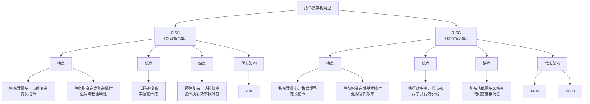
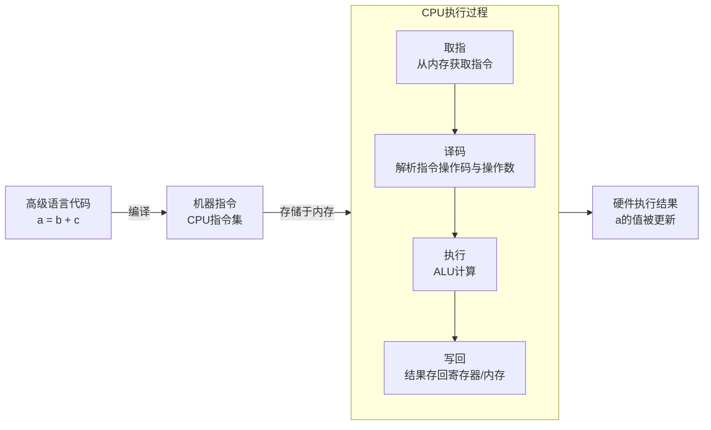

# 2025 南京大学操作系统原理

> 操作系统原理课程学习笔记
> 包括*软件安装，环境配置，运行命令，专有名词，基本概念*等。

[toc]

[PPT](https://jyywiki.cn/OS/2025/lect27.md)

---
## 27. 现代应用程序架构 🌶️
进程 (运行的程序)，一直以来都是操作系统中的核心抽象。作为应用程序的主体，运行它的方式却在多年的发展中历经了许多变化。

**本讲内容**：应用程序是如何运行在数据中心上的。

---
## 27.1 虚拟机和容器
**虚拟化与隔离**

**Full System Emulation 的黄金时代**

- VMWare (1998): 我们能把这个技术做成产品！

**Hack: Guest Ring 3 直接运行在 Host Ring 3**
- System call 会 trap 到 VMM
    - Windows Subsystem for Linux (2016)
- Xen and the art of virtualization (2003)
    - Intel: VT-x (2005) → VT-d (2006) → EPT (2008)
    - (我们之前讲过 /dev/kvm)

20.`kvm.c`

- [X] M7 HTTP

> **cgroups**: 我们可以在 sysfs 中观察 cgroups 的状态，看到 cgroups 的层次结构。

```bash
gdb /usr/bin/busybox  ls
layout asm
starti
si
```

**Dot-com bubble 时代 (2000)**

**Everything is a State Machine...**
**虚拟机：<b style="color:#4169E1">更容易管理状态了</b>！**

**操作系统：我自己就能虚拟化自己啊 🤔**

**pid 可以不再是整个操作系统唯一的**

**祝贺，你发明了 Linux Namespaces!**
**只要想 “操作系统里有什么对象” 就行了**
- 需要为 osid 区别实现的对象
    - pid: (刚才讲了)
    - user: 用户和组 (这个很重要)
    - mnt: 文件系统和设备
    - ipc: 信号量、消息队列、共享内存
    - net: 网络设备、协议栈、端口 (localhost:5000)
    - time: 系统时间和时区
    - uts: 主机名和域名
- Linux namespaces: /proc/[pid]/ns/
    - lsns 可以查看 (strace)

```bash
ps
cd /proc/634
pwd
cd ns
ls
ls -l
sudo ls -l /proc/1/ns

sudo ls -l /proc/1/ns | grep pid
ls -l | grep pid
lsns
```

**Namespaces (7)**
**clone**
- 创建进程时可以带 CLONE_NEW_xxx (PID, IPC, ...) 选项

**setns, unshare**
- 改变某一个项目的 “osid”

**ioctl**
- Windows Subsystem for Linux: 听我说谢谢谢你 😊
    - (我选择放弃)

`man 7 namespaces`

**再进一步：资源调度**
**实现资源的控制**
- “圈一些进程”，设定资源使用策略
- 祝贺，你发明了 cgroups
    - cat /proc/*/cgroup
    - /sys/fs/cgroup

**这是一个和 namespaces 正交的机制**
- 共同使用，你就得到了容器
    - 例子：只有 busybox 的 “系统中的系统”
    - 祝贺，你发明了 docker!

```bash
cat /proc/*/cgroup
cat /proc/634/cgroup
tree /sys/fs/cgroup
```

> **cgroups**: 我们可以在 sysfs 中观察 cgroups 的状态，看到 cgroups 的层次结构。

```bash
python3 cgroups.py > a.dot
dot -T svg a.dot > a.svg
firefox a.svg
```

**云时代的虚拟机**
**如果只需要 Linux**
- 容器就和虚拟机<b style="color:#4169E1">完全一样</b>
- 开销比虚拟机低很多，安全性略低
    - 这样不就可以在一台物理上部署更多的服务了吗
- <b style="color:#4169E1">黑心商人</b>: 💰💰💰 的机会来啦！

**Kubernetes: “容器编排”**
- 跨主机、弹性自动编排
- <b style="color:#4169E1">自动容错</b>：这是云厂商最爱看到的

---
## 27.2 云原生与微服务
**云原生、微服务和 Serverless**

**舞台已经搭好了……
我们有容器 (虚拟机) 了**

**Serverless: “容器” 的概念都可以不要了**

**Function-as-a-Service (FaaS)
Remote Procedure Call (RPC) 调用远程函数**
- apt install ffmpeg; ffmpeg -i a.mp4 -f ffmetadata -

**再加上 CI/CD**

**计算机” 会消失吗？
只需要云和终端？**
- “AI inference” 占程序运行时长的比例会越来越高吗？

---
## 27.3 总结
　　***Take-away Messages***: 透过虚拟化发展的历史浪潮，从虚拟机到容器，再到 Serverless，我们看到 “计算机系统” 作为支撑性技术给应用世界带来的变革。有些时候，革命性的技术建立在极简的动机上，例如 “full system emulator 真的可以运行得很快”，或是 “给每个操作系统对象加一个 osid”，世界就会就此改变。

---
指令集是计算机体系结构中一个非常核心的概念。下面我将为你详细解释，力求清晰易懂。

# 🖥️ 指令集详解

## ✨ 核心定义

**指令集**是存储在CPU内部，对CPU运算进行指导和优化的**指令的集合**。你可以把它理解为CPU的“母语”或“内置技能库”。拥有这些指令集，CPU就可以更高效地运行。它定义了硬件与软件之间交互的基本规则，是CPU性能体现的一个重要标志。

简单来说：
*   **计算机指令**：就是指挥机器工作的指示和命令。
*   **程序**：就是一系列按一定顺序排列的指令。
*   **执行程序的过程**：就是计算机的工作过程。

程序员用各种高级语言（如Python、C++、Java）编写的程序，最终都需要**翻译（编译或解释）** 成以指令形式表示的机器语言之后，才能在计算机上运行。

## 🔍 指令集的构成

一条指令通常包含以下几个关键部分：

| 组成部分     | 说明                                                                                              | 类比（做菜）           |
| :----------- | :------------------------------------------------------------------------------------------------ | :--------------------- |
| **操作码**   | 指定CPU要执行的操作类型，如加法、减法、跳转等。                                                     | 具体的动作，如“切”、“炒” |
| **操作数**   | 指令执行过程中需要处理的数据或数据地址。操作数可以来自寄存器或内存。                                  | 操作的对象，如“土豆”、“牛肉” |
| **寻址方式** | 定义了CPU如何找到指令中指定的操作数。常见方式有直接寻址、间接寻址、寄存器寻址等。                       | 获取食材的方式           |

### 指令示例
```assembly
; x86 指令示例
mov eax, 1      ; 将立即数1移动到eax寄存器 (操作码:mov, 操作数: eax, 1)
add eax, 2      ; 将eax寄存器的值加2 (操作码:add, 操作数: eax, 2)
```

## 🧩 主要类型与对比

指令集架构根据设计哲学和特点，主要分为以下几类：

### 1. CISC (复杂指令集计算机)
*   **特点**：指令数量多，功能复杂，一条指令能完成多个低级操作。指令长度不固定。
*   **优点**：功能强大，可减少程序代码大小，编程相对方便。
*   **缺点**：硬件设计复杂，执行效率相对较低，功耗较大。
*   **代表**：**x86架构**（Intel和AMD的大部分处理器）。

### 2. RISC (精简指令集计算机)
*   **特点**：指令数量少，格式规整，每条指令只完成一个基本操作，执行时间短。
*   **优点**：执行效率高，功耗低，易于实现指令级并行（流水线）。
*   **缺点**：完成复杂功能可能需要更多条指令。
*   **代表**：**ARM架构**（广泛应用于移动设备、嵌入式系统）、**MIPS架构**。

### 3. 其他类型
*   **VLIW (超长指令字)**：一条很长的指令中包含多个操作，由编译器在编译时决定哪些操作可以并行执行。
*   **EPIC (显式并行指令计算)**：类似VLIW，但允许编译器更显式地指定操作的并行性。

下面是CISC与RISC架构的简要对比，帮助你更直观地理解它们的差异：



## 🛠️ 指令集如何工作：代码控制硬件的桥梁

你可能好奇，我们写的代码（如 `a = b + c`）是如何通过指令集最终控制硬件（如CPU中的ALU）完成计算的。这个过程大致如下：

1.  **编译**：编译器将高级语言代码翻译成目标CPU指令集对应的**机器码**（由0和1组成）。
2.  **取指**：CPU的程序计数器(PC)指向下一条要执行的指令地址，从内存或缓存中将指令取到指令寄存器。
3.  **译码**：CPU内部的译码器解析指令的**操作码**和**操作数**，确定要执行什么操作（如加法）以及操作数在哪里（如寄存器或内存地址）。
4.  **执行**：根据译码结果，CPU的**运算器**(ALU)等单元执行具体操作。例如，从寄存器中取出`b`和`c`的值，进行加法运算。
5.  **写回**：将执行结果（如加法结果）写回到指定的**寄存器**或**内存**中（如存入变量`a`对应的位置）。



这个过程周而复始，使得程序得以运行。

## 💡 为什么指令集重要？

1.  **硬件与软件的契约**：指令集是CPU设计者和软件开发者之间的一份“合同”。CPU保证能理解并执行指令集中定义的指令，软件则按照指令集的规范进行编译和优化。
2.  **性能基础**：指令集的先进与否，直接关系到CPU的性能发挥。例如，**SIMD**(单指令多数据)指令集（如SSE, AVX）可以一条指令同时处理多个数据，极大加速多媒体处理、科学计算等任务。
3.  **生态与兼容性**：不同的CPU家族（如Intel的x86和ARM公司的ARM）有不同的指令集，这决定了其上可以运行的操作系统和应用程序。x86指令集在个人电脑和服务器领域占据主导，而ARM指令集则凭借低功耗优势统治了移动设备和嵌入式领域。软件通常需要为不同的指令集架构重新编译。

## 💎 总结

记住以下几点：
*   指令集是CPU的**原生语言**，是所有软件在硬件上运行的**最终形式**。
*   主要分为**CISC**（复杂，x86）和**RISC**（精简，ARM）两大设计哲学。
*   代码通过**编译**成机器指令，并由CPU**取指、译码、执行、写回**来控制硬件。
*   它的设计直接影响CPU的**性能、功耗**和**软件生态**。

希望这个解释能帮助你初步理解指令集这个概念。它是通往理解计算机底层工作原理的一扇重要大门。

---
> NEMU

理解IP、域名和NEMU这些概念，对掌握计算机网络和云计算的基础知识很有帮助。我会用尽可能清晰的方式为你解释。

# 🌐 IP地址、域名与NEMU详解

## 1️⃣ IP地址：互联网的“数字身份证”

IP地址（Internet Protocol Address）是互联网协议为网络设备分配的唯一逻辑地址，用于在网络中标识和定位设备。

*   **主要类型**：
    *   **IPv4**：格式为 `xxx.xxx.xxx.xxx`（如 `192.168.1.1`），每个数字范围是0-255。它使用32位地址，地址空间有限。
    *   **IPv6**：格式为 `xxxx:xxxx:xxxx:xxxx:xxxx:xxxx:xxxx:xxxx`（如 `2001:0db8:85a3:0000:0000:8a2e:0370:7334`）。它使用128位地址，提供了巨大的地址空间，解决了IPv4地址不足的问题。

*   **关键特点**：
    *   **唯一性**：每个联网设备都有一个唯一的IP地址（私有地址除外）。
    *   **可寻址性**：数据包通过源IP和目标IP地址进行路由和传输。
    *   **分层结构**：IP地址通常分为网络号和主机号，便于路由和管理。

## 2️⃣ 域名：人类可读的“好记别名”

域名（Domain Name）是由一串用点分隔的字符组成的名称，用于在互联网上标识计算机或计算机组。

*   **核心作用**：解决IP地址难以记忆的问题（例如，`www.example.com` 比 `192.0.2.1` 更容易记忆和传播）。
*   **结构解析**：域名采用层次化结构，从右向左解读：
    *   **顶级域（TLD）**：如 `.com`（商业机构）、`.org`（非营利组织）、`.net`（网络机构）或国家代码如 `.cn`。
    *   **二级域**：在顶级域下的名称，通常是企业或组织名称（如 `example` in `example.com`）。
    *   **子域**：二级域下的进一步划分（如 `www` in `www.example.com`）。
*   **与IP地址的关系**：域名与IP地址是**一一对应**的。通过**域名系统（DNS）**，域名被解析为对应的IP地址，计算机最终通过IP地址进行通信。

## 3️⃣ NEMU：轻量级的虚拟化解决方案

NEMU 是一款专为现代云工作负载设计的**轻量级开源虚拟化解决方案**。它的目标是提供一个更高效、更安全的虚拟化环境。

*   **定位与目标**：NEMU基于QEMU构建，但专注于云原生工作负载，去除了大量不必要的旧硬件和平台支持，从而实现了更小的代码规模和更低的资源消耗。
*   **主要特点**：
    *   **轻量高效**：通过简化代码库，降低了复杂性和资源消耗，实现了低内存占用和高性能。
    *   **安全性高**：精简的设计有助于减少潜在的安全漏洞和攻击面。
    *   **功能聚焦**：支持现代CPU架构（如x86-64和AArch64），并提供了云环境所需的关键功能，如热插拔（CPU、内存等）、迁移能力等。
*   **应用场景**：
    *   **云服务提供商**：需要高效、低延迟和高安全性虚拟化环境的场景。
    *   **企业内部云**：简化且高效的虚拟化解决方案，帮助企业降低IT基础设施的成本和复杂性。
    *   **开发与测试**：低内存占用和快速启动时间使其适合快速部署和测试云原生应用。

## 🔗 三者之间的联系与协作

理解这三者如何协同工作非常重要：
1.  你在浏览器中输入一个**域名**（例如 `www.example.com`）。
2.  你的计算机会向DNS服务器查询，请求将该**域名**解析为对应的**IP地址**。
3.  获取到目标服务器的**IP地址**后，你的计算机才能与之建立连接，开始传输数据。
4.  在云数据中心，像 **NEMU** 这样的虚拟化工具可能会在后台创建和管理多个虚拟机（VM），每个虚拟机都有自己的虚拟IP地址，来承载你正在访问的网络服务（例如网站）。

## 📊 核心概念对比

下表总结了IP地址、域名和NEMU的核心特征：

| 特性           | IP地址                                      | 域名                                               | NEMU                                                          |
| :------------- | :------------------------------------------ | :------------------------------------------------- | :------------------------------------------------------------ |
| **核心定位**   | 网络设备的唯一逻辑地址标识                        | 人类可读的网络地址别名                                 | 轻量级虚拟化解决方案，用于创建和管理虚拟机                              |
| **主要形式**   | 数字序列（如 `192.168.1.1`）                    | 字符序列（如 `www.example.com`）                      | 开源软件                                                          |
| **关键作用**   | 在网络中唯一标识和定位设备，实现数据包的路由和寻址         | 简化对网络资源的记忆和访问，通过DNS解析为IP地址                | 为云工作负载提供高效、安全的虚拟化环境，优化资源利用和管理                       |
| **相互关系**   | 是域名解析的最终目标，是机器间通信的基础                  | 是IP地址的人类友好“包装”，通过DNS映射到IP地址              | 在云计算平台中，可能负责托管那些提供由域名指向的服务的虚拟机                     |

## 💎 总结

简单来说：
*   **IP地址**是互联网通信的基石，是机器识别和寻找对方的“数字坐标”。
*   **域名**是为了方便人类记忆和使用的“友好姓名”，它通过DNS系统指向IP地址。
*   **NEMU**则是云计算领域中的一个高效“工厂经理”，负责创建和管理虚拟机（这些虚拟机通常拥有IP地址，并可能提供通过域名访问的服务）。

希望这个解释能帮助你清晰理解IP地址、域名和NEMU这三个概念。