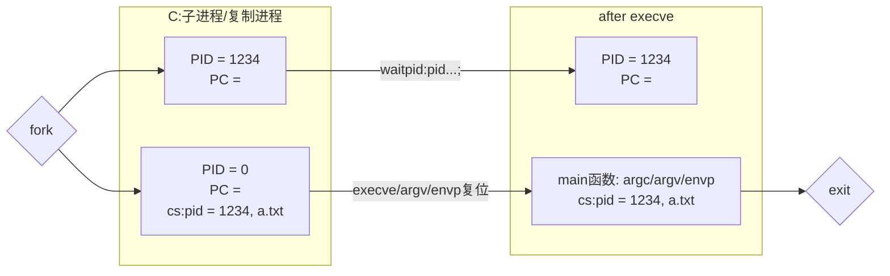

# 2025 南京大学操作系统原理
> 操作系统原理课程学习笔记1-5重新看
包括*软件安装，环境配置，运行命令，专有名词，基本概念*等。

## 5. 程序与进程

### 1.创建状态机
```c
pid_t fork(void);
```
#### 现在我们已经有“一个状态机”了
- 只需要“创建状态机”的 API即可
- UNIX 的答案： fork
    - 做一份状态机完整的复制 (内存、寄存器现场)


==???==

```bash
man 2 fork          #作用：在终端中查看 Linux 系统调用 fork 的详细手册页。
pstree              #作用：以树状图的形式显示当前系统中正在运行的进程之间的父子关系。
ps ax | grep 1867   #作用：查看进程号为 1867 的进程的详细信息。
```
==mosaic==见第四节==
```bash
# mosaic fork_demo.py
# mosaic -c fork_demo.py | collect

mosaic/mosaic.py fork-demo.py
mosaic/mosaic.py -c fork-demo.py | mosaic/collect.py
== python3 mosaic/mosaic.py -c fork-demo.py | mosaic/collect.py
# 管道 (|) 是命令行中非常强大的工具，常用于组合多个命令来处理数据。
# wsl2 运行有点慢
0 0; 0 1003; 1002 0; 1002 1004; 
0 0; 0 1003; 1002 1004; 1002 0; 
0 0; 0 1004; 1002 0; 1002 1003; 
0 0; 0 1004; 1002 1003; 1002 0; 
0 0; 1002 0; 0 1003; 1002 1004; 
0 0; 1002 0; 0 1004; 1002 1003; 
0 0; 1002 0; 1002 1003; 0 1004; 
0 0; 1002 0; 1002 1004; 0 1003; 
0 0; 1002 1003; 0 1004; 1002 0; 
0 0; 1002 1003; 1002 0; 0 1004; 
0 0; 1002 1004; 0 1003; 1002 0; 
0 0; 1002 1004; 1002 0; 0 1003; 
0 1003; 0 0; 1002 0; 1002 1004; 
0 1003; 0 0; 1002 1004; 1002 0; 
0 1003; 1002 0; 0 0; 1002 1004; 
0 1003; 1002 0; 1002 1004; 0 0; 
0 1003; 1002 1004; 0 0; 1002 0; 
0 1003; 1002 1004; 1002 0; 0 0; 
0 1004; 0 0; 1002 0; 1002 1003; 
0 1004; 0 0; 1002 1003; 1002 0; 
0 1004; 1002 0; 0 0; 1002 1003; 
0 1004; 1002 0; 1002 1003; 0 0; 
0 1004; 1002 1003; 0 0; 1002 0; 
0 1004; 1002 1003; 1002 0; 0 0; 
1002 0; 0 0; 0 1003; 1002 1004; 
1002 0; 0 0; 0 1004; 1002 1003; 
1002 0; 0 0; 1002 1003; 0 1004; 
1002 0; 0 0; 1002 1004; 0 1003; 
1002 0; 0 1003; 0 0; 1002 1004; 
1002 0; 0 1003; 1002 1004; 0 0; 
1002 0; 0 1004; 0 0; 1002 1003; 
1002 0; 0 1004; 1002 1003; 0 0; 
1002 0; 1002 1003; 0 0; 0 1004; 
1002 0; 1002 1003; 0 1004; 0 0; 
1002 0; 1002 1004; 0 0; 0 1003; 
1002 0; 1002 1004; 0 1003; 0 0; 
1002 1003; 0 0; 0 1004; 1002 0; 
1002 1003; 0 0; 1002 0; 0 1004; 
1002 1003; 0 1004; 0 0; 1002 0; 
1002 1003; 0 1004; 1002 0; 0 0; 
1002 1003; 1002 0; 0 0; 0 1004; 
1002 1003; 1002 0; 0 1004; 0 0; 
1002 1004; 0 0; 0 1003; 1002 0; 
1002 1004; 0 0; 1002 0; 0 1003; 
1002 1004; 0 1003; 0 0; 1002 0; 
1002 1004; 0 1003; 1002 0; 0 0; 
1002 1004; 1002 0; 0 0; 0 1003; 
1002 1004; 1002 0; 0 1003; 0 0; 
|V| = 557, |E| = 766.
There are 48 distinct outputs.
```

### 1.理解 fork 习题(1) 阅读程序，写出运行结果
```c
pid_t x = fork();
pid_t y = fork();
printf("%d %d\n", x, y);
```
**一些重要问题**
- 到底创建了几个状态机？
- pid 分别是多少？
    - “状态机视角” 帮助我们严格理解

**答：​关键点：​​**
```bash
make
./demo-1
# 9035 9036
# 0 9037
# 0 0
# 9035 0
```
- ​​创建了 4 个独立的进程。​​
- ​​每个进程的 x和 y值如下：​​
    - 父进程（P0）：x = PID1, y = PID2→ 输出 PID1 PID2
    - P0 的子进程（P1）：x = 0, y = PID3→ 输出 0 PID3
    - P0 的另一个子进程（P2）：x = PID1, y = 0→ 输出 PID1 0
    - P1 的子进程（P3）：x = 0, y = 0→ 输出 0 0

### 2.理解 fork: 习题 (2) 阅读程序，写出运行结果
```cpp
for (int i = 0; i < 2; i++) {
    fork();
    printf("Hello\n");
}
```
**状态机视角帮助我们严格理解程序行为**
- `./a.out`
- `./a.out | cat`
    - 计算机系统里没有魔法
    - (无情执行指令的) 机器永远是对的

```bash
mosaic/mosaic.py -c fork-printf.py | mosaic/collect.py
# ⭐️⭐️⭐️⭐️⭐️⭐️
# |V| = 24, |E| = 24.
# There are 1 distinct outputs.

make
./demo-2
# Hello
# Hello
# Hello
# Hello
# Hello
# Hello
./demo-2 | wc -l
# 8
```
- `|` (管道符) 想象成一根“管道”，它把 `./demo-2` 产生的输出，像送水一样输送给了 `wc -l` 命令去处理。
- `wc -l`: `wc` 是 “word count” 的缩写。`-l` 选项告诉 wc 只统计行数 (lines)。	统计行数

==为什么是8行？==
>直接运行时，行缓冲使每次printf立即输出，缓冲区不会在fork时被复制，最终输出6次。而管道导致缓冲数据被复制，产生额外输出。
Actual behavior of printf() is fork-printf1.py
```
可视化流程（全缓冲模式）：
初始进程 P0
├─ i=0: fork() → 创建 C0
│   ├─ P0 缓冲区: "Hello\n" (未刷新)
│   └─ C0 缓冲区: "Hello\n" (未刷新)
├─ i=1: P0 和 C0 各 fork()
│   ├─ P0 fork() → 创建 P1 (继承 P0 缓冲区)
│   │   ├─ P0 追加输出 → 缓冲区: "Hello\nHello\n"
│   │   └─ P1 追加输出 → 缓冲区: "Hello\nHello\n"
│   └─ C0 fork() → 创建 C1 (继承 C0 缓冲区)
│       ├─ C0 追加输出 → 缓冲区: "Hello\nHello\n"
│       └─ C1 追加输出 → 缓冲区: "Hello\nHello\n"
└─ 结束时：4 个进程各刷新 2 行 → 8 行输出
```
**关键点解释**：
1. **缓冲机制差异**：
   - 直接输出到终端时：行缓冲（`\n` 触发刷新）。标准输出（`stdout`）是 **行缓冲**（`line-buffered`），每遇到 `\n` 会立即刷新。
   - 通过管道输出时（如 `| wc -l`）：全缓冲（缓冲区满或进程结束才刷新）。标准输出变成 **全缓冲**（`fully buffered`），数据会累积在缓冲区，直到刷新。
2. **`fork()` 的行为**：
   - 当 fork() 被调用时，**子进程会继承父进程的输出缓冲区副本**。在全缓冲模式下，未刷新的缓冲区内容被复制，导致更多输出。
3. **解决方案**：
   - 在 `fork()` 前用 `fflush(stdout);` 强制刷新缓冲区：
     ```c
     int main() {
         for (int i = 0; i < 2; i++) {
             fork();
             printf("Hello\n");
             fflush(stdout); // 每次输出后刷新
         }
     }
     ```
     这样两种场景都会输出 **6 行**。
     
### 2.复位状态机
```c
int execve(const char *filename, char *const argv[], char *const envp[]);
// execve 有三个参数：path, argv, envp，分别是可执行文件的路径、传递给 main 函数的参数和环境变量。execve 是一个 “底层” 的系统调用，而 POISX 额外提供了 execl 等库函数便于我们使用。
```

```bash
env     # 输出环境变量
```
#### UNIX 选择只给一个复位状态机的 API
- 将当前进程<b style="color:#4169E1">重置</b>成一个可执行文件描述状态机的初始状态
- <b style="color:#4169E1">操作系统维护的状态不变</b>：进程号、目录、打开的文件……
(程序员总犯错，因此打开文件有了 `O_CLOEXEC`)

`execve` 是<b style="color:red">唯一能够 “执行程序” 的系统调用</b>
- 因此也是一切进程 `strace` 的第一个系统调用
```bash
./demo-1
strace ./demo-1
# execve("./demo-1", ["./demo-1"], 0x7ffd0e080a20 /* 34 vars */) = 0

strace ./demo-1 |& less
# 在 less 中，你可以用上下箭头键滚动，按 / 搜索，按 q 退出。
strace ls |& vim -
== strace ls 2>&1 | vim -
# strace 的作用就是像一个窃听器，它启动指定的命令（这里是 ls），并拦截和记录该命令及其所有子进程发出的每一个系统调用，以及这些调用接收到的信号。
# |& 将标准错误（stderr，文件描述符2） 重定向到标准输出（stdout，文件描述符1） 的同一位置。然后将合并后的输出流通过管道传递给下一个命令。
# vim - 会接收从前面管道 |& 传来的所有数据（即 strace ls 的全部输出），并将其作为一个缓冲区在 Vim 编辑器中打开。
# 将 ls 命令执行过程中的所有底层系统调用信息捕获并输出到 Vim 编辑器中

strace echo hello |& vim -
# 将 echo hello 命令执行过程中的所有系统调用（system calls）信息捕获，并直接送入 Vim 编辑器中进行查看和编辑。
# echo 会简单地在标准输出（stdout）上打印 “hello”。
```
==`&|,|&`：jyy:用的前者，但我的wsl2 ubuntu22.04 前者运行不了，后者可以。==

正常退出vim（保存并退出）：
- 按下 Esc 键确保处于正常模式
- 输入 `:wq` 然后按 Enter（write and quit）
- 或者输入 `:x` 然后按 Enter

不保存退出：
- 按下 Esc 键
- 输入 `:q!` 然后按 Enter（quit without saving）

***示意图：***


```bash
make
./demo
== 
make && ./demo # 同上。 && 逻辑与

./demo.c
# PWD=/mnt/e/2025/learn/VS Code/2025 南京大学操作系统原理/5. 程序与进程/execve-demo
# HELLO=WORLD
# SHLVL=0
# _=/usr/bin/env
./demo-0.c
# HELLO=WORLD
./demo-1.c
# execve failed: No such file or directory
# Hello, World!
```
```c
// demo.c
    char *const argv[] = {
        "/bin/bash",  // "/bash" 也会报错 # execve failed: No such file or directory 必须是完整路径
        NULL,
    };
```
```c
// demo-0.c
char *const argv[] = {
        "/bin/env",
        // "-c",
        // "env",
        NULL,
    };
```
```c
// demo-1.c
    char *const argv[] = {
        "/bin/bash1",
        "-c",
        "env",
        NULL,
    };
```

```bash
bash -c ls 
== ls

bash -c 'TK_VERSION=1 ./main' 
# 在一个临时的、独立的 Bash 子进程中，设置一个名为 TK_VERSION 值为 1 的环境变量，然后立即运行 ./main 程序。程序运行结束后，临时变量也随之清除，不会污染你当前的 Shell 环境。

/bin/bash -c env 
== env # 基本相当
# 启动一个干净的 Bash 子进程，并打印出该子进程从父进程（你的当前 Shell）继承来的所有环境变量。这是一个用于检查和调试当前 Shell 环境状态的经典命令。
```

### execve() 设置了进程的初始状态
#### argc & argv: 命令行参数
- 困扰多年的疑问得到解答：main 的参数是 execve 给的！

#### envp: 环境变量
- 使用 env 命令查看
PATH, PWD, HOME, DISPLAY, PS1, ...
- export: 告诉 shell 在创建子进程时设置环境变量
小技巧：`export TK_VERBOSE=1`

#### 程序被正确加载到内存
- 代码、数据、PC 位于程序入口

### 例子：PATH 环境变量
```bash
export TK_VERBOSE=1
# export TK_VERBOSE=1是 Linux/Unix 系统中的命令，用于设置环境变量 TK_VERBOSE的值为 1，并使其对当前 Shell 会话及所有子进程生效。
 #命令仅对当前 Shell 会话有效，关闭终端后失效

export PATH=
# 这条命令会清空 PATH 环境变量，使得当前 Shell 会话及所有子进程的 PATH 环境变量都为空。

ls # No such file or directory
env # No such file or directory

# 重新打开shell bash
echo $PATH
# /home/hhu/.vscode-server/cli/servers/Stable-6f17636121051a53c88d3e605c491d22af2ba755/server/bin/remote-cli:/usr/local/sbin:/usr/local/bin:/usr/sbin:/usr/bin:/sbin:/bin:/usr/games:/usr/local/games:/snap/bin
```

#### 可执行文件搜索路径
- 还记得 gcc 的 strace 结果吗？
```bash
[pid 28369] execve("/usr/local/sbin/as", ["as", "--64", ...
[pid 28369] execve("/usr/local/bin/as", ["as", "--64", ...
[pid 28369] execve("/usr/sbin/as", ["as", "--64", ...
[pid 28369] execve("/usr/bin/as", ["as", "--64", ...
```
- 这个搜索顺序恰好是 `PATH` 里指定的顺序
```bash
$ PATH="" /usr/bin/gcc a.c
gcc: error trying to exec 'as': execvp: No such file or directory
$ PATH="/usr/bin/" gcc a.c
```
**<b style="color:#4169E1">计算机系统里没有魔法。机器永远是对的。</b>**

### 3. 销毁状态机
```c
void _exit(int status);
```
**这个没有争议**
- 立即摧毁状态机，允许有一个返回值
    - 返回值可以被父进程获取

### UNIX 进程的生存周期
#### UNIX 中实现 “创建新状态机” 的方式
- Spawn = fork + execve
- 我们会在之后介绍这些系统调用的灵活应用
```c
int pid = fork();
if (pid == -1) { // 错误
    perror("fork"); goto fail;
} else if (pid == 0) { // 子进程
    execve(...);
    perror("execve"); exit(EXIT_FAILURE);
} else { // 父进程
    ...
    int status;
    waitpid(pid, &status, 0); // testkit.c 中有
}
```