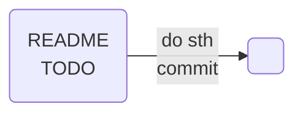

# 2025 南京大学操作系统原理

> 操作系统原理课程学习笔记
> 包括*软件安装，环境配置，运行命令，专有名词，基本概念*等。

## 6. 进程的地址空间

有了创建进程的 `API (CreateProcess; fork-execve)`，我们的 “操作系统” 就初具雏形，你也能够编写出真正并行执行的程序了。

**本讲内容**：每个进程都 “拥有” 自己的内存——我们可以用 `new/delete` 管理它们。但进程的内存是哪里来的？一个指针 p 到底能指向什么？管理地址空间的系统调用: `mmap` 给我们答案。

### Review & Comments

---

### 2024 ACM A.M. Turing Award Winner

**Andrew Barto and Richard Sutton**

- For developing the conceptual and algorithmic foundations of reinforcement learning
- 未来将会是怎样的？

Manus.im



git repo
'init'

---

### 我们如何应对？

**在这门课上，还得讲操作系统**

- 操作系统依然很重要
- 编程语言是 “可信可验证” 的桥梁
  - Markdown, js, Python, ...
- 操作系统是运行支撑
  - 虚拟环境、文件系统快照、网络……

---

### 状态机的生命周期管理 API

**fork, execve 和 _exit**

- 操作系统视角：状态机的复制、重置和删除

```c
int pid = fork();
if (pid == -1) { // 错误
    perror("fork"); goto fail;
} else if (pid == 0) { // 子进程
    execve(...);
    perror("execve"); exit(EXIT_FAILURE);
} else { // 父进程
    ...
    int status;
    waitpid(pid, &status, 0); // testkit.c 中有
}
```

---

## 6.1 进程的初始状态
> 进程的地址空间: 配合 gdb 调试器，我们甚至可以 “随时查看程序的地址空间”。这一切代码都是人工智能生成的！因为 AI 知晓几乎所有的细节，它是帮助我们理解复杂细节的利器。

---

### 进程的初始状态进程 execve 后的初始状态

**寄存器**

- (之前观察过一次)
- 这个好办，直接打印出来就行了

**内存**

- 《计算机系统基础》上好像讲过？
- 这个有点难办
  - 我们可以把任何整数 cast 成指针
  - `<b style="color:#4169E1">`用工具，看真实系统`</b>`

**(暂时忽略操作系统管理的状态: pid, 打开的文件……)**

```c
int *p = (int *) main;
*p = 42; // x
printf("p = %p\n", *p);
// p = 00000000e5894855
printf("p = %p\n", p);
// p = 00007ff708e2174e
return 0;  
```

```bash
#adress-space
make 
gdb simple 
start #在 main函数开头暂停。
starti # 在第一条机器指令处暂停。
layout asm # 切换到汇编视图
si # 单步执行step into
info registers # 打印寄存器
q # 退出gdb

tui disable # 关闭tui模式
info proc mappings # 查看进程虚拟内存映射信息

source statedump.py # GDB插件脚本，必须在GDB调试器内部加载
statedump # 打印进程状态信息
auto-statedump # 自动打印进程状态信息
```

```bash
readelf -h simple # 查看ELF文件头信息   
# Entry Point Address: 0x401620
# plot.md: rip = 0x401620; but my rip = 0x40174d 
# deepseek: 根本原因是现代操作系统的地址空间布局随机化（ASLR）安全机制。

# 真实原因：gdb 应该使用starti命令，而不是start命令。

readelf -a simple | less # 查看ELF文件全部信息
```

Q: What are vvar and vsdo in Linux?

---

### 结论

**进程 execve 后的初始状态**

- ABI 中规定的 initial state ([System V ABI](https://jyywiki.cn/OS/manuals/sysv-abi.pdf)
  )
  - Section 3.4: “Process Initialization”
  - 只规定了部分寄存器和栈 (argv 和 envp 中的字符串保存在栈中)
- Binary 中指定的 PT_LOAD 段
  - 内存是分成 “一段一段” 的
  - 每一段有访问权限 (rwx)

---

## 6.2 进程的地址空间管理

### 往后想一想

**进程的初始状态**

- 只有`<b style="color:#4169E1">`ELF 文件里声明的`</b>`内存和一些操作系统分配的内存
  - 任何其他指针的访问都是非法的
  - 如果我们从输入读一个 size，然后 malloc(size)
    - 内存从拿来呢？

**一定有一个`<b style="color:#4169E1">`系统调用`</b>`可以改变进程的地址空间**

- 你会怎么设计？

---

### Memory Map 系统调用

**在状态机状态上增加/删除/修改一段可访问的内存**

- MAP_ANONYMOUS: 匿名 (申请) 内存
- fd: 把文件 “搬到” 进程地址空间中 (例子：加载器)
- 更多的行为请参考手册 (复杂性暴增)

```c
// 映射
void *mmap(void *addr, size_t length, int prot, int flags,
           int fd, off_t offset);
int munmap(void *addr, size_t length);

// 修改映射权限
int mprotect(void *addr, size_t length, int prot);
```

==deepseek==:???

- 我们可以用 pmap 命令查看进程的地址空间
  - (它是怎么实现的？)

---

**Prompt: Linux pmap 命令是用什么机制实现的？如果在 Windows 上实现同样的机制，应该怎么做？**
pmap 命令通过读取 /proc/[pid]/maps 和 /proc/[pid]/smaps 文件来获取进程的内存映射信息。Linux 内核将这些信息以文本形式暴露在 /proc 文件系统中，pmap 通过解析这些文件实现功能，而无需直接调用特定的系统调用。 
在 Windows 上实现类似功能，可以使用 VirtualQueryEx 函数。该函数可以查询指定进程的虚拟地址空间信息，包括内存区域的类型、状态和保护属性等。结合 ReadProcessMemory 函数，可以进一步读取进程内存内容。通过遍历整个地址空间，可以实现类似于 pmap 的功能。

---

```bash
ps # 查看进程信息
man pmap # 查看 man 手册
pmap 789 # 查看进程 789 的地址空间
ls /proc/789/
ls /proc/789/maps
cat /proc/789/maps # 打印进程地址空间信息

strace pmap 789 | vim - # 跟踪系统调用
strace pmap 789 2>&1 | vim - 
== strace pmap 789 |& vim - # bash 简写命令
```

1. `2>&1`（关键且容易混淆）
   这是**输出重定向**，是命令的灵魂所在。
   在 Linux/Unix 系统中，每个进程都有三个标准数据流：

- 标准输入 (stdin) : 文件描述符为 `0`，通常是键盘输入。
- 标准输出 (stdout) : 文件描述符为 `1`，通常是正常输出的文本。
- 标准错误 (stderr) : 文件描述符为 `2`，通常是错误信息和警告。

`strace` 命令的设计是将其跟踪结果输出到 stderr (2)，而不是 stdout (1)。这可能是为了区分程序本身（`pmap`）的输出和 `strace` 的诊断输出。

- `2>&1` 的含义是：“将标准错误（2）重定向（>）到标准输出（1）当前所在的地方（&）”。
- 在这个命令中，在 `|` 管道符之前，标准输出（1）的目标是管道（`|`）。
- 所以，`2>&1` 的整体效果是： 将 `strace` 产生的 stderr（跟踪信息）和 `pmap` 可能产生的 stdout（正常结果）**合并**到一起，然后全部发送给管道（|）。

如果没有 `2>&1`， 只有 `pmap` 的正常输出（stdout）会进入 Vim，而最重要的 `strace` 跟踪信息（stderr）会直接打印到你的终端屏幕上，造成干扰。

2. `| vim -`

- `|` (管道符): 将其左侧命令的**标准输出**作为其右侧命令的**标准输入**。
- `vim -`: 启动 Vim 编辑器。单独的 `-` 参数告诉 Vim**从标准输入**读取内容，而不是打开一个文件。

**整个命令的完整工作流程**

1. Shell 启动 `strace pmap 789`。
2. `strace` 开始工作，拦截 `pmap 789` 的所有系统调用。
3. 这些跟踪信息（原本去往 stderr）被 `2>&1` 重定向，与 `pmap` 的任何正常输出（stdout）混合在一起。
4. 混合后的数据流通过管道 `|` 被发送。
5. Vim 被启动，并通过 `-` 参数从管道（也就是它的标准输入）读取这个混合后的数据流。
6. 最终结果是：`strace` 的完整输出在一个 Vim 缓冲区中被打开，供你查看、搜索、分析和保存。

**这样做的好处**

- 立即查看： 无需先将输出保存到临时文件再打开。
- 内容完整： 确保了所有输出（包括错误和跟踪信息）都被捕获。
- 利用编辑器功能： 你可以使用 Vim 强大的搜索（`/`）、跳转、语法高亮（如果设置了的话）等功能来浏览可能很冗长的 `strace` 输出。
- 保持终端整洁： 所有输出都被封装在 Vim 会话中，不会弄乱你的终端历史。

```bash
d
make
./././mmap-demo # line31: argv[0]

gdb mmap-demo
layout src # 切换到源代码视图
source
source statedump.py
auto-statedump
start
n # next 单步执行,不进入函数
s # step 单步执行，进入函数
p mem1

# n 
# line39
p fd
# $4 = 3
p st.st_size 
# $5 = 912784
p exe_map 
# $6 = (void *) 0x7ffff7f19000

b 71 # 断点
c # 继续执行到断点

n
# line 71 -> 72 -> 73
```

`layout` 命令是控制 TUI 界面显示内容的核心，可以根据调试需求切换不同视图。

| 布局类型 | 命令         | 显示内容                                 | 适用场景                         |
| -------- | ------------ | -------------------------------------- | -------------------------------- |
| 源代码   | layout src   | 源代码窗口 + 命令窗口                    | 最常用，关注高级语言代码执行    |
| 汇编     | layout asm   | 汇编代码窗口 + 命令窗口                  | 分析底层汇编指令               |
| 混合     | layout split | 源代码 + 汇编代码 + 命令窗口             | 同时对照源码和汇编              |
| 寄存器   | layout regs  | 寄存器窗口 + (源码或汇编)窗口 + 命令窗口   | 监控寄存器值的变化，分析底层状态 |

```bash
./././mmap-demo
xxd mmap-demo | less
```

--- 
### 使用 mmap
**Example 1: 申请大量内存空间**
- 瞬间完成内存分配
    - mmap/munmap 为 malloc/free 提供了机制
    - libc 的大 malloc 会直接调用一次 mmap 实现
- 不妨 strace/gdb 看一下

**Example 2: Everything is a file**
- 映射大文件、只访问其中的一小部分

```py
with open('/dev/sda', 'rb') as fp:
    mm = mmap.mmap(fp.fileno(),
                   prot=mmap.PROT_READ, length=128 << 30)
    hexdump.hexdump(mm[:512])
```

```bash
time ./alloc 
```
==page fault== 缺页异常

```bash
ls
ll
pwd
vim read_disk.py

# 确保已安装 python3-pip
sudo apt install python3-pip  # 如果尚未安装 pip
# 使用 pip 安装 hexdump
sudo pip3 install hexdump

# pip3 install hexdump	当前用户的 ~/.local/lib/python3.x/site-packages/	当前用户	当前用户	python3
# sudo pip3 install hexdump	系统级的 /usr/local/lib/python3.x/dist-packages/	root	所有用户	sudo python3
# pip3 install --user hexdump	同 pip3 install hexdump	当前用户	当前用户	python3

# 尝试从当前用户环境卸载
pip3 uninstall hexdump
# 尝试从系统环境中卸载 (如果之前用 sudo 安装过)
sudo pip3 uninstall hexdump
# 确保为 root 重新安装
sudo pip3 install hexdump

sudo apt install bsdmainutils  # 安装工具
sudo apt remove bsdmainutils  # 卸载工具
sudo apt purge bsdmainutils  # 彻底卸载工具
sudo apt autoremove # 自动删除不再需要的包
which hexdump
# 或者
hexdump --version # 查看版本

sudo python3 read_disk.py

lsblk # 查看磁盘信息
```
**Why all disks is 00?**
1. ​​WSL2 的磁盘访问限制​​：
    - WSL2 使用虚拟磁盘而非真实物理设备
    - `/dev/sda`在 WSL2 中是一个虚拟设备，不包含真实磁盘数据
    - WSL2 无法直接访问 Windows 主机的物理磁盘

2. ​​内存映射限制​​：
    - mmap尝试映射 128GB 空间，但 WSL2 虚拟磁盘不支持此操作
    - 即使成功映射，虚拟设备的内容也是空的

1. WSL2 的虚拟化本质：WSL2 不是一个直接运行在裸金属上的操作系统。它是一个轻量级虚拟机（实际是一个高度优化的 Hyper-V 虚拟机）。在这个虚拟机内部，您看到的硬件设备是 Hyper-V 虚拟化出来的虚拟硬件，而不是您主机上真实的物理硬件。
    - `/dev/sda` 在 WSL2 中指的是这个虚拟机自己的虚拟硬盘，这块虚拟硬盘的文件实际上是存储在 Windows 主机上的一个 ext4.vhdx 虚拟磁盘文件中。您读取的是这个虚拟磁盘，而不是您想访问的 Windows 的 C: 盘或另一个物理硬盘。

2. 设备映射：在 WSL2 中，对物理磁盘设备（如 `/dev/sdb`, `/dev/nvme0n1` 等）的访问默认是被屏蔽或未映射的。这是出于极其重要的**安全考虑**。允许一个用户空间的子系统直接读写裸设备会带来巨大的安全风险。您可以通过 `ls -l /dev/sd*` 或 `ls -l /dev/nvme*` 命令查看，通常会发现这些设备节点不存在或没有读写权限。

3. **“全零”读写的含义**：
    - **读取返回全零**：当您尝试读取一个不存在、无权访问或已被内核拦截的设备时，Linux 内核的一种常见安全行为就是返回“空”数据（全零），而不是抛出一个致命的错误。这可以防止程序因读取随机内存数据而崩溃，同时也避免了信息泄露。
    - **写入被丢弃**：同样，如果您尝试写入，数据通常会被静默丢弃，而不会真正写入任何存储介质。

```bash
lsblk # 查看磁盘信息
sudo fdisk -l

# 尝试读取一个不存在的第二块磁盘的首扇区
sudo dd if=/dev/sdb bs=512 count=1 2>/dev/null | hexdump -C

ls -l /dev/sda # 检查设备号
# brw-rw---- 1 root disk 8, 0 Sep  1 17:10 /dev/sda
# brw-rw----" 表示这是一个​​块设备文件​​，其​​所有者​​和​​所属用户组​​的成员都有​​读写权限​​，而​​其他用户​​则​​没有任何访问权限
# rwx = 4 + 2 + 1 = ​​7​​
# rw- = 4 + 2 + 0 = ​​6​​
# --- = 0 + 0 + 0 = ​​0​
```
对于需要直接访问物理磁盘的操作，建议使用原生 Linux 环境。

---
## 6.3 入侵进程的地址空间
>金山游侠：通过操作系统赋予我们实现调试器的机制，我们可以窥探甚至修改任何进程的代码和数据。这个能力使我们可以绕过游戏为我们设置的 “人为障碍”，取得更多的金钱、经验，或是锁定生命值等。

---

### Hacking Address Spaces
**进程 (状态机) 在 “无情执行指令机器” 上执行**
- 状态机是一个封闭世界
- <b style="color:#4169E1">但如果允许一个进程对其他进程的地址空间有访问权？</b>
    - 意味着可以任意改变另一个程序的行为
        - 听起来就很 cool

**“入侵” 进程地址空间的例子**
- 调试器 (gdb)
    - gdb 可以任意观测和修改程序的状态

---
### 物理入侵进程地址空间
**金手指：直接物理劫持内存**
- 听起来很离谱，但 “卡带机” 时代的确可以做到！
>
- 今天我们有 Debug Registers 和 [Intel Processor Trace](https://perfwiki.github.io/main/)
- 帮助系统工具 “合法入侵” 地址空间

---
### 物理入侵进程地址空间 (cont'd)
**Game Genie: 一个 Look-up Table (LUT)**
center

- 简单、优雅：当 CPU 读地址 a时读到 x，则替换为 y
    - [Technical Notes](https://tuxnes.sourceforge.net/gamegenie.html) ([专利](https://patents.google.com/patent/EP0402067A2/en), [How did it work?](https://patents.google.com/patent/EP0402067A2/en))

**Game Genie as a Firmware**
- 配置好 LUT、加载卡带上的代码 (像是一个 “Boot Loader”)

---
### 随着游戏越来越大……
**地址空间那么大，哪个才是 “金钱”？**
- 包含动态分配的内存，每次地址都不一样
- 思路：<b style="color:#4169E1">Everything is a state machine </b>
    - 观察状态机的 trace，就知道哪个是金钱了

**查找 + Filter**
- 进入游戏时 exp = 4950
- 打了个怪 exp = 5100
- 符合 4950 → 5100 变化的内存地址是<b style="color:#4169E1">很少</b>的
    - 好了，出门就是满级了！

---
### 入侵进程地址空间：金山游侠
**一招制胜**
- 包含非常贴心的 “游戏内呼叫” 功能 (Hack DirectX)

**它就是专为游戏设计的 “调试器”**

>VirtualBoxVM 虚拟机 红警
```bash
./knight VirtuaBoxVM
```     
---

**Prompt: 在 Linux 下，除了修改 /proc/[pid]/mem，还有其他方式可以修改另一个进程的地址空间吗？假设我有权限。**
除了直接操作 /proc/[pid]/mem 外，还有以下方法可以修改其他进程的地址空间（需具备权限）：
1. ptrace **系统调用**
通过 PTRACE_PEEKDATA 和 PTRACE_POKEDATA 请求读写目标进程内存。调试工具（如 GDB）即依赖此机制，但需附加到目标进程（可能暂停其执行）。
2. process_vm_writev **系统调用**
允许直接向目标进程写入数据，效率高于 ptrace，且无需暂停目标进程。需要 CAP_SYS_PTRACE 能力或权限配置。
3. **动态库注入**
通过 ptrace 或 LD_PRELOAD 向目标进程注入代码，间接修改其内存（如调用 mprotect 修改权限后写入）。
4. **共享内存（需协作）**
使用 shm_open 或 mmap 创建共享内存区域，但需目标进程主动映射并配合访问。
5. **内核模块**
编写自定义内核模块直接操作内存，但风险较高且需系统级权限。

**适用场景**：
- ptrace 适用于调试或精细控制；
- process_vm_writev 适合高效批量写入；
- 动态库注入常用于逆向或热修复。
    需注意权限及稳定性风险。

<b style="color:red">我们也可以继续追问，例如 Linux 3.2 为什么会需要新引入 process_vm_writev 系统调用。对比手册，它只有 NOTES 里的一句话简略解释了应用场景——从学习者的角度，大语言模型彻底颠覆了 “上手” 任何计算机系统的体验。</b>

process_vm_writev 是 Linux 系统调用，用于直接向目标进程的地址空间写入数据。其典型使用场景包括：
**适用场景：**
1. **高效进程间通信**：需要跨进程批量传输数据时（如共享内存的替代方案）
2. **动态热补丁**：运行时修改目标进程的代码/配置
3. **调试/监控工具**：注入代码或修改内存状态进行调试
4. **性能敏感操作**：相比 ptrace 无需频繁暂停目标进程，延迟更低

**复杂性来源：**
- 需要手动管理 struct iovec 数组，分别描述本地/远程内存布局
- 需处理跨进程地址空间映射（远程指针需在目标进程有效）
- 限要求严格（需 CAP_SYS_PTRACE 或 root）

**对比 ptrace：**
- 优势：无暂停开销，吞吐量高
- 劣势：不自动处理地址转换，错误处理更复杂

适合对性能要求高且需精细控制内存操作的场景（如高频数据采集工具）。普通场景建议优先考虑更上层的 IPC 机制。

---

### 入侵地址空间：“外挂” 才是终极的手段
**做一个虚假的内存控制器** 😂
DMA

---

### “外挂”：另一个思路
**采集视频信号**
- 采集卡 ([MS2130](https://jyywiki.cn/OS/manuals/MS2130.pdf)) + 树莓派 = 外挂
**用魔法打败魔法**
- 创造变得前所未有的容易
> 我能否用 FPGA 设计一个电路，收到视频流，以及来自 I/O 端口的 bound-box 绘图指令，把 bound-box 绘制到视频流上输出。

==ag(deepseek):???==

---

## 6.4 总结
　　**Take-away Messages**: 操作系统通过虚拟内存为每个进程提供独立的地址空间，实现了进程间的隔离和保护。操作系统通过 mmap/munmap 实现地址空间的管理，并且还提供特定机制 (如 procfs、ptrace、process_vm_writev、共享内存等) 访问彼此的地址空间。