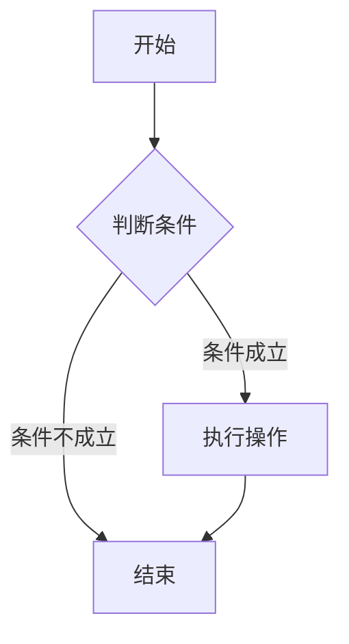
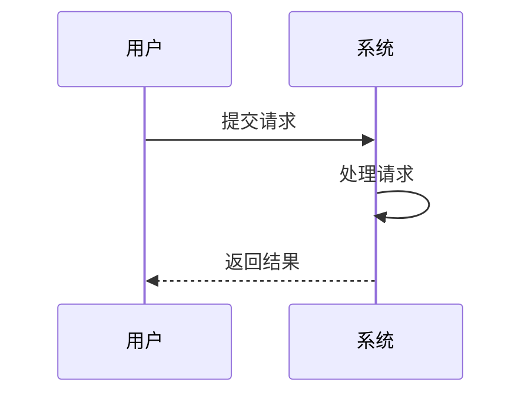
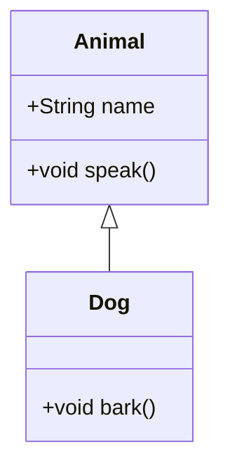
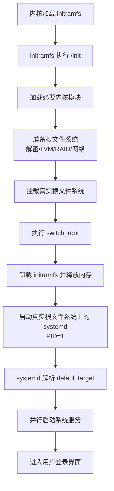
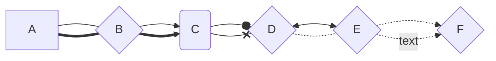

# Markdown 专业指南

## 标题

# H1 标题

## H2 标题

### H3 标题

#### H4 标题

##### H5 标题

###### H6 标题

## 文本样式

*这是斜体*
_这也是斜体_

**这是粗体**
__这也是粗体__

~~删除线文本~~

`行内代码`

## 列表

### 无序列表

- 项目一
- 项目二
  - 子项目一
  - 子项目二

### 有序列表

1. 第一项
2. 第二项
   1. 子项一
   2. 子项二

## 链接和图片

[Markdown官方文档](https://daringfireball.net/projects/markdown/)


## 引用块

> 这是引用文本
> 多行引用
>
> — 作者名称

## 代码块

```python
def hello_world():
    print("Hello, World!")
    return True
```

## 代码块

```cpp
int main (){
    int n = 5, step = 0;
    while (n != 1){
        if (n % 2 == 0){
            n /= 2;
        }else{
            n = 3 * n + 1;
        }
        step++;
    }
    // printf("The number of steps is %d", step);
    cout << "The number of steps is " << step << endl;
    return 0;
}
//输出：The number of steps is 5
```

==marked==
==???==

## 画图：

### 1. Mermaid（最推荐，通用性强）

1. 流程图示例



2. 时序图示例



### 2. 流程图（Flowchart）语法


### 3. 甘特图示例


### 4. 类图示例



### 5.


### 
```markdown
---
-->
===
==>
--o
--x
<-->
-.-
-.->
-.text.->
```



## 字体颜色

- <b style="color:red">唯一能够 “执行程序” 的系统调用 </b>唯一能够 “执行程序” 的系统调用
- <b style="color:#4169E1">重置 </b>重置
- <font color="red">你的文本</font>你的文本

- <table><tr><td bgcolor="#F5EEFD">文字</td></tr></table> 重置
- <mark style="background-color: red">文字 </mark>重置
- <span style="background-color: lightgreen">文字重置

## 首行缩进
操作系统通过虚拟内存为每个进程提供独立的地址空间，实现了进程间的隔离和保护。操作系统通过 mmap/munmap 实现地址空间的管理，并且还提供特定机制 (如 procfs、ptrace、process_vm_writev、共享内存等) 访问彼此的地址空间。
　　操作系统通过虚拟内存为每个进程提供独立的地址空间，实现了进程间的隔离和保护。操作系统通过 mmap/munmap 实现地址空间的管理，并且还提供特定机制 (如 procfs、ptrace、process_vm_writev、共享内存等) 访问彼此的地址空间。

全角空格
