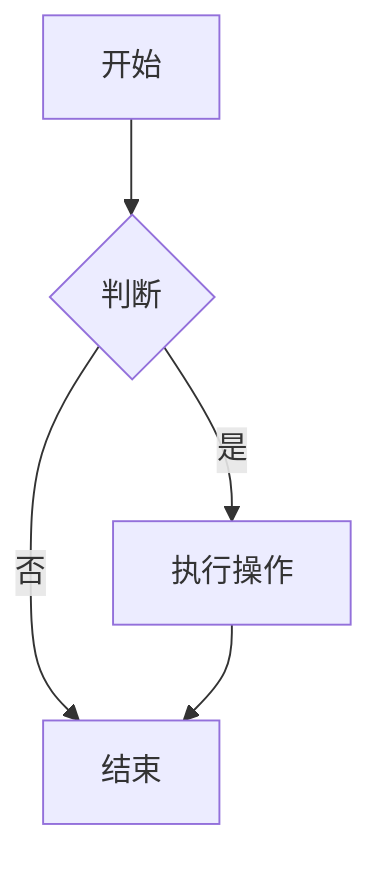
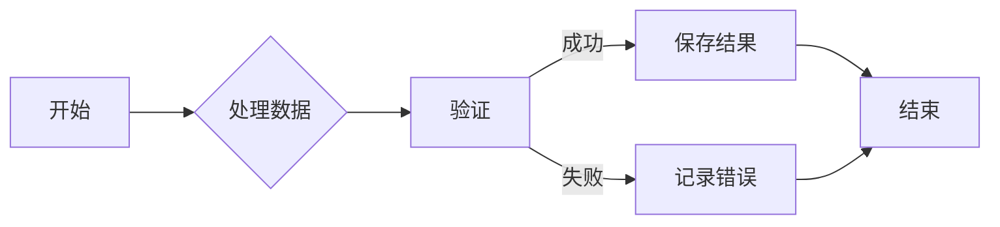
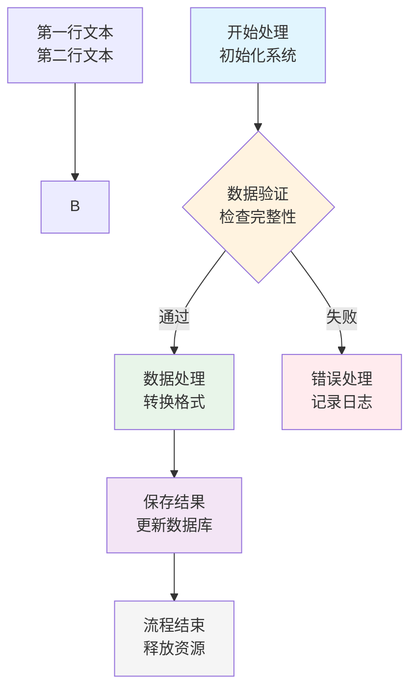
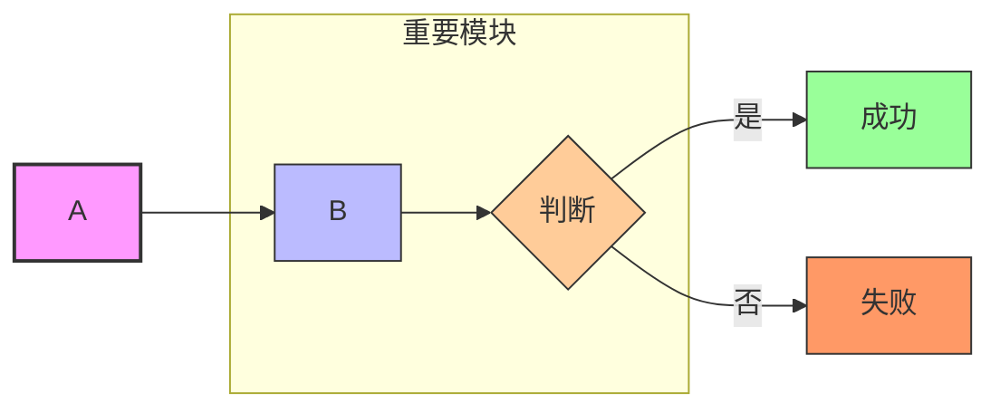
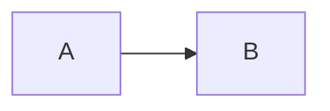

# Project: My Awesome App - API Design Notes
## Authentication Module
### JWT Implementation Decisions

## 1.​​标题 (Headers): ​使用`#`#定义不同层级的标题，组织笔记结构。

## 2.​​列表 (Lists): 有序列表 (`1.`) 和无序列表 (`-`或`*`) 
- [x] Implement user registration endpoint
- [ ] Add email verification
- [ ] Write unit tests for auth service
  - [ ] Implement user login endpoint
  - [ ] Implement user logout endpoint
* [ ] Implement user login endpoint
* [ ] Implement user logout endpoint

## 3.​代码块 (Code Blocks):​ ​​最重要！​​ 用 ` ``` `包裹代码片段。可以指定语言以获得语法高亮。
```python

def calculate_sum(a, b):

"""Adds two numbers."""

return a + b

```

```bash

Command to start the dev server
npm run dev

```
## 4.​​行内代码 (Inline Code):​ 用反引号`` ` `` 包裹行内的代码、命令、文件名或变量名。
`The configuration is stored inconfig.yaml.Use the get_user()function.`

## 5.链接(Links): ​使用`[Title](URL)`语法创建链接。
- See the [database schema diagram](./docs/db_schema.png) for details.

- Reference the [official React docs](https://reactjs.org/docs/hooks-intro.html).

  - Reference the [official React docs][参考]


## 6.图片 (Images): ​使用``语法插入图片。（通常建议放在项目内的 docs/或 images/目录）。


## 7.​​表格 (Tables):​​​ ​使用`|`和`-`创建表格。
| Parameter     | Default Value | Description          |
| :------------ | :-----------: | -------------------: |
| `timeout`     |     30s       | Request timeout      |
| `max_retries` |      3        | Maximum API retries |

## 8.块引用 (Blockquotes): ​使用`>`创建块引用。    
> **Important:** This endpoint requires admin privileges.
>> Please make sure to use secure authentication methods such as OAuth 2.0 or JSON Web Tokens (JWT) to ensure the security of your API.
>>> **Note:** This endpoint is rate-limited to prevent abuse.

## 9.​​强调 (Emphasis):​
- ​`**`或`__`加粗: **italic** or __italic__
- ​`*`或`_`斜体: *italic* or _italic_
- `~~`删除线: ~~strikethrough~~

## 10.​​分隔线 (Horizontal Rule): ​使用三个或三个以上的`*`、`-`或`_`创建分隔线。

***
---
___

## 11.​​脚注 (Footnotes): ​使用`[^1]`语法创建脚注。
- This is 1st footnote.[^1]
- This is 2nd footnote.[^2]
- This is 3rd footnote [^research_source]

---

[^1]: This is the first footnote.
[^2]: This is the second footnote.
[^research_source]: Smith, J., & Jones, A. (2023). *The Study of Things*. Academic Press. [Link](https://example.com/study)

## Using Footnotes in Markdown

Markdown is a lightweight markup language.[1](@ref) It allows you to write using an easy-to-read, easy-to-write plain text format, which then converts to structurally valid HTML (or other formats).[2](@ref)

Footnotes are a useful feature for adding supplementary information without cluttering the main text.[3](@ref)


### References

[1](@ref): Created by John Gruber in 2004.
[2](@ref): Many static site generators and documentation tools support Markdown.
[3](@ref): Footnotes appear as superscript numbers in the text and are listed at the bottom of the document or section.

## 12.画图
### 1. Mermaid - 现代 Markdown 绘图的绝对主流


方法一：使用 <br>标签（最常用）






### 2. PlantUML - 专业、强大的图表标准


### 3. Graphviz - 关系图和网络图的终极武器


### 4. 纯文本草图 - 快速沟通
    +--------+   request   +-------------+
    |        | ----------> |             |
    | Client |             |   Server    |
    |        | <---------- |             |
    +--------+   response  +-------------+

## 导出pdf
***注意: 远程linux没有安装chrome，需要在windows上转pdf。***
- [x] 插件Markdown Preview Enhanced可以将markdown文件导出为pdf文件。


[参考]: https://reactjs.org/docs/hooks-intro.html
