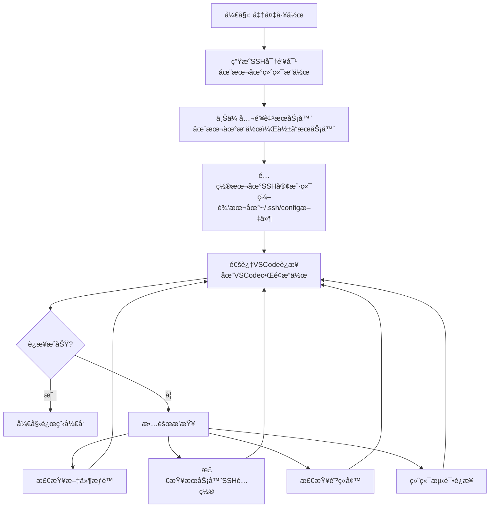

# 2025 å—京大学æ“作系统åŸç†

*本文档为å—京大学æ“作系统åŸç†è¯¾ç¨‹çš„软件ç¯å¢ƒé…置说æ˜ã€‚*

- [视频b站](https://www.bilibili.com/video/BV1XZAbeqEyt/)
- [课程资料](https://jyywiki.cn)

## ç¯å¢ƒé…ç½®

- **编辑器**：VS Code
- **æ“作系统wsl2**：Ubuntu 22.04

### WSL2 and Ubuntu 22.04 安装

```bash
# é…置代ç†
`7897` 端å£ä¿®æ”¹
$env:https_proxy="http://127.0.0.1:7897"
$env:http_proxy="http://127.0.0.1:7897"
Remove-Item Env:\https_proxy
Remove-Item Env:\http_proxy

set http_proxy=http://127.0.0.1:10808
set https_proxy=http://127.0.0.1:10808
set all_proxy=socks5://127.0.0.1:10808

set HTTP_PROXY=http://127.0.0.1:10808
set HTTPS_PROXY=http://127.0.0.1:10808
set ALL_PROXY=socks5://127.0.0.1:10808


wsl --instail --no-distribution
wsl --list --online
wsl --list --verbose
wsl --install -d Ubuntu-24.04
wsl --install -d Ubuntu-22.04
wsl --install -d Ubuntu-20.04

# é‡ç½® WSL 组件：
wsl --unregister Ubuntu-22.04       # å¸è½½å½“å‰æŸå的分å‘
wsl --shutdown                      # 关闭 WSL åå°è¿›ç¨‹
wsl --install --no-distribution     # é‡è£… WSL 内核

# é‡å¯åé‡æ–°å®‰è£… Ubuntu
wsl --install -d Ubuntu-22.04
# 首次安装登录需è¦è¾“入用户å和密ç ï¼Œä¹‹å会自动安装必è¦è½¯ä»¶ã€‚

# ç¯å¢ƒéªŒè¯ï¼š
wsl -l -v                           # 查看 WSL 版本（应为 2）

# 打开WSL终端：在 PowerShell 输入 wsl ç›´æ¥è¿›å…¥ 
wsl                                 # 显示：yourname@DESKTOP-XXXXXX:~$
# 退出WSL终端：输入exit
exit

# å¸è½½wsl
wsl --shutdown
wsl --list --all
wsl --list --verbose
wsl --unregister <DistributionName>

wsl --uninstall
wsl --list
```

### 软件下载

```bash
sudo apt update                       # 更新软件æºï¼ˆè¿æ¥Ubuntu官方仓库）
sudo apt install -y build-essential   # 安装编译工具链（GCC/G++/Make等）**
sudo apt install -y git               # 安装 Git

# 安装常用编辑器（选一个å³å¯ï¼ŒVim 或 Nano）
sudo apt install -y vim               # æ¨è Vim
或
sudo apt install -y nano              # 更简å•çš„ Nano

sudo apt install -y gdb               # 安装调试器 GDB
sudo apt install -y openssh-server    # 安装 SSH æœåŠ¡å™¨ï¼ˆé‡è¦ï¼ç”¨äºåç»­ VS Code è¿æ¥ï¼‰ 
or 
sudo apt-get install openssh-server   #（å¯é€‰ï¼‰

gcc --version                         # 检查编译器，其他软件类似

sudo apt-get install -y fish          # 安装fish
chsh -s $(which fish)                 # 设置默认 shell 为 fish
```

### SSH设置

```bash
ssh localhost                       # 测试 SSH æœåŠ¡

sudo systemctl enable ssh           # å¯ç”¨SSH开机自å¯
sudo systemctl start ssh            # ç«‹å³å¯åŠ¨æœåŠ¡ == sudo service ssh start
passwd                              # 设置登录密ç ï¼ˆäº‘æœåŠ¡å™¨é€šå¸¸ç”¨å¯†é’¥ç™»å½•ï¼‰

âš ï¸ å®‰å…¨æ示：
生产ç¯å¢ƒå»ºè®®ç”¨å¯†é’¥ç™»å½•è€Œé密ç ï¼Œæ­¤å¤„为简化æµç¨‹ä½¿ç”¨å¯†ç ç™»å½•ã€‚
```

- 首次执行 ssh localhost 会æ示ä¿å­˜å¯†é’¥ï¼Œè¾“å…¥ yes
- 之å会è¦æ±‚输入密ç ï¼ˆè¾“入你的 WSL 用户密ç ï¼‰

### VS Code Remote-SSSH 密钥è¿æ¥ Linux æœåŠ¡å™¨æŒ‡å—

> 通过SSH密钥è¿æ¥LinuxæœåŠ¡å™¨ï¼Œæ—¢å®‰å…¨åˆæ–¹ä¾¿ï¼Œè¿˜èƒ½å…å»æ¯æ¬¡è¾“入密ç çš„麻烦。下é¢æ˜¯ä¸€ä»½è¯¦ç»†çš„步骤指å—，包括æ¯ä¸€æ­¥çš„æ“作ä½ç½®å’Œä½œç”¨ã€‚

#### 1. 准备工作

- **è·å–æœåŠ¡å™¨ä¿¡æ¯**：
  - æœåŠ¡å™¨ IP 地å€
  - 用户å
  - 密ç ï¼ˆå¦‚æœä½¿ç”¨å¯†ç ç™»å½•ï¼‰

```bash
hostname # Host DESKTOP-UUJIN0R
hostname -I # 显示的IP  HostName 172.31.221.21
whoami # è¾“å‡ºçš„ç”¨æˆ·å  User hhu 
```

#### 2. 安装必è¦çš„VSCode扩展

Microsoftå‘布的 `Remote-SSH`扩展

#### 3. 生æˆSSH密钥对

**作用**：创建一对加密密钥（公钥和ç§é’¥ï¼‰ã€‚公钥将放置äºæœåŠ¡å™¨ï¼Œç§é’¥ä¿ç•™åœ¨æœ¬åœ°ï¼Œç”¨äºèº«ä»½éªŒè¯ï¼Œå®ç°å…密ç ç™»å½•ã€‚

1. 打开终端：本地计算机的终端（Windows系统å¯ä½¿ç”¨**PowerShell**ã€CMD或Git Bashï¼›Linux/macOS系统使用系统终端）。
2. 执行以下命令生æˆå¯†é’¥å¯¹ï¼ˆæ¨è使用更ç°ä»£çš„Ed25519算法，或使用兼容性更好的RSA算法）：
   **Ed25519 (æ¨è)**：

   ```bash
   ssh-keygen -t ed25519 -C "你的注释（如邮箱或用途说æ˜ï¼‰"
   ```

   **RSA (兼容旧系统)**：

   ```bash
   ssh-keygen -t rsa -b 4096 -C "你的注释（如邮箱或用途说æ˜ï¼‰"
   ```

   å‚数解释：

   * `-t rsa`：指定密钥类å‹ä¸ºRSA
   * `-b 4096`：指定密钥长度为4096ä½ï¼ˆæ›´å®‰å…¨ï¼‰
   * `-C`：添加注释（通常用邮箱标识）
3. 系统会æ示你选择密钥ä¿å­˜ä½ç½®ã€‚默认是 `C:\Users\你的用户å\.ssh\id_rsa`（Windows）或 `~/.ssh/id_rsa`（Linux/Mac）。**建议直æ¥æŒ‰å›è½¦ä½¿ç”¨é»˜è®¤ä½ç½®**。
4. æ¥ç€ä¼šæ示你**设置一个密钥密ç **（passphrase），这å¯ä»¥ä¸ºå¯†é’¥å†åŠ ä¸€å±‚ä¿æŠ¤ã€‚

> **为了真正å®ç°â€œå…密â€ç™»å½•ï¼Œå¯ä»¥ç›´æ¥æŒ‰ä¸¤æ¬¡å›è½¦è·³è¿‡è®¾ç½®**（但出äºå®‰å…¨è€ƒè™‘，设置一个密ç ä¼šæ›´å®‰å…¨ï¼‰ã€‚）。

**密钥å£ä»¤(passphrase)删除:**
方法：使用 ssh-keygen 命令移除å£ä»¤
这个过程é常简å•ï¼Œä½ åªéœ€è¦ä¸€ä¸ªå‘½ä»¤ã€‚

1. 打开终端

   - 在 Windows 上，你å¯ä»¥ä½¿ç”¨ PowerShell 或 CMD。
   - 在 macOS 或 Linux（包括 WSL）上，直æ¥æ‰“开系统终端。
2. 执行命令
   è¿è¡Œä»¥ä¸‹å‘½ä»¤ï¼Œå°† 路径/到/ä½ çš„/ç§é’¥ 替æ¢ä¸ºä½ çš„ç§é’¥æ–‡ä»¶çš„å®é™…路径（例如 C:\Users\YourUserName\.ssh\id_rsa 或 ~/.ssh/id__rsa）。

   ```bash
   ssh-keygen -p -f "路径/到/ä½ çš„/ç§é’¥"
   ```

   - `-p`：表示è¦æ±‚修改ç§é’¥çš„å£ä»¤ã€‚
   - `-f`：用äºæŒ‡å®šè¦æ“作的ç§é’¥æ–‡ä»¶ã€‚
3. 按æ示æ“作
   系统会首先æ示你输入当å‰çš„å£ä»¤ï¼ˆå¦‚æœä½ å½“å‰æœ‰è®¾ç½®çš„è¯ï¼‰ã€‚

   ```bash
   Enter old passphrase:
   ```

   然å，系统会æ示你输入新å£ä»¤ã€‚这里直æ¥æŒ‰ä¸¤æ¬¡å›è½¦é”®ï¼Œè¾“入空密ç å³å¯ã€‚

   ```bash
   Enter new passphrase (empty for no passphrase):
   Enter same passphrase again:
   ```
4. 完æˆ
   如æœçœ‹åˆ° `Your identification has been saved with the new passphrase`. 这样的æ示，就表示å£ä»¤å·²æˆåŠŸç§»é™¤ã€‚

> 更安全的替代方案：强烈æ¨è使用 ssh-agent + ssh-add çš„æ–¹å¼ã€‚

生æˆæˆåŠŸå，你å¯ä»¥åœ¨æŒ‡å®šä¿å­˜ä½ç½®ï¼ˆé»˜è®¤æ˜¯æœ¬åœ°ç”¨æˆ·ç›®å½•ä¸‹çš„ .ssh 文件夹，例如 `C:\Users\你的用户å\.ssh\`）找到两个文件：

- `id_rsa`：ç§é’¥ï¼ˆPrivate Key），**ç»ä¸èƒ½æ³„露**，åƒä½ çš„钥匙一样ä¿ç®¡å¥½ã€‚
- `id_rsa.pub`：公钥（Public Key），需è¦æ”¾åˆ°æœåŠ¡å™¨ä¸Šï¼Œåƒæ˜¯ä½ èƒ½ç»™åˆ«äººçš„é—¨ç¦å¡ã€‚

#### 4. 将公钥上传到LinuxæœåŠ¡å™¨

**æ“作ä½ç½®**：ä»æœ¬åœ°è®¡ç®—机æ“作，将公钥文件内容添加到远程æœåŠ¡å™¨çš„指定文件中。
**作用**：让æœåŠ¡å™¨çŸ¥æ™“并信任你的公钥，å…许æŒæœ‰å¯¹åº”ç§é’¥çš„客户端进行è¿æ¥ã€‚

- [ ] **方法一：使用 `ssh-copy-id` 命令（最简å•ï¼Œæ¨è）**
  在本地终端中è¿è¡Œï¼š

```bash
ssh-copy-id -i ~/.ssh/id_rsa.pub username@server_ip
```

- 请将 `username` 替æ¢ä¸ºä½ çš„æœåŠ¡å™¨ç”¨æˆ·å
- `server_ip` 替æ¢ä¸ºæœåŠ¡å™¨çš„IP地å€æˆ–域å
- `id_rsa.pub` 替æ¢ä¸ºä½ å®é™…生æˆçš„公钥文件å
- `-i ~/.ssh/id_rsa.pub` 指定公钥路径。如æœå…¬é’¥å°±åœ¨é»˜è®¤ä½ç½®ä¸”å称是 `id_rsa.pub`，有时å¯ä»¥çœç•¥ `-i` 部分。
- æ ¹æ®æ示输入æœåŠ¡å™¨çš„用户密ç ã€‚输入å，公钥会自动追加到æœåŠ¡å™¨å¯¹åº”用户的 `~/.ssh/authorized_keys` 文件中。

- [X] **方法二：手动å¤åˆ¶ï¼ˆé€šç”¨æ–¹æ³•ï¼‰ï¼ˆå¦‚æœ `ssh-copy-id` ä¸å¯ç”¨ï¼‰**

1. **在本地计算机**上查看公钥内容：
   ```bash
   cat ~/.ssh/id_rsa.pub
   ```

   å¤åˆ¶ç»ˆç«¯æ˜¾ç¤ºçš„全部内容。
2. **登录到远程æœåŠ¡å™¨**（使用密ç SSH登录或通过其他方å¼ï¼‰ã€‚
3. 在æœåŠ¡å™¨ä¸Šï¼Œç¡®ä¿å­˜åœ¨ `~/.ssh` 目录并设置正确æƒé™ï¼Œç„¶åå°†å¤åˆ¶çš„公钥内容追加到 `authorized_keys` 文件中：
   ```bash
   mkdir -p ~/.ssh # 创建 ~/.ssh 目录（如æœä¸å­˜åœ¨ï¼‰
   echo "ä½ å¤åˆ¶çš„公钥内容" >> ~/.ssh/authorized_keys # 将公钥内容追加到 authorized_keys 文件中

   # 下é¢ä¸ä¸€å®šè¦è®¾ç½®
   chmod 700 ~/.ssh          # 设置.ssh目录æƒé™ä¸ºä»…用户å¯è¯»ã€å†™ã€æ‰§è¡Œ
   chmod 600 ~/.ssh/authorized_keys # 设置authorized_keys文件æƒé™ä¸ºä»…用户å¯è¯»ã€å†™
   ```

**é‡è¦æ示**：åƒä¸‡ä¸èƒ½ä½¿ç”¨ `>`覆盖已有的 `authorized_keys` 文件（如æœå­˜åœ¨çš„è¯ï¼‰ï¼Œå¦åˆ™å…¶ä»–å·²é…置密钥的用户将无法登录ï¼ä¸€å®šè¦ä½¿ç”¨ `>>` 追加或å°å¿ƒåœ°åœ¨æ–‡ä»¶ä¸­æ·»åŠ ã€‚

> 使用文本编辑器（如 vim）打开 authorized_keys 文件并粘贴进å»ä»£ç 

```bash
ssh your_username@your_server_ip
# 例如： ssh hhu@172.31.221.21
# 然å输入用户密ç 
cd ~ # 进入用户主目录（å¯é€‰ï¼Œä½†å¥½ä¹ æƒ¯ï¼‰
mkdir -p ~/.ssh  # -p å‚æ•°ç¡®ä¿å¦‚æœç›®å½•å·²å­˜åœ¨ä¹Ÿä¸ä¼šæŠ¥é”™
vim ~/.ssh/authorized_keys
cat ~/.ssh/authorized_keys # （å¯é€‰ï¼‰ç¡®è®¤ä¸€ä¸‹æ–‡ä»¶å†…容是å¦æ­£ç¡®
```

**vim 编辑器内的æ“作指令**
这是一个简å•çš„æ“作æµç¨‹ã€‚进入 vim å，你会看到（如æœæ˜¯æ–°æ–‡ä»¶ï¼‰ä¸€ä¸ªç©ºç™½çª—å£æˆ–者（如æœæ˜¯å·²æœ‰æ–‡ä»¶ï¼‰æ–‡ä»¶çš„内容。界é¢åº•éƒ¨ä¼šæ˜¾ç¤ºæ–‡ä»¶å和行数等信æ¯ã€‚

- 按 i 键：进入æ’å…¥æ¨¡å¼ (Insert Mode)。此时底部会显示 -- INSERT --，表示你å¯ä»¥å¼€å§‹è¾“入或粘贴文本了。
- 粘贴公钥内容：

  - 在你本地电脑上，用记事本或任何文本编辑器打开你的公钥文件 (id_rsa.pub)。
  - 完整地å¤åˆ¶å…¶ä¸­çš„所有内容（它应该是一长行文本，以 ssh-rsa AAAAB3NzaC1yc2E... 开头，结尾是你的邮箱注释）。
  - å›åˆ°æœåŠ¡å™¨çš„终端 vim 窗å£ä¸­ï¼Œå³é”®å•å‡»è¿›è¡Œç²˜è´´ã€‚或者，对äºæŸäº›ç»ˆç«¯ï¼Œå¯èƒ½éœ€è¦ä½¿ç”¨ Shift+Insert å¿«æ·é”®è¿›è¡Œç²˜è´´ã€‚
  - ç¡®ä¿ç²˜è´´çš„内容是完整的一行，没有多余的æ¢è¡Œæˆ–空格。
- 按 Esc 键：退出æ’入模å¼ï¼Œå›åˆ°å‘½ä»¤æ¨¡å¼ (Command Mode)。底部的 -- INSERT -- 会消失。
- ä¿å­˜å¹¶é€€å‡ºï¼š

  - 输入 :wq ï¼ˆå†’å· : 会激活底部的命令输入，æ¥ç€è¾“å…¥ wq）
  - 然å按 Enter 键。
  - :w = write (ä¿å­˜)
  - :q = quit (退出)
  - :q! = force quit (强制退出，ä¸ä¿å­˜)
  - :x = ä¿å­˜å¹¶é€€å‡º (ä¿å­˜å¹¶é€€å‡º)
  - :w 文件å = å¦å­˜ä¸º (å¦å­˜ä¸ºæ–‡ä»¶å)
    :q
  - :wqa = ä¿å­˜å¹¶é€€å‡ºæ‰€æœ‰çª—å£ (ä¿å­˜å¹¶é€€å‡ºæ‰€æœ‰çª—å£)

#### 5. é…置本地VSCodeçš„SSHé…置文件

**作用**：告诉VSCode如何è¿æ¥ä½ çš„æœåŠ¡å™¨ï¼Œä»¥åŠä½¿ç”¨å“ªä¸ªç§é’¥æ–‡ä»¶è¿›è¡Œè®¤è¯ã€‚
**æ“作ä½ç½®**：VSCode的设置远程资æºç®¡ç†å™¨ï¼ˆRemote-SSH扩展æ供）。

1. 在VSCode中，按 `F1` 或 `Ctrl+Shift+P` 打开命令é¢æ¿ã€‚
2. 输入 **`Remote-SSH: Open SSH Configuration File...`** 并选择。
3. ä»åˆ—表中选择你的SSHé…置文件（通常是 `C:\Users\你的用户å\.ssh\config`**Windows** 或 `~/.ssh/config`**Linux/macOS**）。
4. 在é…置文件中添加以下内容（如æœæ–‡ä»¶ä¸å­˜åœ¨åˆ™åˆ›å»ºï¼‰ï¼š**注æ„æ ¼å¼ï¼Œå°¤å…¶æ˜¯ç¼©è¿›**
   ```ssh
   Host MyRemoteServer # 自定义一个易记的æœåŠ¡å™¨åˆ«å
     HostName your_server_ip # æœåŠ¡å™¨çš„IP地å€æˆ–域å
     User your_username      # 登录æœåŠ¡å™¨çš„用户å
     IdentityFile ~/.ssh/id_rsa # 本地ç§é’¥æ–‡ä»¶çš„路径
     # Port 22 # 如æœSSHæœåŠ¡ä¸æ˜¯é»˜è®¤çš„22端å£ï¼Œå–消注释并修改端å£å·
   ```

   * å°† `MyRemoteServer` 替æ¢ä¸ºä½ å–œæ¬¢çš„ä»»æ„别å。
   * å°† `your_server_ip` å’Œ `your_username` 替æ¢ä¸ºå®é™…ä¿¡æ¯ã€‚
   * `IdentityFile` å的路径指å‘ä½ çš„**ç§é’¥**文件。如æœä½ ç”Ÿæˆå¯†é’¥æ—¶æŒ‡å®šäº†å…¶ä»–å称或路径，请在这里修改。有时候ä¸éœ€è¦å¯èƒ½é»˜è®¤ä½ç½®å°±è¡Œã€‚

#### 6. 在VSCode中è¿æ¥åˆ°è¿œç¨‹æœåŠ¡å™¨

**æ“作ä½ç½®**：本地计算机上的VSCode。
**作用**：建立VSCodeä¸è¿œç¨‹æœåŠ¡å™¨çš„è¿æ¥ï¼Œå¼€å§‹è¿œç¨‹å¼€å‘。
**步骤**：

1. 点击VSCode左下角的**è“色远程è¿æ¥æŒ‰é’®**（类似“><â€ç¬¦å·ï¼‰ã€‚
2. 在弹出的顶部命令框中，选择 **`Remote-SSH: Connect to Host...`**。
3. - ä»åˆ—表中选择你刚æ‰åœ¨ `config` 文件里设置的**主机别å**（如 `MyRemoteServer`）。
   - 选择“Add New SSH Host...â€ï¼Œç„¶å输入 `ssh username@server_ip` æ ¼å¼çš„命令（如æœä½ æ²¡æœ‰é…ç½®config文件）。
4. 如æœä¸€åˆ‡é…置正确，VSCode将会在新窗å£ä¸­æ‰“开并è¿æ¥åˆ°ä½ çš„æœåŠ¡å™¨ï¼Œ**ä¸å†éœ€è¦è¾“入密ç **。第一次è¿æ¥æ—¶å¯èƒ½ä¼šè¯¢é—®ä½ æ˜¯å¦ç»§ç»­è¿æ¥ï¼ˆéªŒè¯æœåŠ¡å™¨æŒ‡çº¹ï¼‰ï¼Œé€‰æ‹©ç¡®è®¤å³å¯ã€‚
5. è¿æ¥æˆåŠŸå，你å¯ä»¥é€šè¿‡VSCodeçš„**文件管ç†å™¨**打开æœåŠ¡å™¨ä¸Šçš„目录，使用**集æˆç»ˆç«¯**è¿è¡Œå‘½ä»¤ï¼Œå°±åƒåœ¨æœ¬åœ°æ“作一样。

```ssh
# Host DESKTOP-UUJIN0R  # hostname
#   HostName 172.31.221.21  # 替æ¢ä¸º hostname -I 显示的IP
#   User hhu # 替æ¢ä¸º whoami 输出的用户å

# Host 172.31.221.21 # 自定义别å
#   HostName 172.31.221.21 # WSL2å¯é€šè¿‡localhost访问
#   User hhu # 你在WSLå­ç³»ç»Ÿä¸­çš„用户å
#   Port 22 # SSH默认端å£
#   IdentityFile "C:\Users\Administrator\.ssh\id_rsa" # ç§é’¥è·¯å¾„
#   # è‹¥WSL SSH使用é默认端å£ï¼Œéœ€ä¿®æ”¹Port项sudo service ssh restart

# é•œåƒç½‘络模å¼
Host DESKTOP-UUJIN0R  # hostname
  HostName localhost # 替æ¢ä¸º hostname -I 显示的IP  192.168.3.17
  User hhu # 替æ¢ä¸º whoami 输出的用户å
  Port 22 # SSH默认端å£
  IdentityFile "C:\Users\Administrator\.ssh\id_rsa" # ç§é’¥è·¯å¾„
```

#### 7. æ•…éšœæ’查

如æœè¿æ¥å¤±è´¥ï¼Œå¯ä»¥æ£€æŸ¥ä»¥ä¸‹å‡ ç‚¹ï¼š

1. **æœåŠ¡å™¨SSHæœåŠ¡é…ç½®**：确ä¿æœåŠ¡å™¨ä¸Š `/etc/ssh/sshd_config` 中包å«ä»¥ä¸‹è®¾ç½®ï¼šï¼ˆä¼¼ä¹ä¸éœ€è¦ï¼‰
   ```bash
   PubkeyAuthentication yes
   AuthorizedKeysFile .ssh/authorized_keys
   ```

   修改å需é‡å¯SSHæœåŠ¡ï¼ˆå¦‚ `sudo systemctl restart sshd`）。
2. **æƒé™æ£€æŸ¥**：å†æ¬¡ç¡®è®¤æœåŠ¡å™¨ä¸Š `.ssh` 目录和 `authorized_keys` 文件的æƒé™æ˜¯å¦æ­£ç¡®ã€‚
3. **config文件语法**：确ä¿SSH config文件中`<b style="color:red">`æ¯è¡Œç¼©è¿›ä½¿ç”¨ç©ºæ ¼`</b>`，ä¸è¦ç”¨Tab键；`IdentityFile` åç›´æ¥è·Ÿè·¯å¾„，中间是空格，没有冒å·æˆ–其他符å·ã€‚
4. **防ç«å¢™**：检查æœåŠ¡å™¨é˜²ç«å¢™æ˜¯å¦æ”¾è¡Œäº†SSH端å£ï¼ˆé»˜è®¤22）。

#### 💡 多密钥管ç†

如æœä½ éœ€è¦ä¸ºä¸åŒçš„æœåŠ¡å™¨æˆ–æœåŠ¡ï¼ˆå¦‚GitHub）使用ä¸åŒçš„密钥对，å¯ä»¥åœ¨SSH config文件中为æ¯ä¸ªä¸»æœºé…ç½®ä¸åŒçš„ `IdentityFile`：

```ssh
Host ServerA
    HostName 192.168.1.100
    User alice
    IdentityFile ~/.ssh/id_rsa_server_a

Host github.com
    HostName github.com
    User git
    IdentityFile ~/.ssh/id_rsa_github
    IdentitiesOnly yes # ç¡®ä¿åªä½¿ç”¨æŒ‡å®šçš„密钥
```

#### æµç¨‹æ¦‚览



### GIT 仓库克隆 è“æ¡¥

- **克隆仓库**
  git clone https://github.com/your_username/your_repository.git
- **切æ¢åˆ†æ”¯**
  git checkout -b your_branch_name
- **æ交代ç **
  git add .
  git commit -m "your_commit_message"
- **æ¨é€ä»£ç **
  git push origin your_branch_name
- **创建 Pull Request**

#### 在 GitHub 上创建仓库ã€

1. 首先，申请一个 GitHub 账户。
2. 第二步，我们æ¥æ–°å»ºä¸€ä¸ªä»£ç ä»“库。
   - 仓库（repository），å¯ç†è§£ä¸ºå‚¨å­˜ä»£ç çš„场所，点击个人主页的å³ä¸Šè§’的加å·ï¼Œå†ç‚¹å‡» New repository，å³å¯åˆ›å»ºæ–°çš„仓库：
   - 然å给你的仓库命å（比如说 Demo），然å点击 Create Repository，无需考虑本页é¢çš„其他选项。

#### 添加 SSH å…³è”æˆæƒ

- 在终端执行下é¢å‘½ä»¤ï¼Œæ¯æ¬¡è¯¢é—®æŒ‰å›è½¦å³å¯ã€‚

  ```bash
  ssh-keygen -t ed25519 -C "你的邮箱地å€"
  ```
- 终端执行 ssh-keygen 命令按几次å›è½¦ç”Ÿæˆå…¬ç§é’¥ï¼Œå…¬ç§é’¥å­˜æ”¾åœ¨ä¸»ç›®å½•ä¸‹çš„éšè—目录 .ssh 中的两个文件中：
- å°† ~/.ssh/id_ed25519.pub 文件中的公钥内容å¤åˆ¶å‡ºæ¥
- 然å在 GitHub 网页上添加公钥：

  - Title 自定义，把剪切æ¿ä¸­çš„内容粘贴到 Key 中，点击绿色按钮添加 SSH Key å³å¯ï¼š

#### 克隆 GitHub 上的仓库到本地

`git clone + [仓库地å€] `

### 挑战：æ交我的代ç 

**介ç»**
我们已ç»æœ‰äº† Github è´¦å·ï¼Œç°åœ¨éœ€è¦ä½ èƒ½æ–°å»ºä¸€ä¸ªä»“库，并å‘仓库中æ交上一个挑战的代ç ã€‚你需è¦å®Œæ•´åœ°æ‰§è¡Œä¸€æ¬¡å¯¹ GitHub 仓库的创建ã€å…‹éš†ã€æ交ã€æ¨é€æ“作。

**目标**

1. 在自己电脑中的æµè§ˆå™¨ä¸Šæ‰“å¼€ GitHub 页é¢ï¼Œç™»å½•è´¦å·å创建 `shiyanlou-code` 仓库。
2. 在å®éªŒç¯å¢ƒä¸­ï¼Œå…‹éš†ä½ çš„仓库到 `/home/shiyanlou/Code` 目录下。
3. 进入 `cd /home/shiyanlou/Code/shiyanlou-code` 中，新建 `jump7.py` 文件，并把你上个挑战的通过代ç ï¼Œå¤åˆ¶è¿›æ–‡ä»¶ä¸­ä¿å­˜ã€‚
4. 将全部修改添加到暂存区ã€åˆ›å»ºæ交ã€æ¨é€åˆ°è‡ªå·±çš„ GitHub 远程 `shiyanlou-code` 仓库
   本挑战没有标准答案，完æˆæ•´ä¸ªä¸Šä¼ ä»“库的æµç¨‹å³å¯ã€‚

**æ示语**

1. `git clone https://github.com/ä½ çš„Githubè´¦å·/仓库å称` 克隆仓库
2. `git add .` 添加修改到暂存区
3. `git commit -m 备注信æ¯` 创建新的æ交版本
4. `git push` å°†æ交æ¨é€åˆ°è¿œç¨‹ä»“库

- [x] **注æ„事项**
`git push` 第一次记得输入`yes`

`git clone --depth 1 --single-branch -b master https://github.com/davidgiven/minix2`

定期è¿è¡Œgit fetch???


---
> DS:windows vscode æ€ä¹ˆä»0开始git push 代ç åˆ°github? 如æœä½ æ˜¯ä¸€ä½ä¸“业人士，有更好的方法和建议å—？尽å¯èƒ½å…¨é¢ã€‚请具体列出详细步骤，æ“作ä½ç½®å’Œæ¯ä¸€æ­¥çš„作用

在Windows上使用VSCode将代ç æ¨é€åˆ°GitHub是一个高效的工作æµã€‚作为专业人士，我建议采用**SSHåè®®**进行è¿æ¥ï¼Œå› ä¸ºå®ƒæ¯”HTTPS更安全且无需频ç¹è¾“入凭è¯ã€‚下é¢æ˜¯ä¸€ä»½ä»é›¶å¼€å§‹çš„详细指å—，包å«ä¸“业优化建议。

# ğŸ› ï¸ Windows VSCode代ç æ¨é€GitHub专业指å—

## 准备工作

1.  **安装Git**
    访问[Git官网](https://git-scm.com/downloads)下载Windows版本。安装时一路默认选项å³å¯ï¼Œä½†æ³¨æ„在“Choosing the default editor used by Gitâ€è¿™ä¸€æ­¥ï¼Œå»ºè®®é€‰æ‹©**Use Visual Studio Code as Git’s default editor**。

2.  **安装VSCode**
    访问[VSCode官网](https://code.visualstudio.com/download)下载并安装。

3.  **é…ç½®Git用户信æ¯ï¼ˆå…¨å±€ï¼‰**
    在桌é¢ä¸Šå³é”®é€‰æ‹©â€œGit Bash Hereâ€ï¼Œæ‰§è¡Œä»¥ä¸‹å‘½ä»¤è¿›è¡Œå…¨å±€åŸºç¡€é…置（此é…置仅为åˆå§‹è®¾ç½®ï¼Œåç»­å¯ä¸ºä¸åŒé¡¹ç›®è®¾ç½®ä¸åŒä¿¡æ¯ï¼‰ï¼š
    ```bash
    git config --global user.name "Your GitHub Username"
    git config --global user.email "Your GitHub Email"
    ```
    使用 `git config --global --list` 命令验è¯é…置。

## 1. 使用SSH密钥认è¯ï¼ˆä¸“业æ¨è）

ä¸éœ€è¦æ¯æ¬¡è¾“入密ç æˆ–使用令牌的HTTPSæ–¹å¼ä¸åŒï¼ŒSSH密钥æ供了更安全ã€æ›´ä¾¿æ·çš„认è¯æ–¹å¼ã€‚

### 生æˆSSH密钥对
1.  打开 **Git Bash**。
2.  è¿è¡Œä»¥ä¸‹å‘½ä»¤ï¼ˆæ›¿æ¢ä¸ºä½ çš„邮箱）：
    ```bash
    ssh-keygen -t rsa -b 4096 -C "your_email@example.com"
    ```
3.  当æ示“Enter file in which to save the keyâ€æ—¶ï¼Œç›´æ¥æŒ‰å›è½¦ä½¿ç”¨é»˜è®¤è·¯å¾„（`C:\Users\你的用户å\.ssh\id_rsa`）。
4.  ä½ å¯ä»¥ä¸ºå¯†é’¥è®¾ç½®ä¸€ä¸ªå¯†ç ï¼ˆpassphrase），或者直æ¥å›è½¦ç•™ç©ºï¼ˆä¸“业人士建议设置密ç ä»¥å¢åŠ å®‰å…¨æ€§ï¼‰ã€‚

### 将SSH公钥添加到GitHub
1.  在Git Bash中è¿è¡Œ `cat ~/.ssh/id_rsa.pub`，å¤åˆ¶è¾“出的全部内容。
2.  登录GitHub，点击å³ä¸Šè§’å¤´åƒ -> **Settings** -> 左侧边æ çš„ **SSH and GPG keys**。
3.  点击 **New SSH key**，Titleå¯è‡ªå®šä¹‰ï¼ˆå¦‚`My Windows PC`），将å¤åˆ¶çš„公钥内容粘贴到Key框中，最å点击 **Add SSH key**。

### 验è¯SSHè¿æ¥
在Git Bash中è¿è¡Œï¼š
```bash
ssh -T git@github.com
```
如æœçœ‹åˆ°ç±»ä¼¼â€œHi your_username! You've successfully authenticated...â€çš„欢è¿ä¿¡æ¯ï¼Œè¯´æ˜è¿æ¥æˆåŠŸã€‚

## 2. 在GitHub上创建远程仓库

1.  登录GitHub，点击å³ä¸Šè§’“+â€å·ï¼Œé€‰æ‹© **New repository**。
2.  填写仓库å称（Repository name），选择公开（Public）或ç§æœ‰ï¼ˆPrivate）。**é‡è¦ï¼šå…ˆä¸è¦å‹¾é€‰â€œInitialize this repository with a READMEâ€**，因为我们将æ¨é€ä¸€ä¸ªå·²å­˜åœ¨çš„本地项目。

## 3. VSCodeåˆå§‹è®¾ç½®ä¸é¡¹ç›®å‡†å¤‡

### é…ç½®Git路径（如需è¦ï¼‰
VSCode通常会自动检测Git安装路径。如æœé‡åˆ°é—®é¢˜ï¼Œå¯ä»¥æ‰‹åŠ¨é…置：
1.  在VSCode中按 `Ctrl + ,` 打开设置。
2.  æœç´¢ `git.path`。
3.  在设置中添加项，指å‘ä½ çš„git.exe路径，例如：
    ```json
    "git.path": "D:\\Git\\bin\\git.exe"
    ```

### 打开项目文件夹
在VSCode中，通过 `File > Open Folder...` 打开你的项目根目录。

## 4. åˆå§‹åŒ–本地Git仓库并进行åˆå§‹æ交

以下æµç¨‹å¯¹æ¯”了VSCode图形界é¢æ“作和终端命令æ“作，你å¯ä»¥æ ¹æ®å–œå¥½é€‰æ‹©æˆ–结åˆä½¿ç”¨ã€‚

| 步骤 | VSCode图形界é¢æ“作（å¯è§†åŒ–） | 终端命令（æ§åˆ¶ç²¾ç¡®åº¦ï¼‰ | 步骤作用解æ |
| :--- | :--- | :--- | :--- |
| **1. åˆå§‹åŒ–仓库** | 点击左侧æºä»£ç ç®¡ç†å›¾æ ‡ï¼ˆCtrl+Shift+G）-> **Initialize Repository** | 在集æˆç»ˆç«¯ï¼ˆCtrl+`）中执行 `git init` | 在当å‰é¡¹ç›®æ–‡ä»¶å¤¹ä¸­åˆ›å»ºä¸€ä¸ªæ–°çš„Git本地仓库，生æˆä¸€ä¸ªéšè—çš„`.git`文件夹。 |
| **2. 暂存更改** | 在“æºä»£ç ç®¡ç†â€é¢æ¿çš„“Changesâ€ä¸‹ï¼Œå°†é¼ æ ‡æ‚¬åœåœ¨æ–‡ä»¶ä¸Šç‚¹å‡»â€œ+â€å·ï¼Œæˆ–点击“Changesâ€æ—的“+â€å·æš‚存所有更改。 | `git add .`（暂存所有文件）或 `git add <filename>`（暂存特定文件）。 | 将文件的当å‰ç‰ˆæœ¬å¿«ç…§æ·»åŠ åˆ°æš‚存区（Staging Area），准备进行æ交。 |
| **3. æ交更改** | 在“消æ¯â€è¾“入框（上方）中输入æ交信æ¯ï¼ˆå¦‚"Inital commit"），然å按Ctrl+Enteræ交，或点击“消æ¯â€æ¡†ä¸Šæ–¹çš„√图标。 | `git commit -m "Your commit message here"`。 | 将暂存区的快照永久记录到本地仓库的å†å²ä¸­ï¼Œå¹¶é™„上æ述性信æ¯ã€‚ |

## 5. 链æ¥è¿œç¨‹ä»“库并æ¨é€ä»£ç 

### 添加远程仓库地å€
你需è¦å‘Šè¯‰æœ¬åœ°ä»“库远程仓库在哪里。在GitHub仓库页é¢ï¼Œç‚¹å‡»ç»¿è‰²çš„“Codeâ€æŒ‰é’®ï¼Œé€‰æ‹© **SSH** 选项å¡ï¼Œå¤åˆ¶ä»¥ `git@github.com:` 开头的地å€ã€‚

-   **VSCodeæ–¹å¼**：
    1.  打开命令é¢æ¿ï¼ˆ`Ctrl+Shift+P`）。
    2.  输入并选择 **Git: Add Remote**。
    3.  输入一个远程仓库å称（通常为 `origin`），按å›è½¦ã€‚
    4.  粘贴刚æ‰å¤åˆ¶çš„SSH地å€ï¼ŒæŒ‰å›è½¦ã€‚

-   **终端命令方å¼**：
    ```bash
    git remote add origin git@github.com:your_username/your_repository_name.git
    ```

### æ¨é€åˆ°è¿œç¨‹ä»“库
最å一步，将本地æ交æ¨é€åˆ°GitHub。

-   **VSCodeæ–¹å¼**：
    1.  打开命令é¢æ¿ï¼ˆ`Ctrl+Shift+P`）。
    2.  输入并选择 **Git: Push**，或者点击æºä»£ç ç®¡ç†è§†å›¾å³ä¸Šè§’的“...â€é€‰æ‹© **Push**。
    3.  如æœæ˜¯é¦–次æ¨é€ï¼Œå¯èƒ½ä¼šæ示你选择上游分支。选择`origin`远程仓库和`main`（或`master`）分支，并选择**OK**进行æ¨é€ã€‚

-   **终端命令方å¼**：
    ```bash
    git push -u origin main
    ```
    （如æœä½ çš„默认分支是`master`，则将命令中的`main`替æ¢ä¸º`master`）。`-u` å‚数设置上游分支，之ååªéœ€ç®€å•æ‰§è¡Œ `git push` å³å¯ã€‚

## 6. 专业人士的进阶é…ç½®ä¸å»ºè®®

### 为ä¸åŒé¡¹ç›®è®¾ç½®ç‹¬ç«‹èº«ä»½ä¿¡æ¯
如æœä½ å¸Œæœ›ä¸ºç‰¹å®šé¡¹ç›®ä½¿ç”¨ä¸å…¨å±€é…ç½®ä¸åŒçš„用户å和邮箱，å¯ä»¥åœ¨é¡¹ç›®æ ¹ç›®å½•ä¸‹æ‰§è¡Œï¼š
```bash
git config user.name "Your Project Specific Name"
git config user.email "Your_Project_Email@example.com"
```
这会在项目的 `.git/config` 文件中创建局部é…置，其优先级高äºå…¨å±€é…置。

### é…置凭è¯å­˜å‚¨ï¼ˆå¦‚æœåšæŒä½¿ç”¨HTTPS）
如æœä½ é€‰æ‹©HTTPSæ–¹å¼å…‹éš†ä»“库，å¯ä»¥æ°¸ä¹…缓存凭è¯ï¼Œé¿å…æ¯æ¬¡æ¨é€éƒ½è¾“入密ç æˆ–令牌：
```bash
git config --global credential.helper store
```
首次æ“作å输入一次凭è¯ï¼Œä¹‹åå°±ä¸å†éœ€è¦äº†ã€‚

### 使用 `.gitignore` 文件
在项目根目录创建一个å为 `.gitignore` 的文件，用äºæŒ‡å®šä¸éœ€è¦çº³å…¥ç‰ˆæœ¬æ§åˆ¶çš„文件或文件夹，如`node_modules/`, `.env`, `*.log`等。在VSCodeçš„æºä»£ç ç®¡ç†é¢æ¿ä¸­ï¼Œå³é”®æ–‡ä»¶å¯ä»¥é€‰æ‹©â€œæ·»åŠ åˆ° `.gitignore`â€ã€‚

### æ¨é€ä»£ç å‰å…ˆæ‹‰å–
在团队å作中，æ¨é€ä»£ç å‰å…ˆæ‰§è¡Œ `git pull`（或VSCode中的“Pullâ€æ“作）是一个好习惯，å¯ä»¥æ•´åˆé˜Ÿå‹çš„æ交，é¿å…冲çªã€‚

### 使用分支进行功能开å‘
专业的开å‘æµç¨‹ä¸ä¼šç›´æ¥åœ¨ä¸»åˆ†æ”¯ï¼ˆ`main`/`master`）上修改代ç ã€‚建议为æ¯ä¸ªæ–°åŠŸèƒ½æˆ–ä¿®å¤åˆ›å»ºæ–°åˆ†æ”¯ï¼š
```bash
git checkout -b feature/awesome-new-feature
```
在VSCode左下角å¯ä»¥æ–¹ä¾¿åœ°æŸ¥çœ‹å’Œåˆ‡æ¢å½“å‰åˆ†æ”¯ã€‚

## æ•…éšœæ’查

-   **æ¨é€è¶…æ—¶**：å¯èƒ½æ˜¯ç½‘络问题，å°è¯•é‡æ–°æ¨é€ã€‚
-   **æƒé™è¢«æ‹’ç»**：请检查SSH密钥是å¦æ­£ç¡®é…置。å¯å°è¯•ç”¨ `ssh -T git@github.com` é‡æ–°æµ‹è¯•ã€‚
-   **无法创建标签**：å¯ä»¥é€šè¿‡å‘½ä»¤é¢æ¿ï¼ˆ`Ctrl+Shift+P`）使用 **Git: Create Tag** å’Œ **Git: Push (Follow Tags)** æ¥ç®¡ç†æ ‡ç­¾ã€‚

希望这份全é¢çš„指å—能帮助你顺利完æˆä»£ç æ¨é€ï¼å¦‚æœä½ åœ¨å…·ä½“步骤中é‡åˆ°é—®é¢˜ï¼Œå¯ä»¥å‘Šè¯‰æˆ‘具体的错误æ示，我能æ供更进一步的帮助。

---
> Tencent:windows vscode æ€ä¹ˆä»0开始git push 代ç åˆ°github? 如æœä½ æ˜¯ä¸€ä½ä¸“业人士，有更好的方法和建议å—？尽å¯èƒ½å…¨é¢ã€‚请具体列出详细步骤，æ“作ä½ç½®å’Œæ¯ä¸€æ­¥çš„作用

在Windows上使用VSCodeä»é›¶å¼€å§‹å°†ä»£ç æ¨é€åˆ°GitHub是一个系统性的过程。下é¢æˆ‘将为你梳ç†ä¸€ä»½è¯¦ç»†æ­¥éª¤å’Œä¸“业人士的建议，旨在æå‡æ•ˆç‡å’Œé¿å…常è§é™·é˜±ã€‚

# 🚀 Windows VSCode 代ç æ¨é€GitHub全指å—

## 1. ç¯å¢ƒå‡†å¤‡ä¸é…ç½®

在开始æ¨é€ä»£ç ä¹‹å‰ï¼Œä½ éœ€è¦ç¡®ä¿ç³»ç»Ÿç¯å¢ƒå·²æ­£ç¡®è®¾ç½®ï¼Œè¿™æ˜¯æ‰€æœ‰åç»­æ“作的基础。

### 1.1 安装必è¦è½¯ä»¶

首先确ä¿ä½ çš„Windows系统上已ç»å®‰è£…了Gitå’ŒVisual Studio Code (VSCode)。
*   **Git下载ä¸å®‰è£…**：访问 https://git-scm.com/downloads 下载Windows版本的Git安装程åºã€‚安装过程中，注æ„选择`Use Git from the Windows Command Prompt`选项，这将å…许你在任何终端中使用Git。
*   **VSCode下载ä¸å®‰è£…**：访问 https://code.visualstudio.com/Download 下载并安装。
*   **验è¯å®‰è£…**：安装完æˆå，打开一个新的命令æ示符（CMD）或PowerShell窗å£ï¼Œè¾“å…¥ `git --version` 并å›è½¦ã€‚如æœç»ˆç«¯è¿”å›äº†Git的版本å·ï¼ˆä¾‹å¦‚ `git version 2.39.0.windows.1`），说æ˜Git已安装æˆåŠŸå¹¶å·²åŠ å…¥ç³»ç»Ÿç¯å¢ƒå˜é‡ã€‚

### 1.2 é…ç½®Git用户信æ¯

安装好Gitå，你需è¦é…置全局的用户å和邮箱地å€ï¼Œè¿™æ ·ä½ æ交的代ç éƒ½ä¼šå¸¦æœ‰è¿™äº›èº«ä»½ä¿¡æ¯ã€‚
*   **æ“作ä½ç½®**：在VSCode中，你å¯ä»¥é€šè¿‡ç‚¹å‡»èœå•æ çš„“终端(Terminal)†-> “新建终端(New Terminal)â€æ‰“开集æˆç»ˆç«¯ã€‚或者直æ¥ä½¿ç”¨Windows命令æ示符/PowerShell。
*   **执行命令**：
    ```bash
    git config --global user.name "ä½ çš„GitHub用户å"
    git config --global user.email "你的GitHub注册邮箱"
    ```
*   **作用**：`--global` å‚数表示这是全局é…置，会应用äºä½ ç³»ç»Ÿä¸Šæ‰€æœ‰çš„Git仓库。此信æ¯ä¼šè¢«è®°å½•åœ¨ä½ çš„æ¯ä¸€æ¬¡ä»£ç æ交中。

## 2. 本地Git仓库æ“作

ç°åœ¨ä½ å¯ä»¥åœ¨æœ¬åœ°çš„项目文件夹中开始进行版本æ§åˆ¶äº†ã€‚

### 2.1 åˆå§‹åŒ–Git仓库

这是将你的普通项目文件夹转å˜ä¸ºGitå¯ç®¡ç†ä»“库的第一步。
*   **æ“作ä½ç½®**：在VSCode中，通过èœå•â€œæ–‡ä»¶(File)†-> “打开文件夹(Open Folder)â€æ‰“开你的项目根目录。
*   **æ“作方法**：
    *   **图形界é¢æ“作**：在VSCode左侧活动æ ç‚¹å‡»â€œæºä»£ç ç®¡ç†â€(Source Control)图标（或按 `Ctrl+Shift+G`），如æœå½“å‰æ–‡ä»¶å¤¹ä¸æ˜¯Git仓库，通常会看到一个“åˆå§‹åŒ–仓库â€(Initialize Repository)的按钮，点击它。
    *   **终端命令**：在VSCode的集æˆç»ˆç«¯ä¸­ï¼Œç¡®ä¿è·¯å¾„在你的项目目录下，然å输入命令：
        ```bash
        git init
        ```
*   **作用**：此命令会在你的项目根目录下创建一个éšè—çš„ `.git` 文件夹，Git会用这个文件夹æ¥è·Ÿè¸ªå’Œç®¡ç†ä½ é¡¹ç›®çš„所有å˜æ›´å†å²ã€‚

### 2.2 添加文件到暂存区

Git需è¦æ˜¾å¼åœ°å‘Šè¯‰å®ƒå“ªäº›æ–‡ä»¶çš„更改你需è¦è¢«ç®¡ç†ã€‚
*   **æ“作ä½ç½®**：VSCode的“æºä»£ç ç®¡ç†â€è§†å›¾ã€‚
*   **æ“作方法**：
    *   **图形界é¢æ“作**：在“æºä»£ç ç®¡ç†â€è§†å›¾ä¸‹ï¼Œä½ ä¼šçœ‹åˆ°â€œæ›´æ”¹â€(Changes)列表。将鼠标悬åœåœ¨æ–‡ä»¶ä¸Šï¼Œä¼šå‡ºç°ä¸€ä¸ªâ€œ+â€å·å›¾æ ‡ï¼Œç‚¹å‡»å³å¯å°†è¯¥æ–‡ä»¶æ·»åŠ åˆ°â€œæš‚存更改â€(Staged Changes)区域。你也å¯ä»¥ç‚¹å‡»â€œæ›´æ”¹â€ä¸Šæ–¹çš„“+â€å·æ¥ä¸€æ¬¡æ€§æ·»åŠ æ‰€æœ‰æ›´æ”¹çš„文件。
    *   **终端命令**：
        ```bash
        git add . # 添加当å‰ç›®å½•ä¸‹æ‰€æœ‰æ›´æ”¹çš„文件和新文件
        git add filename.txt # 添加特定文件
        ```
*   **作用**：`git add` 将你的文件改动“暂存â€èµ·æ¥ï¼Œå‡†å¤‡åœ¨ä¸‹ä¸€æ¬¡æ交时ä¿å­˜åˆ°ç‰ˆæœ¬å†å²ä¸­ã€‚这是一个准备动作，让你å¯ä»¥ç²¾ç¡®æ§åˆ¶å“ªäº›æ”¹åŠ¨è¦çº³å…¥ä¸‹æ¬¡æ交。

### 2.3 æ交更改到本地仓库

æ交相当äºä¸ºä½ é¡¹ç›®çš„当å‰çŠ¶æ€åˆ›å»ºä¸€ä¸ªå¿«ç…§ã€‚
*   **æ“作ä½ç½®**：VSCode的“æºä»£ç ç®¡ç†â€è§†å›¾ã€‚
*   **æ“作方法**：
    *   **图形界é¢æ“作**：在“æºä»£ç ç®¡ç†â€è§†å›¾é¡¶éƒ¨çš„输入框中，填写本次æ交的说æ˜ä¿¡æ¯ï¼ˆä¾‹å¦‚“åˆå§‹åŒ–项目â€æˆ–“修å¤ç™»å½•bugâ€ï¼‰ã€‚然å按 `Ctrl+Enter` (Windows) 或点击输入框æ—边的对勾(✓)图标进行æ交。
    *   **终端命令**：
        ```bash
        git commit -m "ä½ çš„æ交说æ˜ä¿¡æ¯"
        ```
*   **作用**：`git commit` 将已在暂存区的文件改动永久性地记录到本地仓库的å†å²ä¸­ã€‚æ交信æ¯è‡³å…³é‡è¦ï¼Œå®ƒåº”该清晰扼è¦åœ°æ述这次æ交的目的，便äºæ—¥å查阅。

## 3. è¿æ¥ä¸æ¨é€åˆ°GitHub

本地仓库准备好å，就需è¦è¿æ¥åˆ°è¿œç¨‹çš„GitHub仓库并æ¨é€ä»£ç ã€‚

### 3.1 在GitHub上创建远程仓库

你需è¦ä¸€ä¸ªåœ¨çº¿çš„目的地æ¥å­˜æ”¾ä½ çš„代ç ã€‚
*   **æ“作ä½ç½®**：访问 https://github.com/，登录你的账户。
*   **æ“作方法**：
    1.  点击页é¢å³ä¸Šè§’的“+â€å·ï¼Œé€‰æ‹©â€œNew repositoryâ€ã€‚
    2.  填写仓库å称（Repository name），最好ä¸æœ¬åœ°é¡¹ç›®å一致。
    3.  （å¯é€‰ï¼‰æ·»åŠ æ述（Description）。
    4.  选择仓库å¯è§æ€§ï¼ˆPublic 或 Private）。
    5.  **åˆå§‹åŒ–选项**：**ä¸è¦**勾选“Initialize this repository with a READMEâ€ï¼Œå› ä¸ºä½ å·²ç»æœ‰ä¸€ä¸ªæœ¬åœ°ä»“库了，如æœå‹¾é€‰å¯èƒ½ä¼šå¯¼è‡´å†²çªã€‚
    6.  点击“Create repositoryâ€å®Œæˆåˆ›å»ºã€‚

### 3.2 é…ç½®SSH密钥（æ¨è的身份验è¯æ–¹å¼ï¼‰

使用SSH密钥å¯ä»¥å…å»æ¯æ¬¡æ¨é€éƒ½è¾“入用户å和密ç çš„麻烦，更加安全便æ·ã€‚
*   **生æˆSSH密钥**：
    *   **æ“作ä½ç½®**：VSCode集æˆç»ˆç«¯æˆ–Git Bash。
    *   **执行命令**：
        ```bash
        ssh-keygen -t rsa -b 4096 -C "你的GitHub邮箱"
        ```
        è¿ç»­æŒ‰å›è½¦æ¥å—默认ä¿å­˜è·¯å¾„和空密ç ï¼ˆæˆ–设置密ç ï¼‰å³å¯ã€‚
*   **将公钥添加到GitHub**：
    1.  在终端中è¿è¡Œå‘½ä»¤æŸ¥çœ‹å¹¶å¤åˆ¶å…¬é’¥å†…容：
        ```bash
        type %userprofile%\.ssh\id_rsa.pub # Windows CMD
        cat ~/.ssh/id_rsa.pub # Windows Git Bash / macOS/Linux
        ```
        å¤åˆ¶è¾“出的全部文本内容。
    2.  登录GitHub，点击å³ä¸Šè§’å¤´åƒ -> “Settings†-> 左侧“SSH and GPG keysâ€ã€‚
    3.  点击“New SSH keyâ€ï¼Œå¡«å†™ä¸€ä¸ªæ˜“识别的Title（如“My Work Laptopâ€ï¼‰ï¼Œå¹¶å°†å¤åˆ¶çš„公钥内容粘贴到“Keyâ€åŒºåŸŸã€‚
    4.  点击“Add SSH keyâ€ä¿å­˜ã€‚
*   **验è¯è¿æ¥**：
    在终端中输入以下命令æ¥æµ‹è¯•SSH密钥是å¦é…ç½®æˆåŠŸï¼š
    ```bash
    ssh -T git@github.com
    ```
    如æœçœ‹åˆ°ç±»ä¼¼ “Hi username! You've successfully authenticated...†的欢è¿ä¿¡æ¯ï¼Œè¯´æ˜é…ç½®æˆåŠŸã€‚

### 3.3 å…³è”本地ä¸è¿œç¨‹ä»“库并æ¨é€

最å一步，告诉你的本地仓库远程地å€åœ¨å“ªé‡Œï¼Œå¹¶æŠŠä»£ç æ¨ä¸Šå»ã€‚
*   **å…³è”远程仓库**：
    *   **æ“作ä½ç½®**：VSCode集æˆç»ˆç«¯ã€‚
    *   **执行命令**（请将 `你的用户å` å’Œ `你的仓库å` 替æ¢ä¸ºå®é™…ä¿¡æ¯ï¼‰ï¼š
        ```bash
        git remote add origin git@github.com:你的用户å/你的仓库å.git
        ```
        这里的 `origin` 是为远程仓库地å€èµ·çš„一个别å，以åå¯ä»¥ç”¨è¿™ä¸ªåˆ«å指代该远程仓库。
*   **æ¨é€åˆ°GitHub**：
    *   **æ“作ä½ç½®**：VSCode集æˆç»ˆç«¯æˆ–图形界é¢ã€‚
    *   **æ“作方法**：
        *   **终端命令**（首次æ¨é€éœ€è¦ `-u` å‚数）：
            ```bash
            git push -u origin main
            ```
            **注æ„**：GitHubç°åœ¨é»˜è®¤çš„主分支å是 `main`，早年创建的项目å¯èƒ½æ˜¯ `master`，请根æ®ä½ çš„å®é™…情况修改。`-u` å‚数会将本地当å‰åˆ†æ”¯ä¸æŒ‡å®šçš„远程分支关è”èµ·æ¥ï¼Œä¸‹æ¬¡åªéœ€ç®€å•åœ°æ‰§è¡Œ `git push` å³å¯ã€‚
        *   **图形界é¢æ“作**：在VSCode底部状æ€æ ï¼Œä½ å¯ä»¥æ‰¾åˆ°ä¸€ä¸ªåŒæ­¥å›¾æ ‡ï¼ˆğŸ”„ç¯å½¢ç®­å¤´ï¼‰ã€‚点击它，通常会执行“Pullâ€ç„¶å“Pushâ€çš„æ“作。或者，在“æºä»£ç ç®¡ç†â€è§†å›¾ç‚¹å‡»â€œ...â€æ›´å¤šæ“作èœå•ï¼Œé€‰æ‹©â€œæ¨é€â€(Push)。
*   **作用**：`git push` 命令将你本地仓库的æ交记录和文件内容上传到å为 `origin` 的远程仓库（GitHub）的 `main` 分支上。

## 4. 专业人士的建议ä¸æŠ€å·§

æŒæ¡äº†åŸºç¡€æ“作å，以下建议å¯ä»¥å¸®åŠ©ä½ æ›´é«˜æ•ˆã€ä¸“业地使用Git。

*   **SSH vs HTTPS**：**强烈æ¨è使用SSHåè®®**（如 `git@github.com:username/repo.git`）进行远程è¿æ¥ï¼Œè€Œä¸æ˜¯HTTPS（如 `https://github.com/username/repo.git`）。SSH使用密钥对进行认è¯ï¼Œæ— éœ€æ¯æ¬¡è¾“入密ç ï¼Œæ›´åŠ å®‰å…¨æ–¹ä¾¿ã€‚如æœä½ çš„远程仓库之å‰æ˜¯ç”¨HTTPSè¿æ¥çš„，å¯ä»¥ä½¿ç”¨å‘½ä»¤ `git remote set-url origin git@github.com:用户å/仓库å.git` æ¥åˆ‡æ¢ã€‚
*   **主分支å称**：GitHubå·²å°†æ–°ä»“åº“çš„é»˜è®¤ä¸»åˆ†æ”¯ä» `master` æ›´å为 `main`。如æœä½ å¸Œæœ›ä¿æŒä¸€è‡´ï¼Œå¯ä»¥ä½¿ç”¨ `git branch -M main` 命令将你ç°æœ‰çš„本地主分支é‡å‘½å为 `main`，然åå†æ‰§è¡Œæ¨é€ã€‚
*   **有æ„义的æ交信æ¯**：编写æ交信æ¯æ—¶ï¼Œ**第一行应简è¦æ¦‚括æ交内容（ä¸è¶…过50字符），空一行åå¯æ·»åŠ æ›´è¯¦ç»†çš„说æ˜**。好的æ交信æ¯èƒ½è®©é¡¹ç›®å†å²æ¸…晰易懂。例如：
    ```
    ä¿®å¤ç”¨æˆ·å¤´åƒæ— æ³•ä¸Šä¼ çš„问题

    - ä¿®å¤äº†åœ¨ç½‘络延迟时上传æ¥å£è¶…时处ç†é€»è¾‘
    - å¢åŠ äº†å¯¹å›¾ç‰‡æ ¼å¼çš„验è¯
    ```
*   **使用 `.gitignore`**：在项目根目录创建一个å为 `.gitignore` 的文件。这个文件用äºå‘Šè¯‰Git哪些文件或目录ä¸éœ€è¦çº³å…¥ç‰ˆæœ¬ç®¡ç†ï¼Œä¾‹å¦‚系统生æˆçš„文件ã€ä¾èµ–目录（`node_modules/`）ã€æ—¥å¿—文件ã€IDEé…置文件等。这样å¯ä»¥é¿å…将无关文件æ交到仓库。你å¯ä»¥åœ¨ https://www.toptal.com/developers/gitignore/ æ ¹æ®ä½ çš„å¼€å‘ç¯å¢ƒï¼ˆå¦‚Windows, VisualStudioCode, Python, Java等）生æˆæ¨¡æ¿ã€‚
*   **先拉å†æ¨**：在**æ¨é€ï¼ˆPush）之å‰ï¼Œå¦‚æœæ€€ç–‘远程仓库å¯èƒ½æœ‰æ›´æ–°ï¼ˆç‰¹åˆ«æ˜¯åœ¨å›¢é˜Ÿå作中），先执行一次拉å–（Pull）**（`git pull origin main`）或使用VSCode的“åŒæ­¥â€åŠŸèƒ½ã€‚è¿™å¯ä»¥è·å–远程的更新并æå‰åˆå¹¶ï¼Œé¿å…æ¨é€å†²çªã€‚

下é¢æ˜¯æ•´ä¸ªæµç¨‹ä¸»è¦æ­¥éª¤å’Œå…³é”®æ“作的总结表：

| 步骤å称             | 关键æ“作/命令                                      | 主è¦ä½œç”¨                                             |
| :------------------- | :------------------------------------------------- | :--------------------------------------------------- |
| **1. ç¯å¢ƒå‡†å¤‡**      | 安装Gitã€VSCode                                    | æ供版本æ§åˆ¶å’Œä»£ç ç¼–辑的基础ç¯å¢ƒ                       |
|                      | `git config --global user.name/user.email`         | 设置æäº¤è€…èº«ä»½ä¿¡æ¯                                     |
| **2. 本地仓库åˆå§‹åŒ–** | `git init` 或 VSCodeç•Œé¢"åˆå§‹åŒ–仓库"                 | 将普通文件夹å˜ä¸ºGit管ç†çš„仓库                         |
| **3. 暂存更改**      | `git add .` 或 VSCodeç•Œé¢"+"å·                      | 选择è¦çº³å…¥ä¸‹æ¬¡æ交的更改                               |
| **4. æ交到本地**    | `git commit -m "message"` 或 VSCodeç•Œé¢è¾“入信æ¯åæ交 | 将暂存区的更改创建快照并ä¿å­˜åˆ°æœ¬åœ°å†å²è®°å½•ä¸­             |
| **5. è¿æ¥è¿œç¨‹ä»“库**  | 在GitHub创建仓库，è·å–SSHåœ°å€                        | 准备一个远程代ç æ‰˜ç®¡ä½ç½®                               |
|                      | `ssh-keygen`, 将公钥添加到GitHub                    | é…ç½®å…密ç çš„安全认è¯æ–¹å¼                               |
|                      | `git remote add origin git@github.com:user/repo.git` | 为本地仓库关è”一个远程地å€åˆ«å                         |
| **6. æ¨é€åˆ°è¿œç¨‹**    | `git push -u origin main` 或 VSCodeåŒæ­¥/æ¨é€æŒ‰é’®    | 将本地æ交的å†å²å’Œå†…容上传到远程仓库                   |

完æˆä»¥ä¸Šæ‰€æœ‰æ­¥éª¤å，刷新你的GitHub仓库页é¢ï¼Œå°±èƒ½çœ‹åˆ°ä»£ç å·²ç»æˆåŠŸä¸Šä¼ äº†ã€‚之å在日常开å‘中，你通常åªéœ€è¦é‡å¤ **添加 (add) -> æ交 (commit) -> æ¨é€ (push)** 这个循ç¯æ¥ç®¡ç†ä½ çš„代ç è¿­ä»£ã€‚

希望这份详细的指å—能帮助你顺利开始使用Gitå’ŒGitHubï¼å¦‚æœä½ åœ¨è¿‡ç¨‹ä¸­é‡åˆ°ä»»ä½•é—®é¢˜ï¼Œéšæ—¶å¯ä»¥è¿½é—®ã€‚