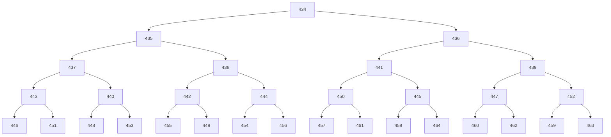
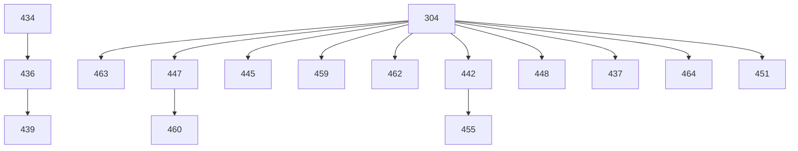

 ``` bash
C/C++: .c.cpp -> 编译器 -> .exe (可执行程序)
g++ test.cpp -o text.exe
.\'text.exe'

VS Code: 代码编辑器 文件名不能有中文

Visual Studio / Code Blocks / Pycharm : IDE集成开发环境 : 编辑器 + （编译器/解释器） +一套完整的生产工具

多文件编译工具——C Make

hello.cpp ->编译 hello.o ->链接 hello.exe
test.cpp ->编译 test.o ->链接 test.exe
```


